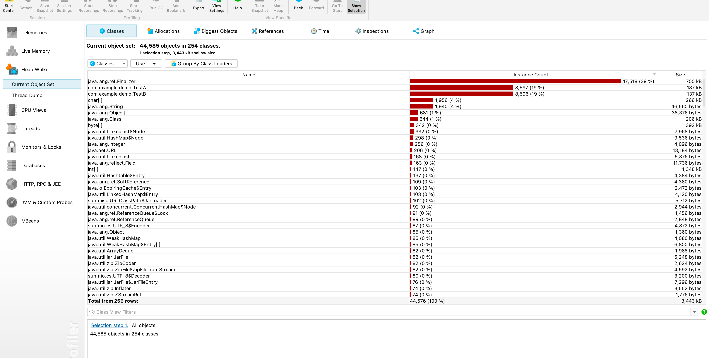
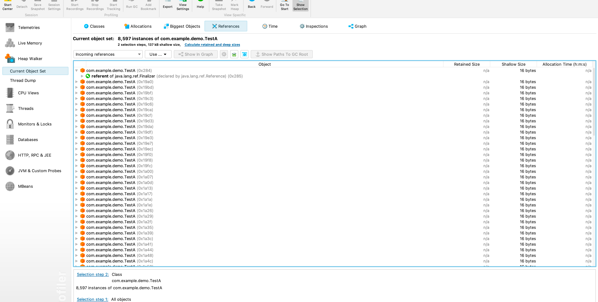

Fianlize 对 GC 的影响

<!-- more -->

## 背景

验证下 finalize 方法出现阻塞的现象。

## finalize 方法介绍

以下内容摘自《深入理解 Java 虚拟机：JVM 高级特性与最佳实践》第三版 3.2.4：

``` text
在可达性分析算法中判定为不可达的对象，也不是“非死不可”的，这时候它们暂时还处于“缓刑”阶段，要真正宣告一个对象死亡，至少要经历两次标记过程：如果对象在进行可达性分析后发现没有与GC Roots相连接的引用链，那它将会被第一次标记，随后进行一次筛选，筛选的条件是此对象是否有必要执行finalize()方法。假如对象没有覆盖finalize()方法，或者finalize()方法已经被虚拟机调用过，那么虚拟机将这两种情况都视为“没有必要执行”。

如果这个对象被判定为确有必要执行finalize()方法，那么该对象将会被放置在一个名为F-Queue的队列之中，并在稍后由一条由虚拟机自动建立的、低调度优先级的Finalizer线程去执行它们的finalize()方法。这里所说的“执行”是指虚拟机会触发这个方法开始运行，但并不承诺一定会等待它运行结束。这样做的原因是，如果某个对象的finalize()方法执行缓慢，或者更极端地发生了死循环，将很可能导致F-Queue队列中的其他对象永久处于等待，甚至导致整个内存回收子系统的崩溃。finalize()方法是对象逃脱死亡命运的最后一次机会，稍后收集器将对F-Queue中的对象进行第二次小规模的标记，如果对象要在finalize()中成功拯救自己——只要重新与引用链上的任何一个对象建立关联即可，譬如把自己（this关键字）赋值给某个类变量或者对象的成员变量，那在第二次标记时它将被移出“即将回收”的集合；如果对象这时候还没有逃脱，那基本上它就真的要被回收了。从代码清单3-2中我们可以看到一个对象的finalize()被执行，但是它仍然可以存活。

```


``` java
/**
 * 此代码演示了两点：
 * 1.对象可以在被GC时自我拯救。
 * 2.这种自救的机会只有一次, 因为一个对象的finalize()方法最多只会被系统自动调用一次
 * @author zzm
 */
public class FinalizeEscapeGC {

    public static FinalizeEscapeGC SAVE_HOOK = null;

    public void isAlive() {
        System.out.println("yes, i am still alive :)");
    }

    @Override
    protected void finalize() throws Throwable {
        super.finalize();
        System.out.println("finalize method executed!");
        FinalizeEscapeGC.SAVE_HOOK = this;
    }

    public static void main(String[] args) throws Throwable {
        SAVE_HOOK = new FinalizeEscapeGC();

        //对象第一次成功拯救自己
        SAVE_HOOK = null;
        System.gc();
        // 因为Finalizer方法优先级很低, 暂停0.5秒, 以等待它
        Thread.sleep(500);
        if (SAVE_HOOK != null) {
            SAVE_HOOK.isAlive();
        } else {
            System.out.println("no, i am dead :(");
        }

        // 下面这段代码与上面的完全相同, 但是这次自救却失败了
        SAVE_HOOK = null;
        System.gc();
        // 因为Finalizer方法优先级很低, 暂停0.5秒, 以等待它
        Thread.sleep(500);
        if (SAVE_HOOK != null) {
            SAVE_HOOK.isAlive();
        } else {
            System.out.println("no, i am dead :(");
        }
    }
}
```

运行结果：

``` text
finalize method executed!
yes, i am still alive :)
no, i am dead :(
```

从代码清单3-2的运行结果可以看到，SAVE_HOOK对象的finalize()方法确实被垃圾收集器触发过，并且在被收集前成功逃脱了。

另外一个值得注意的地方就是，代码中有两段完全一样的代码片段，执行结果却是一次逃脱成功，一次失败了。这是因为任何一个对象的finalize()方法都只会被系统自动调用一次，如果对象面临下一次回收，它的finalize()方法不会被再次执行，因此第二段代码的自救行动失败了。

还有一点需要特别说明，上面关于对象死亡时finalize()方法的描述可能带点悲情的艺术加工，笔者并不鼓励大家使用这个方法来拯救对象。相反，笔者建议大家尽量避免使用它，因为它并不能等同于C和C++语言中的析构函数，而是Java刚诞生时为了使传统C、C++程序员更容易接受Java所做出的一项妥协。它的运行代价高昂，不确定性大，无法保证各个对象的调用顺序，如今已被官方明确声明为不推荐使用的语法。有些教材中描述它适合做“关闭外部资源”之类的清理性工作，这完全是对finalize()方法用途的一种自我安慰。finalize()能做的所有工作，使用try-finally或者其他方式都可以做得更好、更及时，所以笔者建议大家完全可以忘掉Java语言里面的这个方法。

测试代码

``` java
public class TestFinalize {
    public static void main(String[] args) {
        while (true) {
            TestA testA = new TestA();
            testA.setName("TestA");
            TestB testB = new TestB();
            testB.setAge("TestB");
            testA = null;
            testB = null;
            System.gc();
        }
    }
}
```

``` java
package com.example.demo;

/**
 * @author RaymondLam1
 * @since 11.0.30
 * Created on 2024/9/26
 */
public class TestA {
    private String name;

    public String getName() {
        return name;
    }

    public void setName(String name) {
        this.name = name;
    }

    @Override
    protected void finalize() throws Throwable {
        while (true) {
            System.err.println(System.currentTimeMillis() + "这是一个优雅的 TestA 测试");
            Thread.sleep(1000);
        }
    }
}
```

``` java
package com.example.demo;

/**
 * @author RaymondLam1
 * @since 11.0.30
 * Created on 2024/9/26
 */
public class TestB {
    private String age;

    public String getAge() {
        return age;
    }

    public void setAge(String age) {
        this.age = age;
    }

    @Override
    protected void finalize() throws Throwable {
        System.err.println(System.currentTimeMillis() + "这是一个优雅的 TestB 测试");
    }
}
```

## 现象
### GC 日志

从 GC 日志可以发现堆内存在逐渐增大：
``` shell
1.187: [GC (System.gc()) [PSYoungGen: 1310K->64K(76288K)] 2309K->1062K(251392K), 0.0002282 secs] [Times: user=0.00 sys=0.00, real=0.00 secs] 
1.187: [Full GC (System.gc()) [PSYoungGen: 64K->0K(76288K)] [ParOldGen: 998K->998K(175104K)] 1062K->998K(251392K), [Metaspace: 3619K->3619K(1056768K)], 0.0021487 secs] [Times: user=0.01 sys=0.00, real=0.00 secs] 
1.190: [GC (System.gc()) [PSYoungGen: 1310K->96K(76288K)] 2309K->1094K(251392K), 0.0002405 secs] [Times: user=0.00 sys=0.00, real=0.00 secs] 
1.190: [Full GC (System.gc()) [PSYoungGen: 96K->0K(76288K)] [ParOldGen: 998K->999K(175104K)] 1094K->999K(251392K), [Metaspace: 3619K->3619K(1056768K)], 0.0019892 secs] [Times: user=0.02 sys=0.00, real=0.00 secs] 
1.192: [GC (System.gc()) [PSYoungGen: 1310K->96K(76288K)] 2309K->1095K(251392K), 0.0002268 secs] [Times: user=0.00 sys=0.00, real=0.00 secs] 
1.192: [Full GC (System.gc()) [PSYoungGen: 96K->0K(76288K)] [ParOldGen: 999K->999K(175104K)] 1095K->999K(251392K), [Metaspace: 3619K->3619K(1056768K)], 0.0019473 secs] [Times: user=0.01 sys=0.00, real=0.00 secs] 
1.194: [GC (System.gc()) [PSYoungGen: 1310K->96K(76288K)] 2309K->1095K(251392K), 0.0002530 secs] [Times: user=0.00 sys=0.00, real=0.00 secs] 
1.195: [Full GC (System.gc()) [PSYoungGen: 96K->0K(76288K)] [ParOldGen: 999K->999K(175104K)] 1095K->999K(251392K), [Metaspace: 3619K->3619K(1056768K)], 0.0022420 secs] [Times: user=0.01 sys=0.00, real=0.01 secs] 
1.197: [GC (System.gc()) [PSYoungGen: 1310K->96K(76288K)] 2310K->1095K(251392K), 0.0002492 secs] [Times: user=0.00 sys=0.01, real=0.00 secs] 
1.197: [Full GC (System.gc()) [PSYoungGen: 96K->0K(76288K)] [ParOldGen: 999K->996K(175104K)] 1095K->996K(251392K), [Metaspace: 3619K->3619K(1056768K)], 0.0020321 secs] [Times: user=0.02 sys=0.00, real=0.00 secs] 
1.199: [GC (System.gc()) [PSYoungGen: 1310K->64K(76288K)] 2307K->1060K(251392K), 0.0002222 secs] [Times: user=0.00 sys=0.00, real=0.00 secs] 
1.200: [Full GC (System.gc()) [PSYoungGen: 64K->0K(76288K)] [ParOldGen: 996K->996K(175104K)] 1060K->996K(251392K), [Metaspace: 3619K->3619K(1056768K)], 0.0017809 secs] [Times: user=0.01 sys=0.00, real=0.00 secs] 
1.201: [GC (System.gc()) [PSYoungGen: 2621K->96K(76288K)] 3617K->1092K(251392K), 0.0002206 secs] [Times: user=0.00 sys=0.00, real=0.00 secs] 
1.202: [Full GC (System.gc()) [PSYoungGen: 96K->0K(76288K)] [ParOldGen: 996K->998K(175104K)] 1092K->998K(251392K), [Metaspace: 3619K->3619K(1056768K)], 0.0020145 secs] [Times: user=0.01 sys=0.00, real=0.00 secs] 
1.204: [GC (System.gc()) [PSYoungGen: 2621K->128K(76288K)] 3620K->1126K(251392K), 0.0002278 secs] [Times: user=0.00 sys=0.00, real=0.00 secs] 
1.204: [Full GC (System.gc()) [PSYoungGen: 128K->0K(76288K)] [ParOldGen: 998K->996K(175104K)] 1126K->996K(251392K), [Metaspace: 3623K->3623K(1056768K)], 0.0019126 secs] [Times: user=0.01 sys=0.00, real=0.00 secs] 
1.206: [GC (System.gc()) [PSYoungGen: 2621K->96K(76288K)] 3618K->1092K(251392K), 0.0002181 secs] [Times: user=0.00 sys=0.00, real=0.00 secs] 
1.206: [Full GC (System.gc()) [PSYoungGen: 96K->0K(76288K)] [ParOldGen: 996K->996K(175104K)] 1092K->996K(251392K), [Metaspace: 3623K->3623K(1056768K)], 0.0019522 secs] [Times: user=0.02 sys=0.00, real=0.00 secs] 
1.208: [GC (System.gc()) [PSYoungGen: 2621K->96K(76288K)] 3618K->1092K(251392K), 0.0002222 secs] [Times: user=0.00 sys=0.00, real=0.00 secs] 
1.209: [Full GC (System.gc()) [PSYoungGen: 96K->0K(76288K)] [ParOldGen: 996K->997K(175104K)] 1092K->997K(251392K), [Metaspace: 3623K->3623K(1056768K)], 0.0040308 secs] [Times: user=0.03 sys=0.00, real=0.00 secs] 
1.213: [GC (System.gc()) [PSYoungGen: 2621K->128K(76288K)] 3618K->1125K(251392K), 0.0002934 secs] [Times: user=0.00 sys=0.00, real=0.00 secs] 
1.213: [Full GC (System.gc()) [PSYoungGen: 128K->0K(76288K)] [ParOldGen: 997K->997K(175104K)] 1125K->997K(251392K), [Metaspace: 3623K->3623K(1056768K)], 0.0021715 secs] [Times: user=0.01 sys=0.00, real=0.00 secs] 
1.215: [GC (System.gc()) [PSYoungGen: 2621K->64K(76288K)] 3618K->1061K(251392K), 0.0003589 secs] [Times: user=0.00 sys=0.00, real=0.00 secs] 
1.216: [Full GC (System.gc()) [PSYoungGen: 64K->0K(76288K)] [ParOldGen: 997K->997K(175104K)] 1061K->997K(251392K), [Metaspace: 3623K->3623K(1056768K)], 0.0019535 secs] [Times: user=0.01 sys=0.00, real=0.01 secs] 
1.218: [GC (System.gc()) [PSYoungGen: 2621K->128K(76288K)] 3618K->1125K(251392K), 0.0002746 secs] [Times: user=0.00 sys=0.00, real=0.00 secs] 
1.218: [Full GC (System.gc()) [PSYoungGen: 128K->0K(76288K)] [ParOldGen: 997K->997K(175104K)] 1125K->997K(251392K), [Metaspace: 3623K->3623K(1056768K)], 0.0021636 secs] [Times: user=0.02 sys=0.00, real=0.00 secs] 
1.220: [GC (System.gc()) [PSYoungGen: 2621K->96K(76288K)] 3618K->1093K(251392K), 0.0002092 secs] [Times: user=0.00 sys=0.00, real=0.00 secs] 
1.221: [Full GC (System.gc()) [PSYoungGen: 96K->0K(76288K)] [ParOldGen: 997K->998K(175104K)] 1093K->998K(251392K), [Metaspace: 3623K->3623K(1056768K)], 0.0020094 secs] [Times: user=0.01 sys=0.00, real=0.00 secs] 
1.223: [GC (System.gc()) [PSYoungGen: 2621K->128K(76288K)] 3620K->1126K(251392K), 0.0002053 secs] [Times: user=0.00 sys=0.00, real=0.00 secs] 
1.223: [Full GC (System.gc()) [PSYoungGen: 128K->0K(76288K)] [ParOldGen: 998K->997K(175104K)] 1126K->997K(251392K), [Metaspace: 3624K->3624K(1056768K)], 0.0019441 secs] [Times: user=0.01 sys=0.00, real=0.00 secs] 
1.225: [GC (System.gc()) [PSYoungGen: 1310K->96K(76288K)] 2308K->1093K(251392K), 0.0002101 secs] [Times: user=0.00 sys=0.00, real=0.00 secs] 
1.225: [Full GC (System.gc()) [PSYoungGen: 96K->0K(76288K)] [ParOldGen: 997K->997K(175104K)] 1093K->997K(251392K), [Metaspace: 3625K->3625K(1056768K)], 0.0020283 secs] [Times: user=0.02 sys=0.00, real=0.01 secs] 
1.227: [GC (System.gc()) [PSYoungGen: 1310K->96K(76288K)] 2308K->1093K(251392K), 0.0002172 secs] [Times: user=0.00 sys=0.00, real=0.00 secs] 
1.228: [Full GC (System.gc()) [PSYoungGen: 96K->0K(76288K)] [ParOldGen: 997K->998K(175104K)] 1093K->998K(251392K), [Metaspace: 3625K->3625K(1056768K)], 0.0020333 secs] [Times: user=0.01 sys=0.00, real=0.00 secs] 
1.230: [GC (System.gc()) [PSYoungGen: 2621K->128K(76288K)] 3619K->1126K(251392K), 0.0002210 secs] [Times: user=0.00 sys=0.00, real=0.00 secs] 
1.230: [Full GC (System.gc()) [PSYoungGen: 128K->0K(76288K)] [ParOldGen: 998K->998K(175104K)] 1126K->998K(251392K), [Metaspace: 3631K->3631K(1056768K)], 0.0020060 secs] [Times: user=0.01 sys=0.00, real=0.00 secs] 
1.232: [GC (System.gc()) [PSYoungGen: 2621K->128K(76288K)] 3619K->1126K(251392K), 0.0002058 secs] [Times: user=0.00 sys=0.00, real=0.00 secs] 
1.233: [Full GC (System.gc()) [PSYoungGen: 128K->0K(76288K)] [ParOldGen: 998K->998K(175104K)] 1126K->998K(251392K), [Metaspace: 3632K->3632K(1056768K)], 0.0019526 secs] [Times: user=0.01 sys=0.00, real=0.00 secs] 
1.235: [GC (System.gc()) [PSYoungGen: 1310K->64K(76288K)] 2309K->1062K(251392K), 0.0002334 secs] [Times: user=0.01 sys=0.00, real=0.00 secs] 
1.235: [Full GC (System.gc()) [PSYoungGen: 64K->0K(76288K)] [ParOldGen: 998K->998K(175104K)] 1062K->998K(251392K), [Metaspace: 3632K->3632K(1056768K)], 0.0020912 secs] [Times: user=0.01 sys=0.01, real=0.01 secs] 
1.237: [GC (System.gc()) [PSYoungGen: 1310K->96K(76288K)] 2309K->1094K(251392K), 0.0002133 secs] [Times: user=0.00 sys=0.00, real=0.00 secs] 
1.237: [Full GC (System.gc()) [PSYoungGen: 96K->0K(76288K)] [ParOldGen: 998K->998K(175104K)] 1094K->998K(251392K), [Metaspace: 3632K->3632K(1056768K)], 0.0019521 secs] [Times: user=0.01 sys=0.00, real=0.00 secs] 
1.239: [GC (System.gc()) [PSYoungGen: 1310K->96K(76288K)] 2309K->1094K(251392K), 0.0002153 secs] [Times: user=0.00 sys=0.00, real=0.00 secs] 
1.240: [Full GC (System.gc()) [PSYoungGen: 96K->0K(76288K)] [ParOldGen: 998K->998K(175104K)] 1094K->998K(251392K), [Metaspace: 3632K->3632K(1056768K)], 0.0019557 secs] [Times: user=0.01 sys=0.00, real=0.00 secs] 
1.242: [GC (System.gc()) [PSYoungGen: 2621K->96K(76288K)] 3620K->1094K(251392K), 0.0002088 secs] [Times: user=0.00 sys=0.00, real=0.00 secs] 
1.242: [Full GC (System.gc()) [PSYoungGen: 96K->0K(76288K)] [ParOldGen: 998K->998K(175104K)] 1094K->998K(251392K), [Metaspace: 3632K->3632K(1056768K)], 0.0019442 secs] [Times: user=0.02 sys=0.00, real=0.00 secs] 
1.244: [GC (System.gc()) [PSYoungGen: 1310K->96K(76288K)] 2309K->1094K(251392K), 0.0002081 secs] [Times: user=0.00 sys=0.00, real=0.00 secs] 
1.244: [Full GC (System.gc()) [PSYoungGen: 96K->0K(76288K)] [ParOldGen: 998K->998K(175104K)] 1094K->998K(251392K), [Metaspace: 3632K->3632K(1056768K)], 0.0019658 secs] [Times: user=0.01 sys=0.00, real=0.01 secs] 
1.246: [GC (System.gc()) [PSYoungGen: 2621K->128K(76288K)] 3620K->1126K(251392K), 0.0003438 secs] [Times: user=0.00 sys=0.00, real=0.00 secs] 
1.247: [Full GC (System.gc()) [PSYoungGen: 128K->0K(76288K)] [ParOldGen: 998K->999K(175104K)] 1126K->999K(251392K), [Metaspace: 3632K->3632K(1056768K)], 0.0019414 secs] [Times: user=0.01 sys=0.00, real=0.00 secs] 
1.249: [GC (System.gc()) [PSYoungGen: 2621K->128K(76288K)] 3620K->1127K(251392K), 0.0002165 secs] [Times: user=0.00 sys=0.00, real=0.00 secs] 
1.249: [Full GC (System.gc()) [PSYoungGen: 128K->0K(76288K)] [ParOldGen: 999K->999K(175104K)] 1127K->999K(251392K), [Metaspace: 3632K->3632K(1056768K)], 0.0021418 secs] [Times: user=0.02 sys=0.00, real=0.00 secs] 
1.251: [GC (System.gc()) [PSYoungGen: 2621K->96K(76288K)] 3620K->1095K(251392K), 0.0002239 secs] [Times: user=0.00 sys=0.00, real=0.00 secs] 
1.251: [Full GC (System.gc()) [PSYoungGen: 96K->0K(76288K)] [ParOldGen: 999K->999K(175104K)] 1095K->999K(251392K), [Metaspace: 3632K->3632K(1056768K)], 0.0019509 secs] [Times: user=0.01 sys=0.00, real=0.00 secs] 
1.254: [GC (System.gc()) [PSYoungGen: 2624K->96K(76288K)] 3623K->1095K(251392K), 0.0002171 secs] [Times: user=0.00 sys=0.00, real=0.00 secs] 
1.254: [Full GC (System.gc()) [PSYoungGen: 96K->0K(76288K)] [ParOldGen: 999K->999K(175104K)] 1095K->999K(251392K), [Metaspace: 3636K->3636K(1056768K)], 0.0019719 secs] [Times: user=0.01 sys=0.00, real=0.00 secs] 
1.256: [GC (System.gc()) [PSYoungGen: 2621K->96K(76288K)] 3621K->1095K(251392K), 0.0002409 secs] [Times: user=0.00 sys=0.00, real=0.00 secs] 
1.256: [Full GC (System.gc()) [PSYoungGen: 96K->0K(76288K)] [ParOldGen: 999K->999K(175104K)] 1095K->999K(251392K), [Metaspace: 3637K->3637K(1056768K)], 0.0019611 secs] [Times: user=0.02 sys=0.00, real=0.01 secs] 
1.258: [GC (System.gc()) [PSYoungGen: 2629K->96K(76288K)] 3629K->1095K(251392K), 0.0002186 secs] [Times: user=0.00 sys=0.00, real=0.00 secs] 
1.258: [Full GC (System.gc()) [PSYoungGen: 96K->0K(76288K)] [ParOldGen: 999K->1007K(175104K)] 1095K->1007K(251392K), [Metaspace: 3637K->3637K(1056768K)], 0.0019571 secs] [Times: user=0.01 sys=0.00, real=0.00 secs] 
1.260: [GC (System.gc()) [PSYoungGen: 2637K->128K(76288K)] 3645K->1135K(251392K), 0.0005055 secs] [Times: user=0.00 sys=0.00, real=0.00 secs] 
1.261: [Full GC (System.gc()) [PSYoungGen: 128K->0K(76288K)] [ParOldGen: 1007K->1024K(175104K)] 1135K->1024K(251392K), [Metaspace: 3637K->3637K(1056768K)], 0.0021361 secs] [Times: user=0.01 sys=0.00, real=0.00 secs] 
1.263: [GC (System.gc()) [PSYoungGen: 1310K->96K(76288K)] 2334K->1120K(251392K), 0.0002382 secs] [Times: user=0.00 sys=0.00, real=0.00 secs] 
1.263: [Full GC (System.gc()) [PSYoungGen: 96K->0K(76288K)] [ParOldGen: 1024K->1024K(175104K)] 1120K->1024K(251392K), [Metaspace: 3637K->3637K(1056768K)], 0.0015618 secs] [Times: user=0.01 sys=0.00, real=0.00 secs] 
1.265: [GC (System.gc()) [PSYoungGen: 1310K->96K(76288K)] 2334K->1120K(251392K), 0.0002802 secs] [Times: user=0.00 sys=0.00, real=0.00 secs] 
1.265: [Full GC (System.gc()) [PSYoungGen: 96K->0K(76288K)] [ParOldGen: 1024K->1024K(175104K)] 1120K->1024K(251392K), [Metaspace: 3637K->3637K(1056768K)], 0.0014613 secs] [Times: user=0.01 sys=0.00, real=0.01 secs] 
1.267: [GC (System.gc()) [PSYoungGen: 2621K->128K(76288K)] 3645K->1152K(251392K), 0.0002255 secs] [Times: user=0.00 sys=0.00, real=0.00 secs] 
1.267: [Full GC (System.gc()) [PSYoungGen: 128K->0K(76288K)] [ParOldGen: 1024K->1024K(175104K)] 1152K->1024K(251392K), [Metaspace: 3637K->3637K(1056768K)], 0.0014884 secs] [Times: user=0.01 sys=0.00, real=0.00 secs] 
1.269: [GC (System.gc()) [PSYoungGen: 1310K->96K(76288K)] 2335K->1120K(251392K), 0.0002182 secs] [Times: user=0.00 sys=0.00, real=0.00 secs] 
1.269: [Full GC (System.gc()) [PSYoungGen: 96K->0K(76288K)] [ParOldGen: 1024K->1024K(175104K)] 1120K->1024K(251392K), [Metaspace: 3637K->3637K(1056768K)], 0.0015422 secs] [Times: user=0.01 sys=0.00, real=0.00 secs] 
1.271: [GC (System.gc()) [PSYoungGen: 1310K->96K(76288K)] 2335K->1120K(251392K), 0.0002188 secs] [Times: user=0.00 sys=0.00, real=0.00 secs] 
1.271: [Full GC (System.gc()) [PSYoungGen: 96K->0K(76288K)] [ParOldGen: 1024K->1024K(175104K)] 1120K->1024K(251392K), [Metaspace: 3637K->3637K(1056768K)], 0.0013880 secs] [Times: user=0.00 sys=0.00, real=0.00 secs] 
1.273: [GC (System.gc()) [PSYoungGen: 1310K->64K(76288K)] 2335K->1088K(251392K), 0.0002266 secs] [Times: user=0.01 sys=0.00, real=0.00 secs] 
1.273: [Full GC (System.gc()) [PSYoungGen: 64K->0K(76288K)] [ParOldGen: 1024K->1024K(175104K)] 1088K->1024K(251392K), [Metaspace: 3637K->3637K(1056768K)], 0.0014034 secs] [Times: user=0.00 sys=0.01, real=0.00 secs] 
1.274: [GC (System.gc()) [PSYoungGen: 1310K->96K(76288K)] 2335K->1120K(251392K), 0.0002230 secs] [Times: user=0.00 sys=0.00, real=0.00 secs] 
1.275: [Full GC (System.gc()) [PSYoungGen: 96K->0K(76288K)] [ParOldGen: 1024K->1024K(175104K)] 1120K->1024K(251392K), [Metaspace: 3637K->3637K(1056768K)], 0.0013494 secs] [Times: user=0.01 sys=0.00, real=0.00 secs] 
1.276: [GC (System.gc()) [PSYoungGen: 1310K->96K(76288K)] 2335K->1120K(251392K), 0.0002198 secs] [Times: user=0.00 sys=0.00, real=0.01 secs] 
1.276: [Full GC (System.gc()) [PSYoungGen: 96K->0K(76288K)] [ParOldGen: 1024K->1024K(175104K)] 1120K->1024K(251392K), [Metaspace: 3637K->3637K(1056768K)], 0.0013705 secs] [Times: user=0.01 sys=0.00, real=0.00 secs] 
1.278: [GC (System.gc()) [PSYoungGen: 1310K->64K(76288K)] 2335K->1088K(251392K), 0.0002671 secs] [Times: user=0.00 sys=0.00, real=0.00 secs] 
1.278: [Full GC (System.gc()) [PSYoungGen: 64K->0K(76288K)] [ParOldGen: 1024K->1025K(175104K)] 1088K->1025K(251392K), [Metaspace: 3637K->3637K(1056768K)], 0.0014152 secs] [Times: user=0.01 sys=0.00, real=0.00 secs] 
1.279: [GC (System.gc()) [PSYoungGen: 2621K->160K(76288K)] 3646K->1185K(251392K), 0.0002285 secs] [Times: user=0.00 sys=0.00, real=0.00 secs] 
1.280: [Full GC (System.gc()) [PSYoungGen: 160K->0K(76288K)] [ParOldGen: 1025K->1025K(175104K)] 1185K->1025K(251392K), [Metaspace: 3637K->3637K(1056768K)], 0.0015361 secs] [Times: user=0.01 sys=0.00, real=0.00 secs] 
1.281: [GC (System.gc()) [PSYoungGen: 1310K->96K(76288K)] 2336K->1121K(251392K), 0.0002307 secs] [Times: user=0.00 sys=0.00, real=0.00 secs] 
1.282: [Full GC (System.gc()) [PSYoungGen: 96K->0K(76288K)] [ParOldGen: 1025K->1025K(175104K)] 1121K->1025K(251392K), [Metaspace: 3637K->3637K(1056768K)], 0.0014145 secs] [Times: user=0.00 sys=0.00, real=0.00 secs] 
1.283: [GC (System.gc()) [PSYoungGen: 1310K->64K(76288K)] 2336K->1089K(251392K), 0.0002258 secs] [Times: user=0.00 sys=0.00, real=0.00 secs] 
1.283: [Full GC (System.gc()) [PSYoungGen: 64K->0K(76288K)] [ParOldGen: 1025K->1025K(175104K)] 1089K->1025K(251392K), [Metaspace: 3637K->3637K(1056768K)], 0.0014449 secs] [Times: user=0.01 sys=0.00, real=0.00 secs] 
1.285: [GC (System.gc()) [PSYoungGen: 1310K->96K(76288K)] 2336K->1121K(251392K), 0.0002180 secs] [Times: user=0.00 sys=0.00, real=0.00 secs] 
1.285: [Full GC (System.gc()) [PSYoungGen: 96K->0K(76288K)] [ParOldGen: 1025K->1025K(175104K)] 1121K->1025K(251392K), [Metaspace: 3637K->3637K(1056768K)], 0.0014618 secs] [Times: user=0.01 sys=0.00, real=0.01 secs] 
1.287: [GC (System.gc()) [PSYoungGen: 1310K->96K(76288K)] 2336K->1121K(251392K), 0.0002092 secs] [Times: user=0.00 sys=0.00, real=0.00 secs] 
1.287: [Full GC (System.gc()) [PSYoungGen: 96K->0K(76288K)] [ParOldGen: 1025K->1025K(175104K)] 1121K->1025K(251392K), [Metaspace: 3637K->3637K(1056768K)], 0.0013949 secs] [Times: user=0.01 sys=0.00, real=0.00 secs] 
1.288: [GC (System.gc()) [PSYoungGen: 1310K->96K(76288K)] 2336K->1121K(251392K), 0.0002020 secs] [Times: user=0.00 sys=0.00, real=0.00 secs] 
1.289: [Full GC (System.gc()) [PSYoungGen: 96K->0K(76288K)] [ParOldGen: 1025K->1025K(175104K)] 1121K->1025K(251392K), [Metaspace: 3637K->3637K(1056768K)], 0.0014465 secs] [Times: user=0.01 sys=0.00, real=0.00 secs] 
1.290: [GC (System.gc()) [PSYoungGen: 1310K->96K(76288K)] 2336K->1121K(251392K), 0.0002027 secs] [Times: user=0.00 sys=0.00, real=0.00 secs] 
1.290: [Full GC (System.gc()) [PSYoungGen: 96K->0K(76288K)] [ParOldGen: 1025K->1025K(175104K)] 1121K->1025K(251392K), [Metaspace: 3637K->3637K(1056768K)], 0.0013299 secs] [Times: user=0.00 sys=0.00, real=0.00 secs] 
1.292: [GC (System.gc()) [PSYoungGen: 1310K->96K(76288K)] 2336K->1121K(251392K), 0.0002240 secs] [Times: user=0.00 sys=0.00, real=0.00 secs] 
1.292: [Full GC (System.gc()) [PSYoungGen: 96K->0K(76288K)] [ParOldGen: 1025K->1025K(175104K)] 1121K->1025K(251392K), [Metaspace: 3637K->3637K(1056768K)], 0.0014040 secs] [Times: user=0.01 sys=0.00, real=0.00 secs] 
1.294: [GC (System.gc()) [PSYoungGen: 1310K->64K(76288K)] 2336K->1089K(251392K), 0.0002425 secs] [Times: user=0.00 sys=0.00, real=0.00 secs] 
1.294: [Full GC (System.gc()) [PSYoungGen: 64K->0K(76288K)] [ParOldGen: 1025K->1026K(175104K)] 1089K->1026K(251392K), [Metaspace: 3637K->3637K(1056768K)], 0.0013996 secs] [Times: user=0.01 sys=0.00, real=0.00 secs] 
1.295: [GC (System.gc()) [PSYoungGen: 1310K->96K(76288K)] 2336K->1122K(251392K), 0.0002132 secs] [Times: user=0.00 sys=0.00, real=0.00 secs] 
1.296: [Full GC (System.gc()) [PSYoungGen: 96K->0K(76288K)] [ParOldGen: 1026K->1026K(175104K)] 1122K->1026K(251392K), [Metaspace: 3637K->3637K(1056768K)], 0.0013966 secs] [Times: user=0.01 sys=0.00, real=0.01 secs] 
1.297: [GC (System.gc()) [PSYoungGen: 1310K->64K(76288K)] 2336K->1090K(251392K), 0.0001921 secs] [Times: user=0.00 sys=0.00, real=0.00 secs] 
1.297: [Full GC (System.gc()) [PSYoungGen: 64K->0K(76288K)] [ParOldGen: 1026K->1026K(175104K)] 1090K->1026K(251392K), [Metaspace: 3637K->3637K(1056768K)], 0.0014763 secs] [Times: user=0.01 sys=0.00, real=0.00 secs] 
1.299: [GC (System.gc()) [PSYoungGen: 1310K->64K(76288K)] 2337K->1090K(251392K), 0.0002144 secs] [Times: user=0.00 sys=0.00, real=0.00 secs] 
1.299: [Full GC (System.gc()) [PSYoungGen: 64K->0K(76288K)] [ParOldGen: 1026K->1026K(175104K)] 1090K->1026K(251392K), [Metaspace: 3637K->3637K(1056768K)], 0.0014583 secs] [Times: user=0.00 sys=0.00, real=0.00 secs] 
1.301: [GC (System.gc()) [PSYoungGen: 1310K->128K(76288K)] 2337K->1154K(251392K), 0.0002211 secs] [Times: user=0.00 sys=0.00, real=0.00 secs] 
1.301: [Full GC (System.gc()) [PSYoungGen: 128K->0K(76288K)] [ParOldGen: 1026K->1026K(175104K)] 1154K->1026K(251392K), [Metaspace: 3637K->3637K(1056768K)], 0.0014531 secs] [Times: user=0.01 sys=0.00, real=0.00 secs] 
1.302: [GC (System.gc()) [PSYoungGen: 1310K->64K(76288K)] 2337K->1090K(251392K), 0.0002285 secs] [Times: user=0.00 sys=0.00, real=0.00 secs] 
1.303: [Full GC (System.gc()) [PSYoungGen: 64K->0K(76288K)] [ParOldGen: 1026K->1026K(175104K)] 1090K->1026K(251392K), [Metaspace: 3637K->3637K(1056768K)], 0.0013669 secs] [Times: user=0.01 sys=0.00, real=0.00 secs] 
1.304: [GC (System.gc()) [PSYoungGen: 1310K->96K(76288K)] 2337K->1122K(251392K), 0.0002148 secs] [Times: user=0.00 sys=0.00, real=0.00 secs] 
1.304: [Full GC (System.gc()) [PSYoungGen: 96K->0K(76288K)] [ParOldGen: 1026K->1026K(175104K)] 1122K->1026K(251392K), [Metaspace: 3637K->3637K(1056768K)], 0.0014347 secs] [Times: user=0.01 sys=0.01, real=0.00 secs] 
1.306: [GC (System.gc()) [PSYoungGen: 1310K->64K(76288K)] 2337K->1090K(251392K), 0.0002033 secs] [Times: user=0.00 sys=0.00, real=0.01 secs] 
1.306: [Full GC (System.gc()) [PSYoungGen: 64K->0K(76288K)] [ParOldGen: 1026K->1026K(175104K)] 1090K->1026K(251392K), [Metaspace: 3637K->3637K(1056768K)], 0.0014613 secs] [Times: user=0.01 sys=0.00, real=0.00 secs] 
1.308: [GC (System.gc()) [PSYoungGen: 1310K->64K(76288K)] 2337K->1090K(251392K), 0.0002174 secs] [Times: user=0.00 sys=0.00, real=0.00 secs] 
1.308: [Full GC (System.gc()) [PSYoungGen: 64K->0K(76288K)] [ParOldGen: 1026K->1026K(175104K)] 1090K->1026K(251392K), [Metaspace: 3637K->3637K(1056768K)], 0.0013894 secs] [Times: user=0.00 sys=0.00, real=0.00 secs] 
1.309: [GC (System.gc()) [PSYoungGen: 1310K->64K(76288K)] 2337K->1090K(251392K), 0.0002204 secs] [Times: user=0.00 sys=0.00, real=0.00 secs] 
1.310: [Full GC (System.gc()) [PSYoungGen: 64K->0K(76288K)] [ParOldGen: 1026K->1027K(175104K)] 1090K->1027K(251392K), [Metaspace: 3637K->3637K(1056768K)], 0.0014036 secs] [Times: user=0.01 sys=0.00, real=0.00 secs] 
1.311: [GC (System.gc()) [PSYoungGen: 1310K->96K(76288K)] 2337K->1123K(251392K), 0.0002102 secs] [Times: user=0.00 sys=0.00, real=0.00 secs] 
1.311: [Full GC (System.gc()) [PSYoungGen: 96K->0K(76288K)] [ParOldGen: 1027K->1027K(175104K)] 1123K->1027K(251392K), [Metaspace: 3637K->3637K(1056768K)], 0.0013985 secs] [Times: user=0.01 sys=0.00, real=0.00 secs] 
1.313: [GC (System.gc()) [PSYoungGen: 1310K->64K(76288K)] 2337K->1091K(251392K), 0.0002112 secs] [Times: user=0.00 sys=0.00, real=0.00 secs] 
1.313: [Full GC (System.gc()) [PSYoungGen: 64K->0K(76288K)] [ParOldGen: 1027K->1027K(175104K)] 1091K->1027K(251392K), [Metaspace: 3637K->3637K(1056768K)], 0.0014127 secs] [Times: user=0.01 sys=0.00, real=0.00 secs] 
1.315: [GC (System.gc()) [PSYoungGen: 1310K->64K(76288K)] 2337K->1091K(251392K), 0.0002191 secs] [Times: user=0.00 sys=0.00, real=0.00 secs] 
1.315: [Full GC (System.gc()) [PSYoungGen: 64K->0K(76288K)] [ParOldGen: 1027K->1027K(175104K)] 1091K->1027K(251392K), [Metaspace: 3637K->3637K(1056768K)], 0.0014757 secs] [Times: user=0.01 sys=0.00, real=0.01 secs] 
1.316: [GC (System.gc()) [PSYoungGen: 1310K->64K(76288K)] 2338K->1091K(251392K), 0.0002268 secs] [Times: user=0.00 sys=0.00, real=0.00 secs] 
1.317: [Full GC (System.gc()) [PSYoungGen: 64K->0K(76288K)] [ParOldGen: 1027K->1027K(175104K)] 1091K->1027K(251392K), [Metaspace: 3637K->3637K(1056768K)], 0.0013744 secs] [Times: user=0.00 sys=0.00, real=0.00 secs] 
1.318: [GC (System.gc()) [PSYoungGen: 1310K->64K(76288K)] 2338K->1091K(251392K), 0.0002037 secs] [Times: user=0.01 sys=0.00, real=0.00 secs] 
1.318: [Full GC (System.gc()) [PSYoungGen: 64K->0K(76288K)] [ParOldGen: 1027K->1027K(175104K)] 1091K->1027K(251392K), [Metaspace: 3637K->3637K(1056768K)], 0.0013728 secs] [Times: user=0.00 sys=0.00, real=0.00 secs] 
1.320: [GC (System.gc()) [PSYoungGen: 1310K->64K(76288K)] 2338K->1091K(251392K), 0.0002374 secs] [Times: user=0.00 sys=0.00, real=0.00 secs] 
1.320: [Full GC (System.gc()) [PSYoungGen: 64K->0K(76288K)] [ParOldGen: 1027K->1027K(175104K)] 1091K->1027K(251392K), [Metaspace: 3637K->3637K(1056768K)], 0.0013732 secs] [Times: user=0.01 sys=0.00, real=0.00 secs] 
1.322: [GC (System.gc()) [PSYoungGen: 1310K->96K(76288K)] 2338K->1123K(251392K), 0.0002155 secs] [Times: user=0.00 sys=0.00, real=0.00 secs] 
1.322: [Full GC (System.gc()) [PSYoungGen: 96K->0K(76288K)] [ParOldGen: 1027K->1027K(175104K)] 1123K->1027K(251392K), [Metaspace: 3638K->3638K(1056768K)], 0.0013527 secs] [Times: user=0.01 sys=0.00, real=0.00 secs] 
1.323: [GC (System.gc()) [PSYoungGen: 1310K->64K(76288K)] 2338K->1091K(251392K), 0.0002116 secs] [Times: user=0.00 sys=0.00, real=0.00 secs] 
1.324: [Full GC (System.gc()) [PSYoungGen: 64K->0K(76288K)] [ParOldGen: 1027K->1027K(175104K)] 1091K->1027K(251392K), [Metaspace: 3638K->3638K(1056768K)], 0.0013539 secs] [Times: user=0.01 sys=0.00, real=0.00 secs] 
1.325: [GC (System.gc()) [PSYoungGen: 1310K->96K(76288K)] 2338K->1123K(251392K), 0.0002132 secs] [Times: user=0.00 sys=0.00, real=0.00 secs] 
1.325: [Full GC (System.gc()) [PSYoungGen: 96K->0K(76288K)] [ParOldGen: 1027K->1028K(175104K)] 1123K->1028K(251392K), [Metaspace: 3638K->3638K(1056768K)], 0.0014182 secs] [Times: user=0.00 sys=0.00, real=0.01 secs] 
1.327: [GC (System.gc()) [PSYoungGen: 1310K->64K(76288K)] 2338K->1092K(251392K), 0.0002117 secs] [Times: user=0.01 sys=0.00, real=0.00 secs] 
1.327: [Full GC (System.gc()) [PSYoungGen: 64K->0K(76288K)] [ParOldGen: 1028K->1028K(175104K)] 1092K->1028K(251392K), [Metaspace: 3638K->3638K(1056768K)], 0.0013675 secs] [Times: user=0.00 sys=0.00, real=0.00 secs] 
1.328: [GC (System.gc()) [PSYoungGen: 1310K->64K(76288K)] 2338K->1092K(251392K), 0.0002262 secs] [Times: user=0.00 sys=0.00, real=0.00 secs] 
1.329: [Full GC (System.gc()) [PSYoungGen: 64K->0K(76288K)] [ParOldGen: 1028K->1028K(175104K)] 1092K->1028K(251392K), [Metaspace: 3638K->3638K(1056768K)], 0.0014438 secs] [Times: user=0.01 sys=0.00, real=0.00 secs] 
1.330: [GC (System.gc()) [PSYoungGen: 1310K->96K(76288K)] 2338K->1124K(251392K), 0.0002122 secs] [Times: user=0.00 sys=0.00, real=0.00 secs] 
1.330: [Full GC (System.gc()) [PSYoungGen: 96K->0K(76288K)] [ParOldGen: 1028K->1028K(175104K)] 1124K->1028K(251392K), [Metaspace: 3638K->3638K(1056768K)], 0.0014191 secs] [Times: user=0.01 sys=0.00, real=0.00 secs] 
1.332: [GC (System.gc()) [PSYoungGen: 1310K->64K(76288K)] 2339K->1092K(251392K), 0.0002019 secs] [Times: user=0.00 sys=0.0
```
### 堆栈

Finalizer 线程阻塞在 TestA 的 while 循环中：

``` shell
"Finalizer" #3 daemon prio=8 os_prio=31 tid=0x00007fa1e0808800 nid=0x4103 waiting on condition [0x0000700006927000]
   java.lang.Thread.State: TIMED_WAITING (sleeping)
	at java.lang.Thread.sleep(Native Method)
	at com.example.demo.TestA.finalize(TestA.java:23)
	at java.lang.System$2.invokeFinalize(System.java:1287)
	at java.lang.ref.Finalizer.runFinalizer(Finalizer.java:102)
	at java.lang.ref.Finalizer.access$100(Finalizer.java:34)
	at java.lang.ref.Finalizer$FinalizerThread.run(Finalizer.java:189)
```

### dump 文件

从 dump 文件可以发现 TestA 和 TestB 对象都没有被正常回收（在使用JProfiler 打开时注意不要执行一次 Full GC，否则 JProfiler 会认为 TestA 和 TestB 对象可以被正常回收，这里的具体原因没有研究过，参考：https://blog.csdn.net/Receptive2WE/article/details/121695250）






## 结论

finalize 方法阻塞会导致对象无法被正常 GC，F-Queue 并不会被阻塞（JVM 不保证每个 finalize 方法会被执行完毕）。

## 参考

https://www.cnblogs.com/benwu/articles/5812903.html
