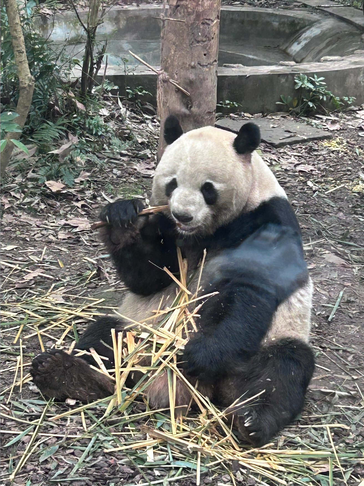
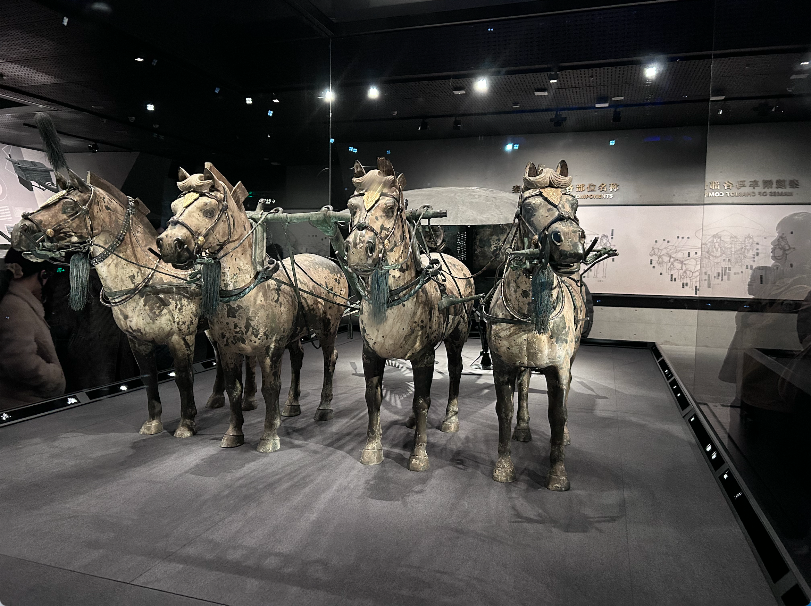

2026 年的春节如约而至。看着日历，猛然惊觉虚岁已经三十。古人云“三十而立”，以前总觉得是个遥远的目标，现在才发现，这四个字是直接撞进生活里的。2025 年，我的人生按下了快进键，从单枪匹马到为人夫、为人父，这一年的滋味，远比代码复杂，也远比文字动人。
> 又到了农历新年之际，说实话，我这人写文档水平是真的臭，但是今年一定一定要开始写起来。2026年了，一眨眼我虚岁都30了，时间快的离谱噢。

## 生活

2025年最重要的事情肯定是结婚,我与太太相识于 24 年初春，一年时间，我们完成了从相识到相守的跨越。这一年，我们有过争吵，但在琐碎的婚礼筹备中，更多的是彼此的体谅。看着她顶着单休的疲惫去对接那些繁复的细节，脸色差到让我心疼，我才意识到，婚姻不只是那一本红字，更是漫长生活里的风雨同舟。

我们的婚假，是一场身心的放逐。九寨沟的海子蓝得摄人心魄，成都街头的米粉冒着热气，大熊猫的憨态、三星堆的震撼、西安秦砖汉瓦里的厚重……这些记忆，是我们婚姻初期的注脚。

> 2025年最重要的事情肯定是结婚，我和太太相识于2024年3月，一年后步入婚姻的殿堂，中间有过争吵，但更多的是两个人彼此体谅，互相融合，2025年和她很多的精力是在准备婚礼，实在是太耗费精力了，她当时还单休，脸色差的离谱。我们的婚假去的九寨沟，顺带在成都玩了一圈，看过大熊猫，吃过成都的米粉，看过三星堆，重头戏是九寨沟确实美得很，只能多放图展示。婚假第二波是去的西安，看了兵马俑，以及秦汉博物馆，虽然有点累，但是还是不虚此行。

2025 年末，一份惊喜悄然而至——太太怀孕了。预产期就在 2026 年 6 月。看着她被孕吐折磨得精疲力尽，我包揽了所有的家务。虽然累，但每每想到那个即将到来的小生命，心中总会涌起一种异样的、柔软的兴奋。不求他未来如何惊天动地，只愿平平安安，健康降临。

> 另一个比较重要的事情是我太太怀孕了，预产期是2026年6月份，怀孕后的各种检查、孕吐等让她精疲力尽，我也主动承担了家里几乎所有的家务，老实说很累，但是想到孩子即将诞生，还是有种异样的兴奋，希望我的孩子能够平平安安、健健康康。

父母康健，便是最大的福气。这一年，身边的兄弟们一个个成家，压力给到了还没“说法”的小老弟。2026，希望他也带个好消息回来。
> 2025年爸爸妈妈身体健康，小老弟发展也还不错的，陶健也结婚了，这一代就剩下小老弟还没结婚，希望他2026年有说法

## 工作

老实说，2025年的工作不太顺心，年初不太看好所在团队的未来（2026年已经解散，合并进入业务团队），主动申请调到现在的数据分析团队，刚来时干劲十足，但是几个月后，随着繁杂的项目管理流程、信息差较大的团队氛围、不太融洽的前后端配合工作，让我逐渐有点摆烂状态，绩效一般（好在年终奖基本符合预期），希望明年能够有所改变。

## 个人发展

今年看了许多书籍，包括 k8s、DDD、DDIA、AI 入门、JPA 等各类技术书籍，还是有一定的提升，但是日常以业务代码为主，明年可能需要多抽出一些时间做技术调研。

