使用 FineBI 完成 LOD 15题

<!-- more -->

题目地址：https://www.tableau.com/zh-cn/blog/LOD-expressions

### 题目1

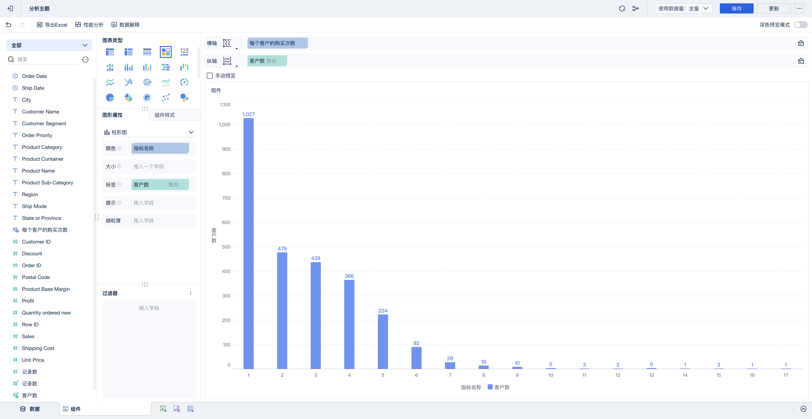

### 题目2

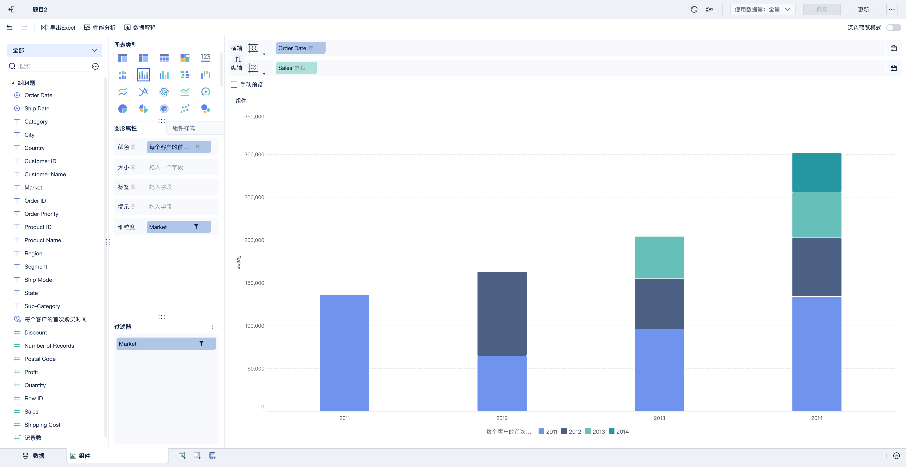

### 题目3

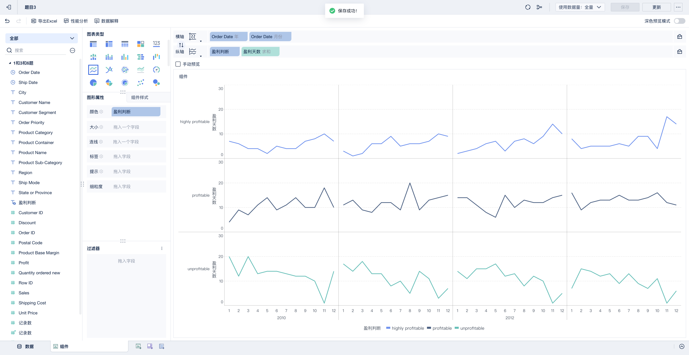

### 题目4

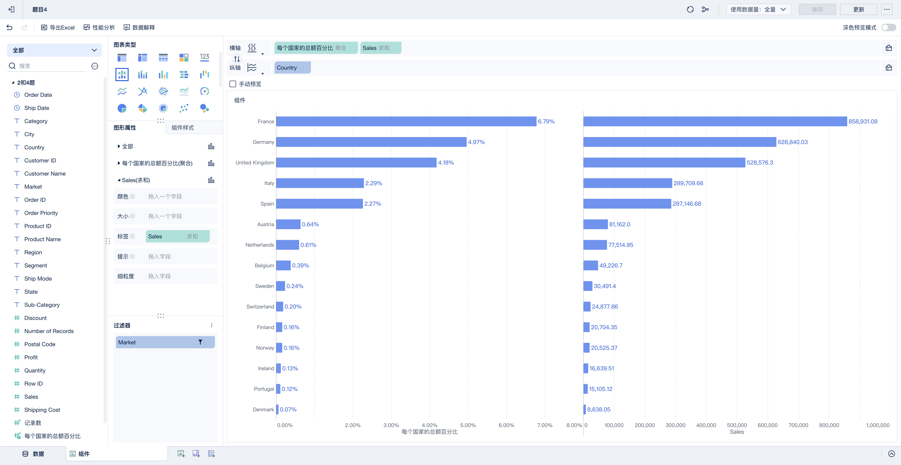

### 题目5

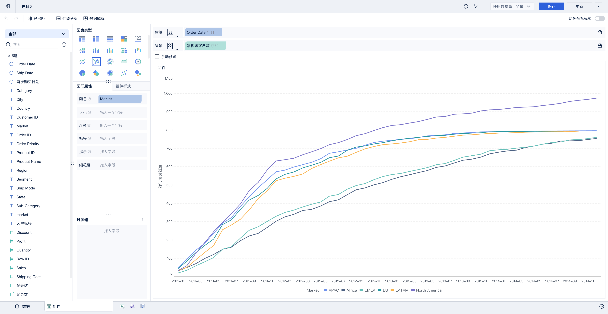

我觉得挺奇怪的，性能比较差，直接做的话，比 Tableau 慢多了

### 题目6

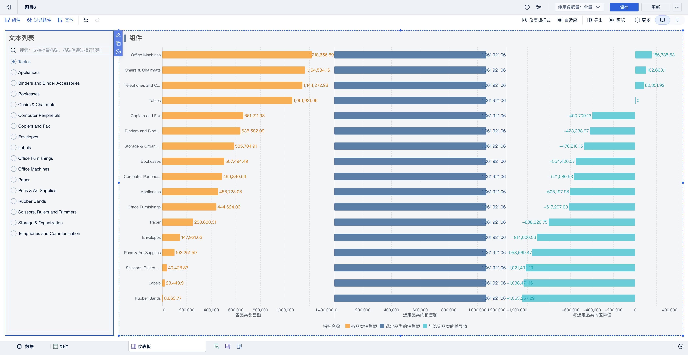

### 题目7

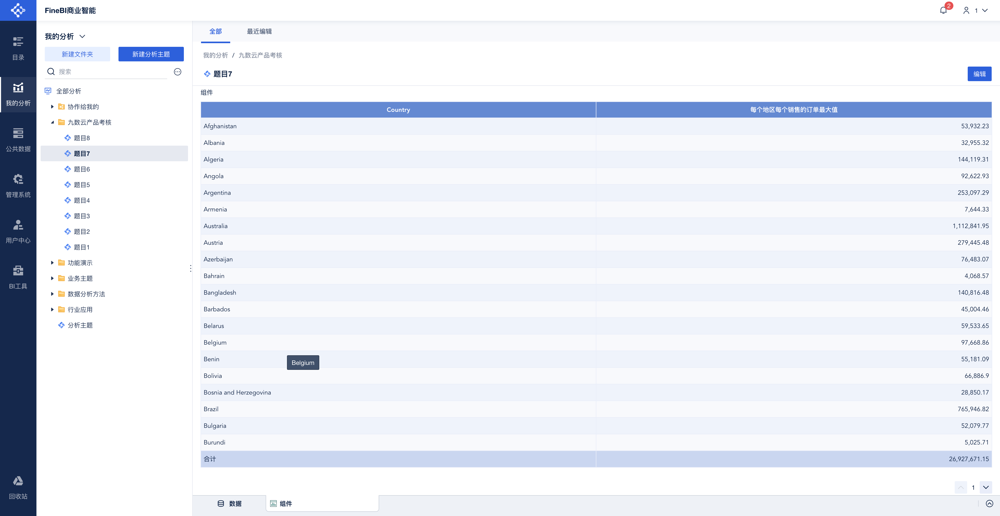

### 题目8

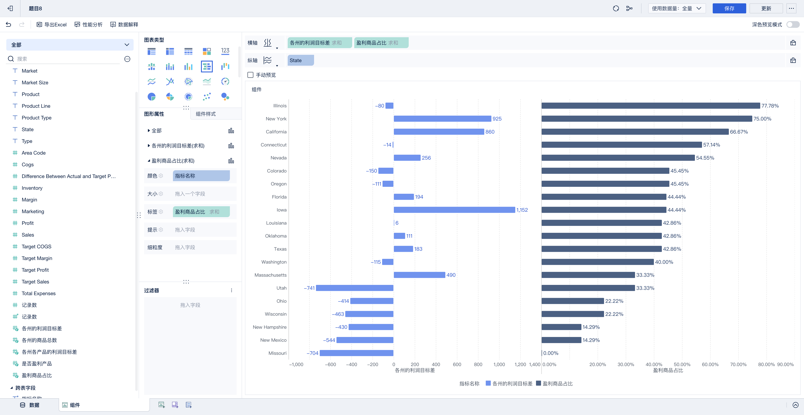

### 题目9

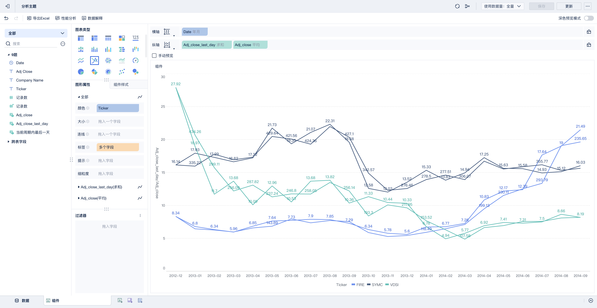

### 题目10

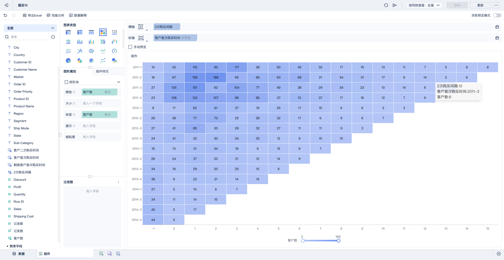

### 题目11

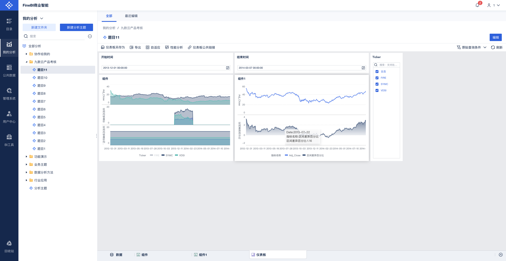

### 题目12

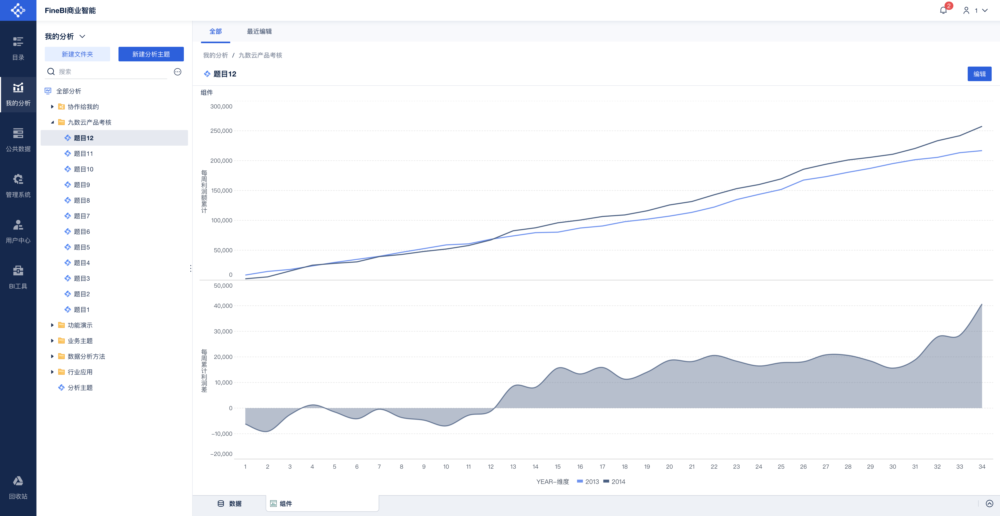

### 题目13

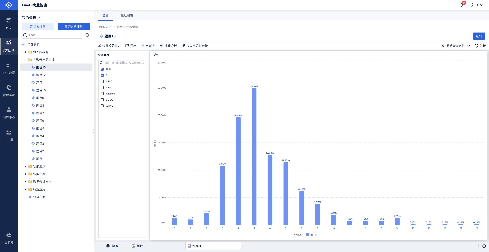

### 题目14

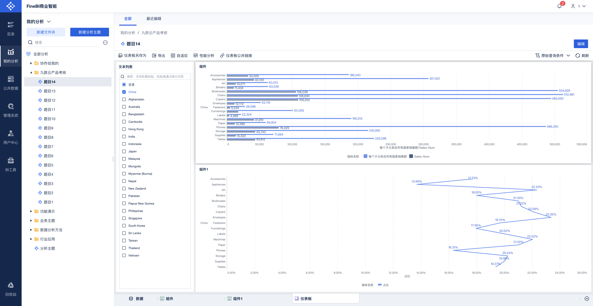

### 题目15

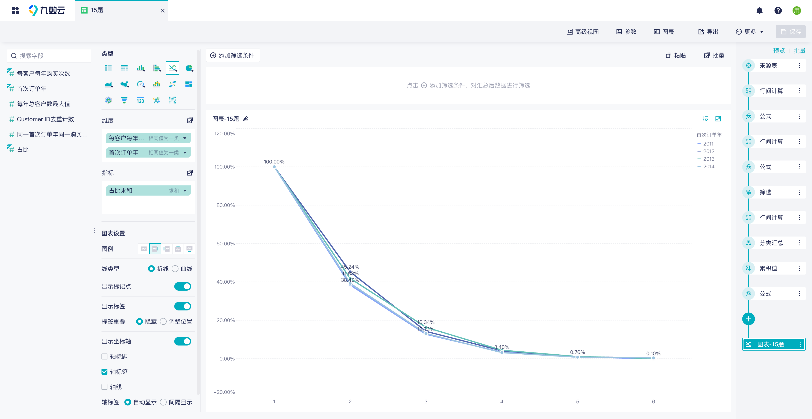