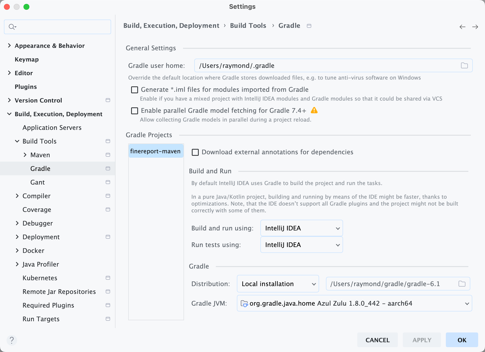

Gradle JVM 配置

<!-- more -->

公司有个使用 gralde 6.1 的老项目，换 arch 芯片后第一次构建，报错：

```
org.gradle.tooling.GradleConnectionException: Could not run phased build action using connection to Gradle installation '/Users/raymond/gradle/gradle-6.1'.
	at org.gradle.tooling.internal.consumer.ConnectionExceptionTransformer.transform(ConnectionExceptionTransformer.java:57)
	at org.gradle.tooling.internal.consumer.ResultHandlerAdapter.onFailure(ResultHandlerAdapter.java:42)
	at org.gradle.tooling.internal.consumer.async.DefaultAsyncConsumerActionExecutor$1$1.run(DefaultAsyncConsumerActionExecutor.java:68)
	at org.gradle.internal.concurrent.ExecutorPolicy$CatchAndRecordFailures.onExecute(ExecutorPolicy.java:64)
	at org.gradle.internal.concurrent.AbstractManagedExecutor$1.run(AbstractManagedExecutor.java:48)
	at java.base/java.util.concurrent.ThreadPoolExecutor.runWorker(ThreadPoolExecutor.java:1144)
	at java.base/java.util.concurrent.ThreadPoolExecutor$Worker.run(ThreadPoolExecutor.java:642)
	at java.base/java.lang.Thread.run(Thread.java:1583)
Caused by: org.gradle.launcher.daemon.client.DaemonConnectionException: The newly created daemon process has a different context than expected.
It won't be possible to reconnect to this daemon. Context mismatch: 
Java home is different.
Wanted: DefaultDaemonContext[uid=null,javaHome=/Users/raymond/.sdkman/candidates/java/current,daemonRegistryDir=/Users/raymond/.gradle/daemon,pid=4279,idleTimeout=null,priority=NORMAL,daemonOpts=-XX:MaxPermSize=512m,-XX:+HeapDumpOnOutOfMemoryError,-Xmx2048m,-Dfile.encoding=UTF-8,-Duser.country=CN,-Duser.language=zh,-Duser.variant]
Actual: DefaultDaemonContext[uid=2391ac83-4837-4467-9651-9ae0908299f2,javaHome=/Users/raymond/.sdkman/candidates/java/8.0.442-zulu/zulu-8.jdk/Contents/Home,daemonRegistryDir=/Users/raymond/.gradle/daemon,pid=4384,idleTimeout=10800000,priority=NORMAL,daemonOpts=-XX:MaxPermSize=512m,-XX:+HeapDumpOnOutOfMemoryError,-Xmx2048m,-Dfile.encoding=UTF-8,-Duser.country=CN,-Duser.language=zh,-Duser.variant]

```

> 来源于 idea.log

参考：https://stackoverflow.com/questions/37960949/intellij-idea-says-java-home-is-different 

尝试在 `gradle.properties` 设置 `org.gradle.java.home` ，更改 IDEA `Gradle JVM` 为指定的 JVM



发现可以解决问题


::: important
Gradle JVM 配置需要慎重
:::