### 题目1

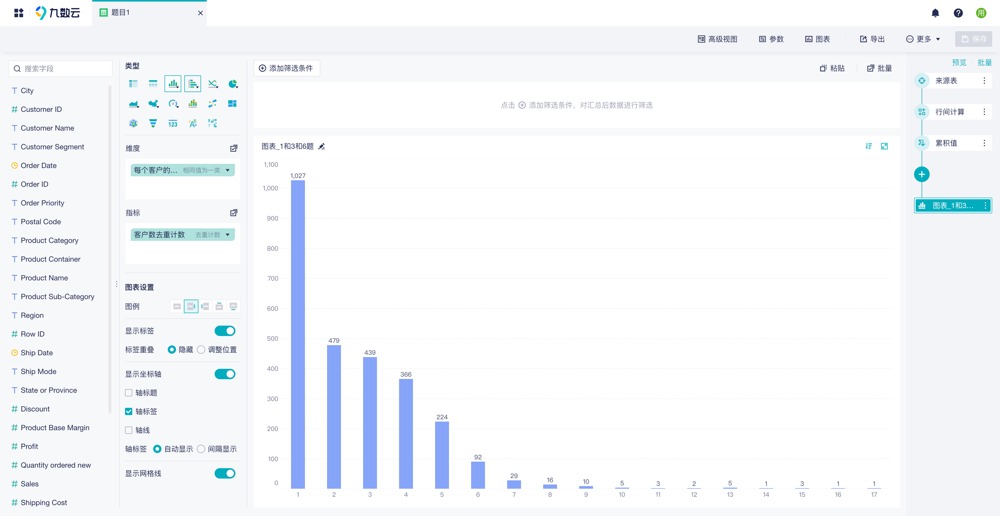

### 题目2

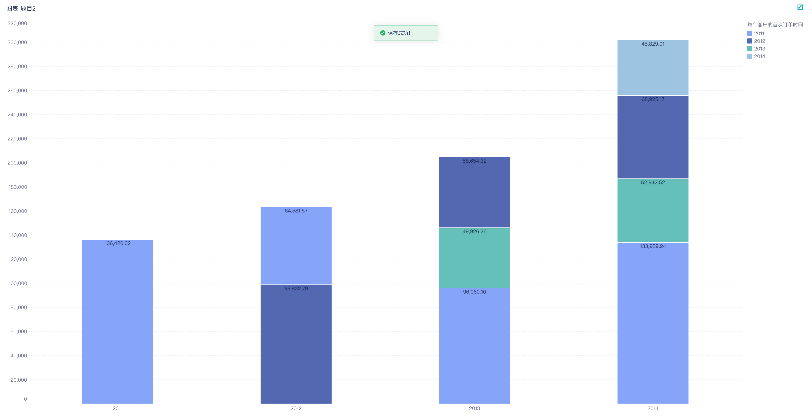

### 题目3

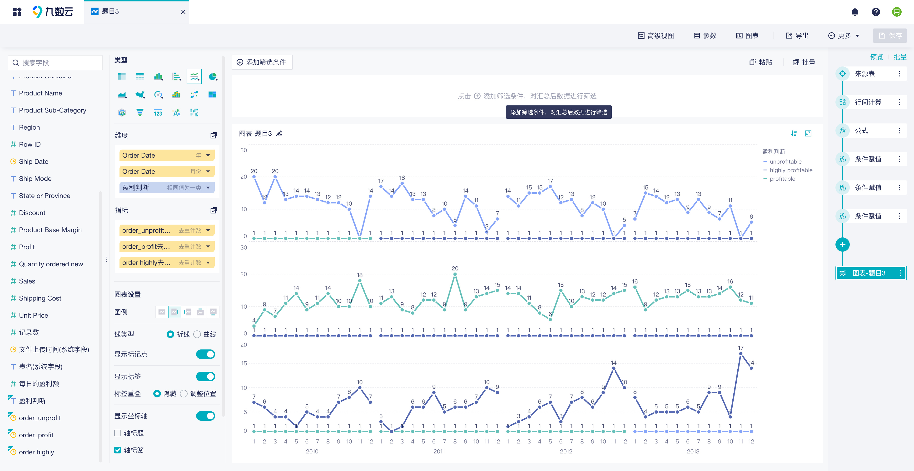

### 题目4

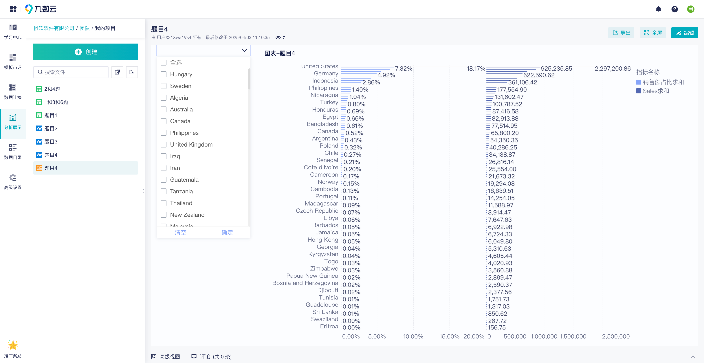

### 题目5

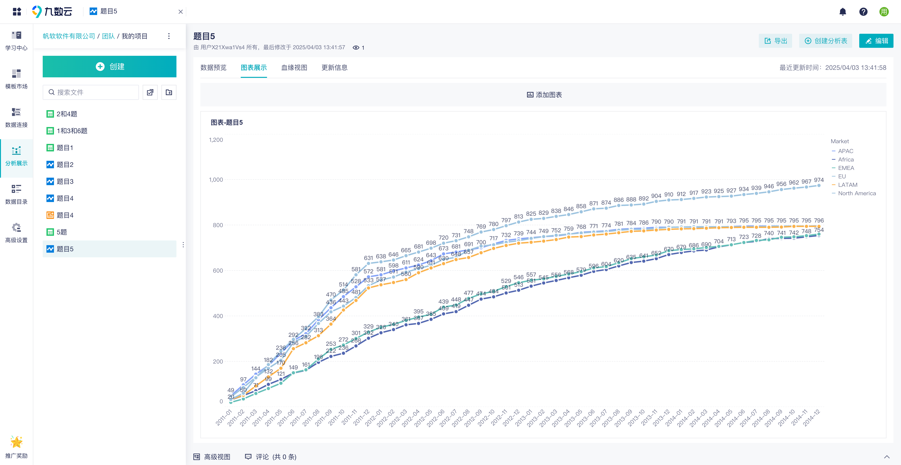

### 题目6

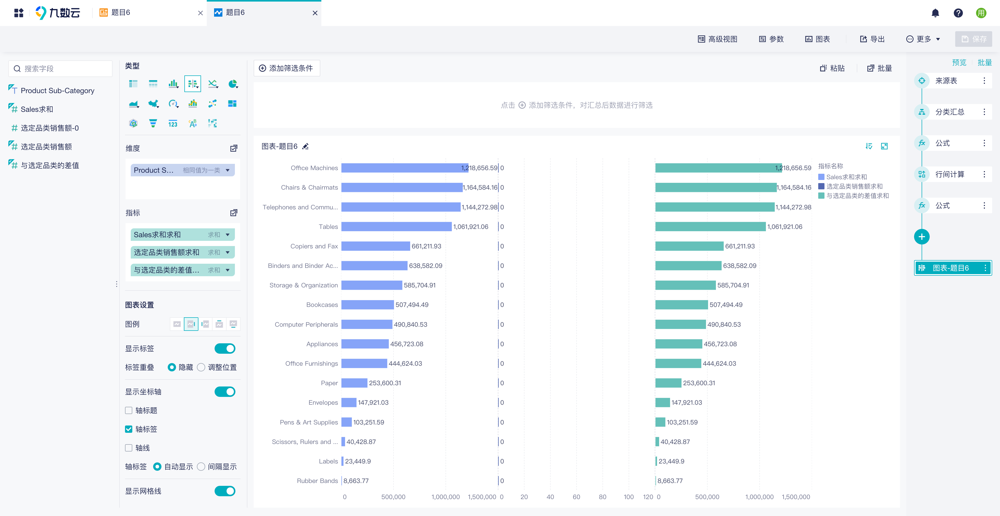

### 题目7

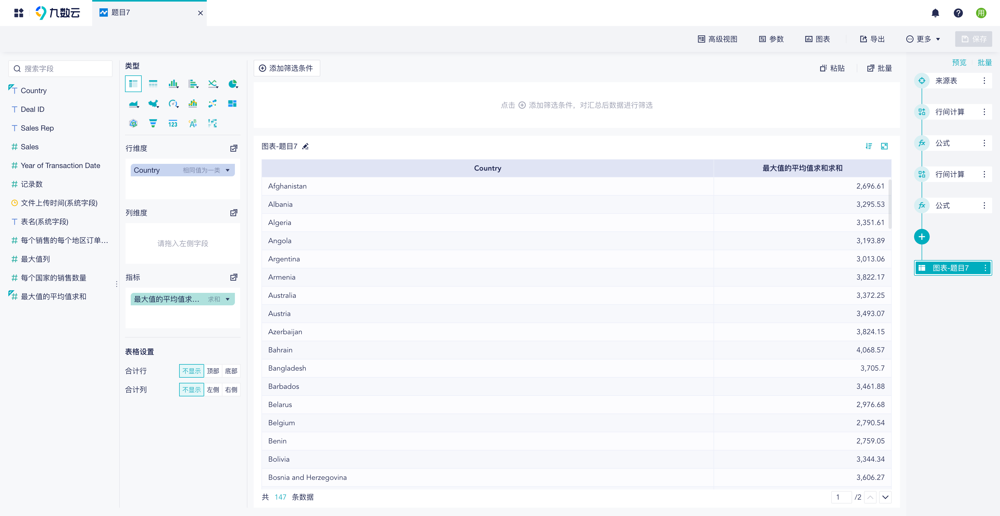

### 题目8

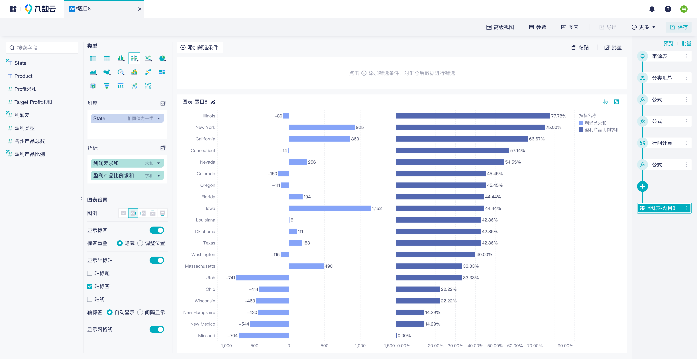

### 题目9

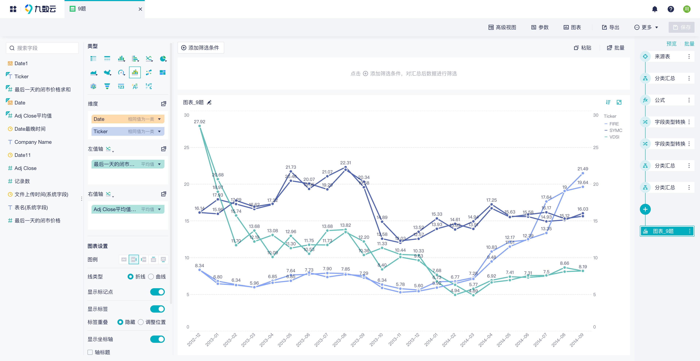

### 题目10

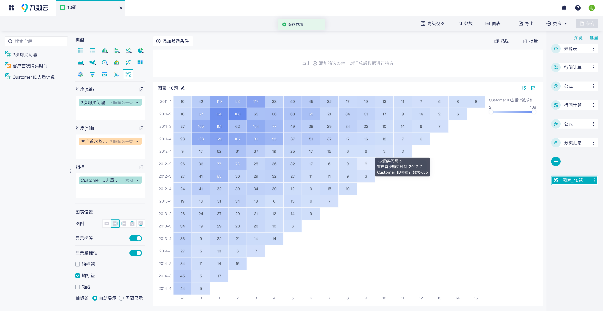

### 题目11

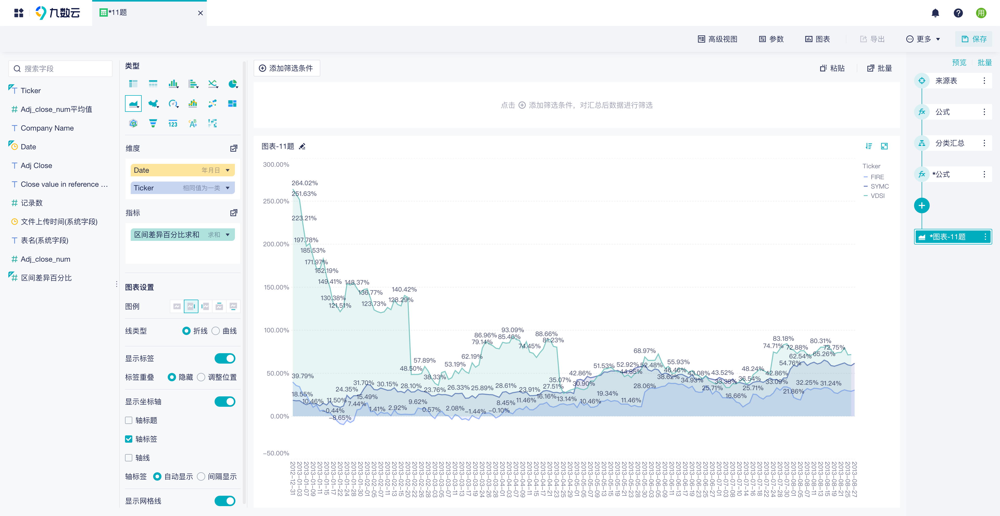

### 题目12

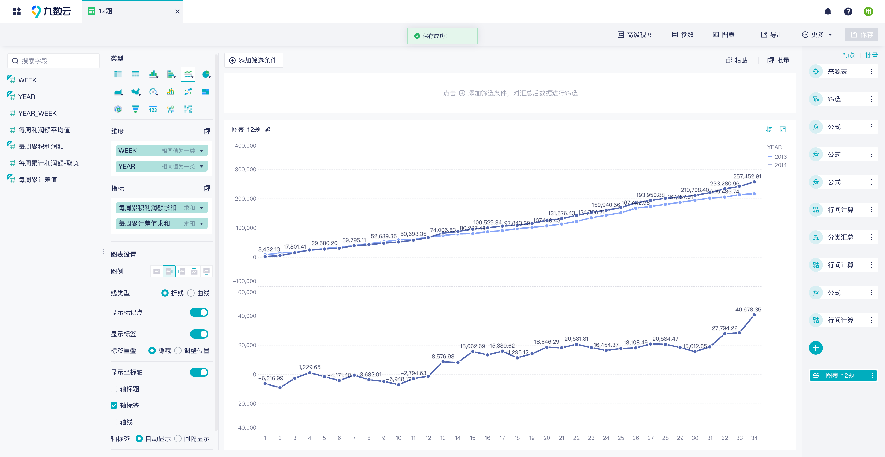

### 题目13

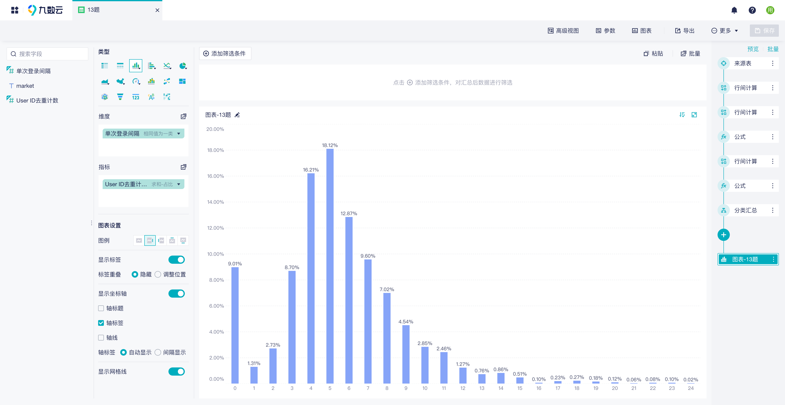

### 题目14

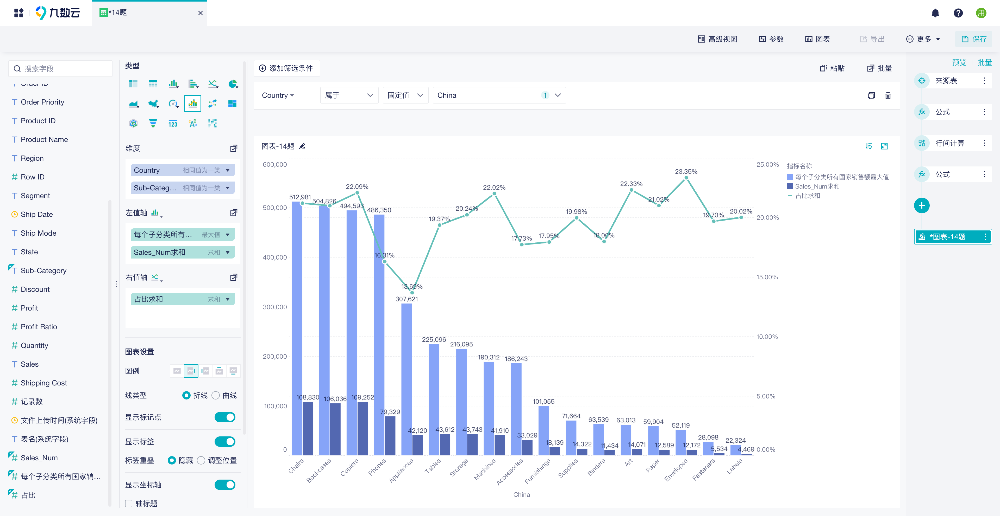

### 题目15

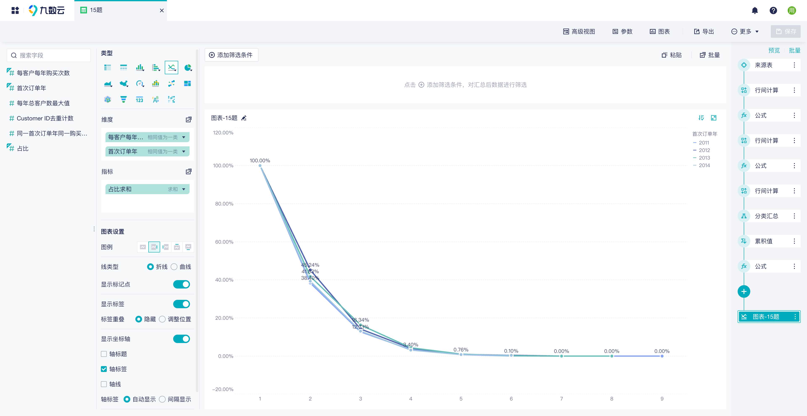

### 参考

* https://kms.fineres.com/pages/viewpage.action?pageId=1244181352
* https://kms.fineres.com/display/DR/LOD15+-+JSY