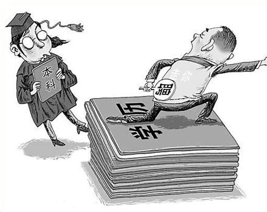

朋友上周约我喝酒，开口就扔了个重磅消息：他们组有裁员名额，N+3赔偿，他在考虑主动申请。这个毕业于985院校硕士，以校招生身份加入大厂某团队，近三年却始终未能获得晋升机会，在业务萎缩的部门里，连最基本的薪资涨幅都成了奢望。这种困境我太熟悉了。去年七月我离开杭州时，工牌上同样定格在入职时的职级，涨薪、股票成为奢望。

如果按照常规升学路径：6岁入学→23岁本科→26岁硕士。互联网有所谓"35岁门槛"，意味着职业生涯黄金期被压缩到不足十年。在互联网行业，超过2年未晋升的员工，跳槽时议价能力会断崖式下跌——这个残酷的生存法则，正在批量制造28岁以上的"职场新鲜人"。

所以，我是非常不推荐打算就业的同学攻读国内的三年制硕士，很可能遇到毕业工作不到五年即将失业的处境。

