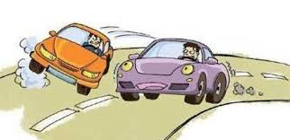

今天早上，亲历两件潜在的严重交通事故：

1. 前方的特斯拉正常以时速大约65km/h行驶，对向车道突然有辆车从我的盲区以很快的速度掉头，速度快到有点甩尾。特斯拉被吓得打方向盘，整辆车“跳”起来了。

2. 上述发生后不久，我正常行驶，车况良好，速度75km/h左右，右侧靠边停车着双闪的某辆车开始向左变道，我大力摁喇叭，这辆车充耳不闻，缓缓变道。吸取特斯拉的经验，我只踩刹车，并没有随意变动方向盘，以防后车反应不及。所幸，距离它不到五米刹住了车。我赶上去，发现这辆车是要左转，是一位女士在开车，她正在忙着控制手机导航/回消息。

::: important
很多人是没有安全驾驶的意识，他们不适合开车。
:::