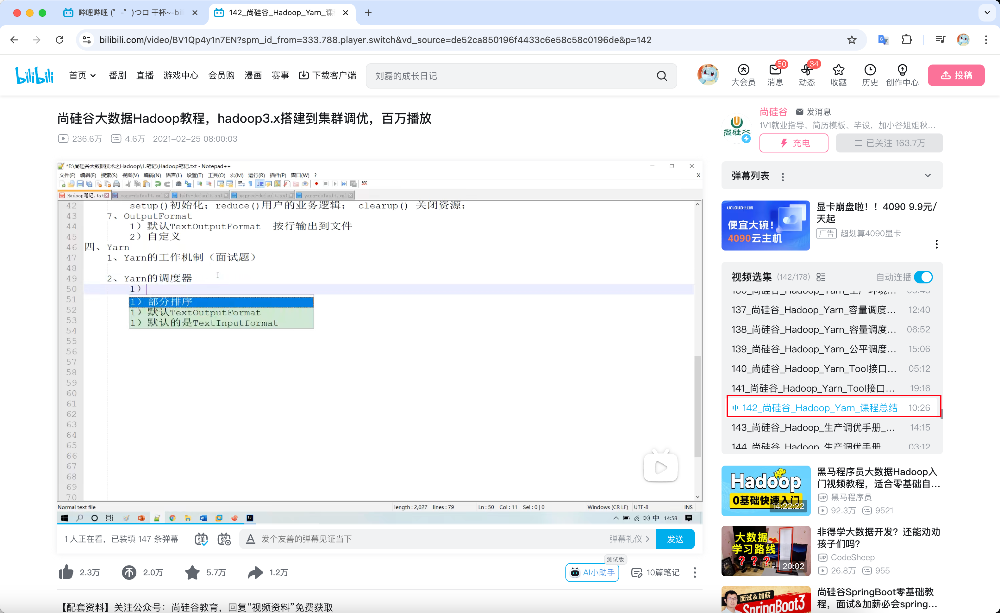

<!-- more -->

## 2025-04-14 Tech Time

### 微软 CEO：AI Agent 替代 Sass ？
::: info
https://officechai.com/stories/saas-applications-will-collapse-in-the-ai-agent-era-microsoft-ceo-satya-nadella/
:::

### Dify + OpenRouter + k8s：快速搭建准生产环境的LLM应用开发平台
::: info
https://www.ifb.me/zh/blog/ai/difyopenrouterk8s-ku
:::

### RAG 快速入门：30 分钟手把手教你实现 ChatPDF
::: info
https://www.ifb.me/zh/blog/zh/ai/rag-kuai-su-ru-men-3
:::

### 一文看懂：MCP(大模型上下文协议)

::: info

https://zhuanlan.zhihu.com/p/27327515233

MCP 协议

:::

### 在线分析 GC、Heap Dump 的开源软件

::: info

https://github.com/eclipse-jifa/jifa

:::

### MODE 数据分析

::: info

https://mode.com/

:::

## 其他

数据分析通过尚硅谷入门：

Hadoop 看到 P142，暂时够用了

Spark 跳过P72-80，案例不看了