# 前言

在企业系统中，设计合理的数据库访问层可以对整体应用程序性能产生重大影响。根据 AppDynamics3 的数据，超过一半的应用程序性能瓶颈源于数据库。数据分布在各种结构（表行、索引节点）中，数据库记录可以被多个并发用户读取和写入。从并发的角度来看，这是一个极具挑战性的任务，为了最大限度地发挥持久层的作用，数据访问逻辑必须与底层数据库系统相匹配。

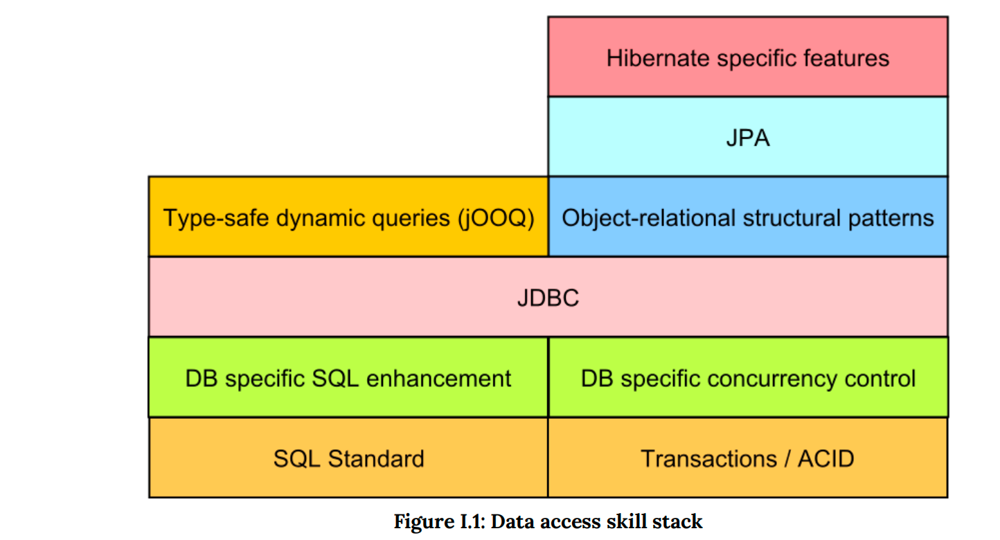


典型的关系数据库管理系统（RDBMS）数据访问层需要掌握多种技术，而整个企业解决方案的强度取决于团队中最薄弱的技能。在深入到更高抽象层（例如对象关系映射（ORM）框架）之前，最好先攻克底层技术。

## 数据库服务器和连接层

数据库手册并非仅供数据库管理员使用。在不了解数据库工作原理的情况下与其交互，就像驾驶赛车却不接受任何驾驶培训一样。熟悉 SQL 标准和数据库特有的功能，能够决定应用程序的运行速度是高性能还是慢如蜗牛。对数据库可移植性的担忧可能会导致人们因为某些功能在不同数据库系统之间无法互换而放弃使用它们。实际上，数据库层运行缓慢的情况比将一个正在运行的系统移植到新的数据库解决方案更为常见。

所有数据访问框架都依赖 JDBC（Java 数据库连接）API 与数据库服务器通信。JDBC 提供了许多性能优化技术，旨在缩短事务响应时间并处理更多流量。因此，本书的第一部分专门介绍 JDBC 和数据库基础知识，涵盖数据库连接管理、语句批处理、结果集获取和数据库事务等主题。

## 应用数据访问层

许多企业应用场景中都证明了某些数据访问模式的有效性。Martin Fowler 的《企业应用架构模式》是每位企业应用开发人员的必读之作。除了对象关系映射 (ORM) 模式之外，大多数 ORM 框架还采用了诸如工作单元 (Unit of Work)、身份映射 (Identity Map)、延迟加载 (Lazy Loading)、嵌入值 (Embedded Value)、实体继承 (Entity Inheritance) 或乐观锁和悲观锁等技术。


### ORM框架

ORM工具可以提升应用程序的开发速度，但其学习曲线无疑十分陡峭。要解决将关系数据与应用程序领域模型桥接起来的固有复杂性，唯一的方法就是完全理解所使用的ORM框架。

有时，即使是参考文档也可能不够，当遇到性能相关问题时，熟悉源代码是不可避免的。JPA（Java持久化API）在数据写入方面表现出色，因为所有DML（数据操作语言）语句都会在持久化模型更改时自动更新，从而加快迭代开发过程。

本书第二部分介绍了各种Hibernate特有的优化技术，例如标识符生成器、高效的实体获取、状态转换、应用程序级事务和实体缓存。

### 本地查询构建框架

JPA 和 Hibernate 从来不是用来替代 SQL 的，并且在任何非平凡的企业应用中，本地查询都是不可避免的。虽然 JPA 可以抽象 DML 语句和常见的实体检索查询，但在读取和处理数据时，没有什么可以胜过本地 SQL。

JPQL（Java 持久化查询语言）抽象了大多数关系型数据库支持的常见 SQL 语法。因此，JPQL 无法利用窗口函数、公共表表达式、派生表或 PIVOT。

与 JPA 不同，jOOQ（Java 面向对象查询）提供了类型安全的 API，它支持底层数据库系统提供的任何数据库特定查询功能。正如 Criteria API 在动态生成实体查询时能防止 SQL 注入攻击一样，jOOQ 在构建本地 SQL 语句时也提供了相同的安全保障。

因此，本书的第三部分是关于高级查询的。

::: info

关于数据库性能基准测试

本书中穿插了一些基准测试，旨在展示特定性能优化带来的相对收益。基准测试结果始终取决于底层硬件、操作系统和数据库服务器配置、数据库大小以及并发模式。因此，绝对值不如相对优化收益重要。实际上，最相关的基准测试结果是针对实际生产系统进行的测试。

为了防止读者将不同数据库进行比较，并基于某些特定用例的基准测试得出错误的结论，数据库名称已进行混淆处理，分别以 DB_A、DB_B、DB_C 和 DB_D 表示。本书中使用的所有示例的源代码均可在 GitHub 上找到。

::: 

# JDBC 和数据库基础知识


# 1. 性能与扩展

企业应用程序需要尽可能快速地存储和检索数据。在应用程序性能管理中，响应时间和吞吐量是两个最重要的指标。响应时间越短，应用程序的响应速度就越快。因此，响应时间是衡量性能的指标。扩展性是指在增加系统负载的同时保持较低的响应时间，因此，吞吐量是衡量可扩展性的指标。

1.1 响应时间和吞吐量

由于本书侧重于高性能数据访问，因此被测系统的边界位于事务管理器级别。

事务响应时间是指完成一个事务所需的时间，因此它包含以下时间段：

• 获取数据库连接的时间

• 通过网络发送所有数据库语句所需的时间

• 执行所有传入语句所需的时间

• 将结果集发送回数据库客户端所需的时间

• 在释放数据库连接之前，由于应用程序级计算而导致事务空闲的时间

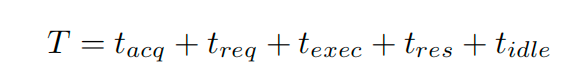


吞吐量定义为完成传入负载的速率。在数据库上下文中，吞吐量可以计算为在给定时间间隔内执行的事务数量。

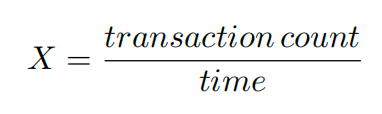


根据这个定义，我们可以得出结论：通过缩短事务执行时间，系统可以处理更多请求。

在单数据库连接测试中，测得的吞吐量将成为进一步基于并发性改进的基准。

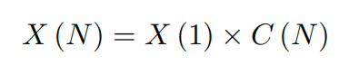


理想情况下，如果系统呈线性扩展，增加数据库连接数将带来成比例的吞吐量提升。然而，由于数据库资源争用以及维护多个并发数据库会话间数据一致性的成本，相对吞吐量提升并非呈线性关系，而是呈曲线关系。通用可扩展性定律 (USL)¹ 可以近似表示最大相对吞吐量（系统容量）与负载生成器（数据库连接数）之间的关系。

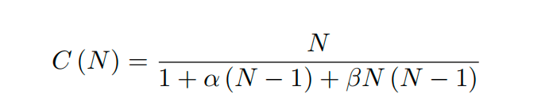

• C - 给定并发级别的相对吞吐量增益
• α - 争用系数（数据处理例程的可串行化部分）
• β - 一致性系数（在所有并发数据库会话中保持一致性的成本）。


::: info
在 PostgreSQL 9.2 版本之前，预编译语句的规划和编译完全在准备阶段完成，因此执行计划是在没有实际绑定参数值的情况下生成的。虽然这种策略旨在节省数据库资源，但它对数据倾斜非常敏感。从 PostgreSQL 9.2 版本开始，准备阶段仅解析和重写语句，而优化和规划阶段则延迟到执行阶段。这样，重写的语法树会根据实际绑定参数值进行优化，从而生成最优的执行计划。

对于单次执行，普通语句只需要一次数据库往返，而预编译语句则需要两次（一次准备请求和一次执行调用）。为了避免网络开销，默认情况下，JDBC PreparedStatement 会在一次数据库请求中完成准备和执行两个阶段。

客户端预编译语句必须至少运行 5 次，驱动程序才能将其转换为服务器端语句。默认执行次数由 prepareThreshold 参数指定，该参数可通过连接属性或驱动程序特定的 API 进行配置。

经过多次执行后，如果性能对绑定参数值不敏感，优化器可能会将执行计划转换为通用计划并缓存以供重用。
:::

::: info
MySQL 在准备语句时，MySQL 解析器会生成一个语法树，并通过解析机制对其进行进一步验证和预优化。该语法树会经历若干数据不敏感的转换，最终输出为一个永久树。自 MySQL 5.7.4a 起，所有永久转换（例如重连接顺序或子查询优化）都在准备阶段完成，因此执行阶段仅应用数据敏感的转换。MySQL 不缓存执行计划，因此每个语句的执行都会针对当前的绑定参数值进行优化，从而避免数据倾斜问题。

由于一些未解决的问题，自 5.0.5b 版本起，MySQL JDBC 驱动程序仅模拟服务器端预处理语句。要切换到服务器端预处理语句，必须将 useServerPrepStmts 和 cachePrepStmts 连接属性都设置为 true。

启用此功能之前，最好查看最新的 Connector/J 发行说明，并确认此功能可以安全使用。
:::

## 4.4 客户端语句缓存

缓存语句不仅对数据库端有益，JDBC 驱动程序也可以重用已构建的语句对象。客户端语句缓存的主要目标可以概括如下：

• 减少客户端语句处理，从而缩短事务响应时间。
• 通过回收语句对象及其关联的数据库特定元数据来节省应用程序资源。

在高性能 OLTP 应用中，事务往往非常短，因此即使响应时间略有减少，也能对整体事务吞吐量产生影响。

::: info

Oracle 隐式语句缓存

与服务器端计划缓存不同，客户端缓存仅限于数据库连接。由于 SQL 字符串会成为缓存条目键，因此 PreparedStatement 和 CallableStatement 语句更容易被重用。因此，Oracle JDBC 驱动程序仅支持这两种语句类型的缓存。启用缓存（默认禁用）后，驱动程序会返回一个逻辑语句，因此当客户端关闭连接时，该逻辑语句会返回缓存。

从开发角度来看，存在隐式语句缓存机制以及显式缓存机制。两种缓存选项共享相同的驱动程序存储空间，需要根据当前应用程序的需求进行配置。

隐式缓存只能存储语句元数据，这些元数据在每次执行之间不会改变。虽然可以为每个连接单独设置，但在数据源级别进行配置更为方便（所有连接继承相同的缓存属性）。

connectionProperties.put("oracle.jdbc.implicitStatementCacheSize", Integer.toString(cacheSize));
dataSource.setConnectionProperties(connectionProperties);

设置 implicitStatementCacheSize 也会启用缓存。默认情况下，所有正在执行的语句都会被隐式缓存，但这可能并非理想之选（某些偶尔执行的查询可能会清除其他频繁执行的语句）。为了控制语句缓存策略，JDBC 定义了 isPoolable() 和 setPoolable(boolean poolable) 语句方法：

if (statement.isPoolable()) {
  statement.setPoolable(false);
}

:::


::: info
Oracle 显式语句缓存

显式缓存是可配置的，并通过 Oracle 特定的 API 管理。在使用它之前，必须使用底层的 OracleConnection 引用启用并调整其大小。

        OracleConnection oracleConnection = (OracleConnection) connection;
        oracleConnection.setExplicitCachingEnabled(true);
        oracleConnection.setStatementCacheSize(cacheSize);

在使用显式缓存时，数据访问会控制哪些语句可以被缓存，因此不再需要使用 setPoolable(boolean poolable) 方法。以下示例演示了如何利用显式缓存机制。

        PreparedStatement statement = oracleConnection
                .getStatementWithKey(SELECT_POST_REVIEWS_KEY);
        if (statement == null)
            statement = connection.prepareStatement(SELECT_POST_REVIEWS);
        try {
            statement.setInt(1, 10);
            statement.execute();
        } finally {
            ((OraclePreparedStatement) statement).closeWithKey(SELECT_POST_REVIEWS_KEY);
        }

显式缓存依赖于两种主要操作，可以总结如下：
1. getStatementWithKey(String key) 方法从缓存中加载语句。如果未找到条目，则必须使用标准 JDBC API 手动创建 PreparedStatement
2. closeWithKey(String key) 方法将语句推回到池中。


特定于供应商的 API 将数据访问代码与 Oracle 特定的 API 绑定，这会阻碍可移植性，并且在兼容多种数据库系统时需要更复杂的数据访问逻辑。

除了缓存元数据之外，显式缓存还存储执行状态和数据。尽管重用更多的客户端构造可能进一步提高性能，但这种策略存在将先前和当前执行上下文混合的风险，因此建议谨慎使用。

:::


::: info

SQL Server

虽然 Microsoft SQL Server JDBC 驱动程序定义了 disableStatementPooling 属性，但截至撰写本文时（4.2 版本），语句缓存无法启用。另一方面，jTDS（开源的 JDBC 3.0 实现）提供基于每个连接的语句缓存。作为 JDBC 4.0 特定的 API，setPoolable(boolean poolable) Statement 方法在 1.3.1 版本的 jTDS 中未实现。缓存的默认大小为 500 条目，也可以调整。

        ((JtdsDataSource) dataSource).setMaxStatements(cacheSize);

即便 jTDS 一直专注于性能，与 Microsoft 驱动程序相比，缺乏稳定的发布计划仍是一个主要缺点。

:::


::: info

PostgreSQL

自 PostgreSQL JDBC 驱动 9.4-1202a 版本起，客户端的语句会被缓存，并且其关联的服务器端语句键即使在初始 PreparedStatement 关闭后也会被保留。只要当前连接缓存中包含指定的 SQL 语句，客户端的 PreparedStatement 和服务器端对象都可以被重用。setPoolable(boolean poolable) 方法无效，并且无法在每个语句的基础上禁用缓存。语句缓存由以下连接属性控制：• preparedStatementCacheQueries - 每个数据库连接缓存的语句数量。值为 0 时禁用缓存，并且在 PreparedStatement 关闭后，服务器端准备语句将不再可用。默认值为 256。• preparedStatementCacheSizeMiB - 语句缓存有上限内存，默认值为 5 MB。值为 0 时禁用缓存。这些属性既可以作为连接参数设置，也可以作为 DataSource 属性设置：

        ((PGSimpleDataSource) dataSource).setPreparedStatementCacheQueries(cacheSize);
        ((PGSimpleDataSource) dataSource).setPreparedStatementCacheSizeMiB(cacheSizeMb);

:::


::: info

MySQL

语句缓存与数据库连接相关，并适用于所有正在执行的语句。在 5.1.36 版本的 Connector/J 驱动程序中，setPoolable(boolean poolable) 方法只能禁用服务器端语句的缓存，客户端语句不受此设置影响。客户端语句缓存可以使用以下属性进行配置：
• cachePrepStmts - 启用客户端语句缓存以及服务器端语句有效性检查。默认情况下，语句缓存是禁用的。
• prepStmtCacheSize - 为每个数据库连接缓存的语句数量。默认缓存大小为 25。• prepStmtCacheSqlLimit - 允许缓存的 SQL 语句的最大长度。默认最大值为 256。

这些属性既可以作为连接参数设置，也可以在 DataSource 级别设置：

        ((MysqlDataSource) dataSource).setCachePrepStmts(true);
        ((MysqlDataSource) dataSource).setPreparedStatementCacheSize(cacheSize);
        ((MysqlDataSource) dataSource).setPreparedStatementCacheSqlLimit(maxLength);
:::


# 5 结果集获取

在讨论了 SQL 语句优化（批处理和缓存）之后，现在是时候关注查询处理的响应部分了。与仅返回受影响行数的 INSERT、UPDATE 和 DELETE 语句不同，JDBC SELECT 查询返回的是一个 ResultSet。

数据库执行器接收执行计划并将数据提取到结果集中。行可以一次性提取，也可以在数据库客户端请求时提取。

SQL 标准通过以下属性定义了结果集和游标描述符：

• 可滚动性（结果集的迭代方向）

• 敏感性（何时提取数据）

• 可更新性（适用于游标，允许客户端在遍历结果集时修改记录）

• 可持有性（结果集在事务生命周期中的作用范围）。


遵循标准规范，JDBC ResultSet 支持以上所有属性。

| 属性名称 | 描述 |
|---------|------|
| TYPE_FORWARD_ONLY | 结果集只能从第一个元素到最后一个元素进行迭代。这是默认的滚动性值。 |
| TYPE_SCROLL_INSENSITIVE | 结果集在加载时会生成一个快照，可以向前和向后迭代。 |
| TYPE_SCROLL_SENSITIVE | 结果集在迭代过程中按需获取，没有任何方向限制。 |
| CONCUR_READ_ONLY | 结果集只是一个静态数据投影，不允许行级操作。这是默认的可更改性值。 |
| CONCUR_UPDATABLE | 可以使用光标位置更新或删除记录，甚至插入新记录。 |
| CLOSE_CURSORS_AT_COMMIT | 当当前事务结束时，结果集将被关闭。 |
| HOLD_CURSORS_OVER_COMMIT | 即使当前事务已提交，结果集仍保持打开状态。 |


## 5.1 结果集的可滚动性

JDBC 结果集可以使用应用程序级游标进行遍历。因此，数据获取机制隐藏在迭代器 API 之后，从而将应用程序代码与数据检索策略解耦。一些数据库驱动程序会在客户端预取整个结果集，而其他实现则会按需检索一批数据。

默认情况下，结果集使用仅向前遍历的应用程序级游标，该游标只能从第一个位置遍历到最后一个位置一次。虽然这对于大多数应用程序来说已经足够，但 JDBC 也提供了可滚动游标，因此允许行级指针自由定位（可以沿任意方向遍历每个记录）。

两种可滚动结果集的主要区别在于它们的选择性。不敏感游标提供当前结果集的静态视图，因此数据需要在迭代之前完全获取。敏感游标允许动态获取结果集，以便反映并发更改。

::: info
Oracle

由于数据库引擎不支持可滚动结果集，JDBC 驱动程序通过客户端缓存机制模拟滚动结果集。因此，结果集不宜过大，否则很容易耗尽客户端应用程序的内存。
::: 


::: info
SQL Server

支持所有三种游标类型。不敏感滚动会生成服务器端数据库快照，客户端分批获取该快照。敏感滚动使用服务器端可更新窗口，并且仅在当前处理窗口内同步更改。
:::

::: info
PostgreSQL
默认情况下，结果集会被完整获取并缓存在客户端。仅支持前向滚动和不敏感滚动。对于大型结果集，一次性获取所有记录可能会给数据库服务器资源和客户端内存带来巨大压力。为此，PostgreSQL 允许将结果集与数据库游标关联，以便按需获取记录。

PreparedStatement statement = connection.prepareStatement(

"SELECT title FROM post WHERE id BETWEEN ? AND ?"

);

statement.setFetchSize(100);

只有前向只读结果集类型才能利用数据库端游标，并且语句提取大小必须设置为正整数值。
:::

::: info
MySQL
即使显式指定了前向只读结果集，也仅支持不敏感滚动类型。默认情况下，驱动程序会检索整个结果集并将其缓存在客户端。

如果语句类型同时是前向只读和只读，并且提取大小值设置为 Integer.MIN_VALUE，则可以流式传输大型结果集。这样，在迭代结果集时，每一行都会被单独提取，这可能会导致多次数据库往返。此外，在流关闭之前，连接无法执行任何其他语句。

PreparedStatement statement = connection.prepareStatement(

“SELECT title FROM post WHERE id BETWEEN ?” AND ?”

);

statement.setFetchSize(Integer.MIN_VALUE);

另一种方法是将 useCursorFetchb Connection 属性设置为 true，然后将 Statement 的提取大小设置为一个正整数值，表示一次需要提取的记录数。

statement.setFetchSize(100);

:::

## 5.2 结果集的可变更性

默认情况下，结果集只是底层数据投影的只读视图。受数据库游标的启发，JDBC 标准提供了可更新的结果集，因此数据访问逻辑可以在迭代应用程序级游标的同时修改记录。

将读取和写入逻辑混合到单个数据库事务中，让人联想到两层架构，在两层架构中，即使在用户思考时间内持有结果集也是常见且可以接受的。

对于 Web 应用程序，请求应该尽可能短，并且大多数应用程序级事务跨越多个 Web 请求。前一个请求可能使用只读数据库事务来获取数据并将其呈现给用户，而后一个请求可能使用读写事务来应用数据修改。在这种情况下，可更新的结果集几乎没有用处，尤其是在多个请求中保持其打开状态（以及底层数据库连接）会严重影响应用程序的可扩展性。

以下测试用例验证了只读且仅向前的游标是否比敏感且可更新的游标性能更好。该测试执行 10000 条语句，获取 100 篇帖子及其详细信息和 1000 条相关评论。

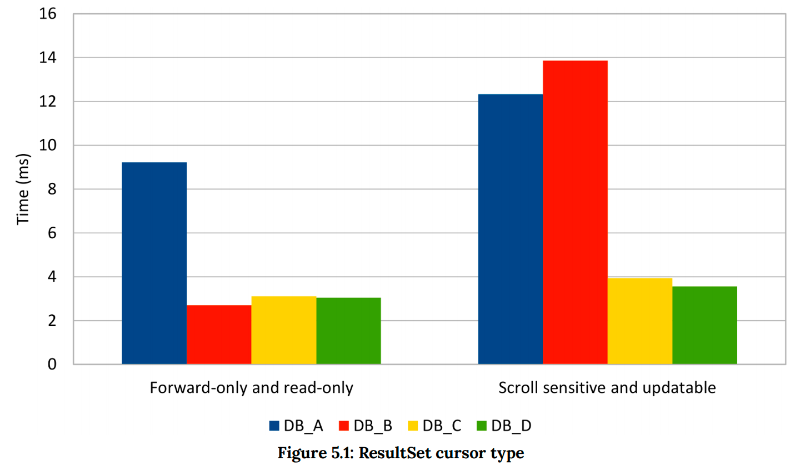

所有受测数据库系统在使用仅前向和只读结果集时均表现出轻微的性能提升。


## 5.3 结果集保持性

JDBC 3.0 版本增加了对结果集保持性的支持，与滚动性和更新性不同，其默认值取决于具体的实现。

::: info
Oracle
默认且唯一支持的保持性值为 HOLD_CURSORS_OVER_COMMIT。尝试将此设置更改为任何其他值都会引发异常。
:::

::: info
SQL Server
默认情况下，即使当前事务已提交或回滚，结果集仍保持打开状态。SQL Server 也支持 CLOSE_CURSORS_AT_COMMIT 设置。
:::

::: info
PostgreSQL
与其他数据库系统不同，其默认保持性值为 CLOSE_CURSORS_AT_COMMIT，但驱动程序也支持 HOLD_CURSORS_OVER_COMMIT 设置。
:::

:::
MySQL
默认且唯一支持的保持性值为 HOLD_CURSORS_OVER_COMMIT。

在典型的企业应用中，数据库连接会在事务之间重复使用，因此在事务结束后保留​​结果集存在风险。根据底层数据库系统和游标类型的不同，结果集可能会占用系统资源，出于可扩展性的考虑，这些资源需要尽快释放。

虽然并非所有数据库引擎都支持 `CLOSE_CURSORS_AT_COMMIT` 选项，但只需关闭所有已获取的结果集及其关联的 `Statement` 对象即可达到相同的效果。
::: info


## 5.4 提取大小

JDBC ResultSet 充当应用程序级游标，因此每次遍历语句时，结果都必须从数据库传输到客户端。传输速率由语句提取大小控制。

statement.setFetchSize(fetchSize);

自定义提取大小可以提示驱动程序在单次数据库往返中需要检索的行数。

默认值为 0，这意味着每个数据库都可以选择其驱动程序特定的提取策略。

::: info
Oracle

由于 JDBC 驱动程序的内存模型，默认提取大小设置为 10 条记录。Oracle 10i 和 11g 驱动程序在语句创建时预分配一个 byte[] 和一个 char[] 缓冲区，其长度由提取大小乘以每个选定列的最大内存占用量得出。VARCHAR2(N) 列最多可以容纳 N 个字节。将最大长度为 5 个字符的字段存储到 VARCHAR2(4000) 列中会在客户端预分配 4000 字节，这无疑会浪费内存。

通过重用现有缓冲区来避免内存分配，是采用语句缓存的一个非常重要的理由。只有在使用隐式语句缓存时，10i 和 11g 驱动程序才能从回收客户端内存缓冲区中获益。

12c 实现将缓冲区分配延迟到结果集准备好进行提取时。此驱动程序版本使用两个 byte[] 数组，并采用延迟分配的方式。与之前的版本相比，12c 的内存占用大大减少，因为驱动程序不再分配最大可能的数据存储空间，而是使用实际提取的数据大小。

尽管最佳提取大小取决于应用程序，并受数据大小和运行时环境并发拓扑结构的影响，但 Oracle JDBC 驱动程序规范建议将提取大小限制在最多 100 条记录。与其他任何性能优化一样，这些建议充其量只是参考，衡量应用程序性能才是找到合适提取大小的唯一可行方法。
:::

::: info

SQL Server

SQL Server JDBC 驱动程序使用自适应缓冲，因此结果集会根据需要分批提取。因此，批次大小由驱动程序自动控制。

虽然默认情况下启用自适应缓冲，但它仅限于只读和前向游标。可滚动和可更新的结果集都基于单个数据块进行操作，该数据块的长度由当前语句的提取大小决定。
:::

::: info
PostgreSQL

整个结果集一次性加载到客户端内存中。默认的加载大小只需要一次数据库往返，但会增加驱动程序的内存消耗。通过更改加载大小，结果集会与数据库游标关联，从而允许按需加载数据。
:::

::: info
MySQL
由于网络协议设计方面的考虑，加载整个结果集是最有效的数据检索策略。唯一的流式选项需要一次处理一行，数据库往返次数由预读缓冲区配置决定。
:::


下图展示了四个数据库系统在加载 10,000 行数据时，随着只前进（forward-only）和只读(read-only)结果集加载大小的变化，响应时间的变化情况。

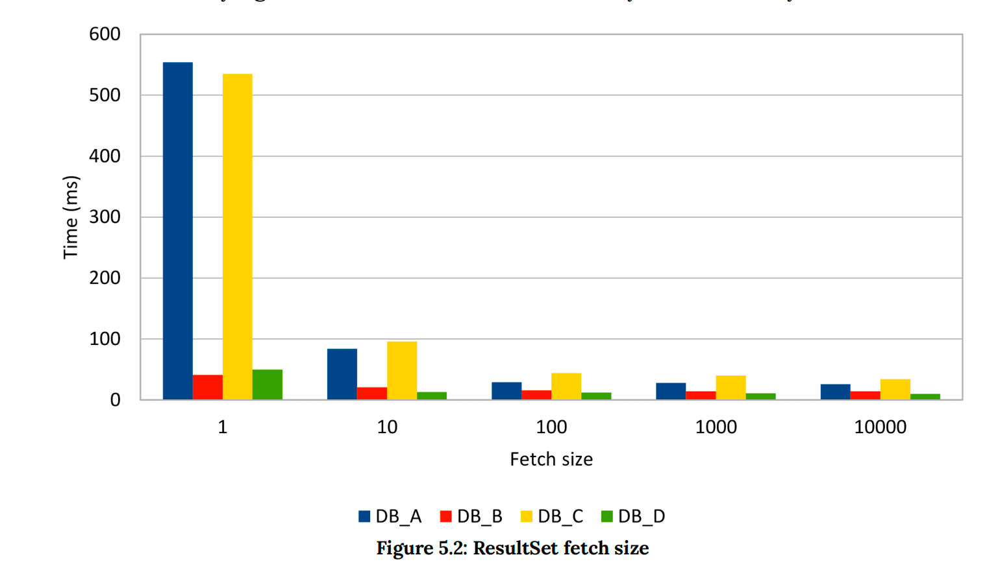

一次加载一行需要 10,000 次往返，网络开销会影响响应时间。最多 100 行时，提取大小在降低检索时间方面起着重要作用（只需 100 次往返），但超过这个点后，收益就不那么明显了。


## 5.5 结果集大小

设置合适的提取大小无疑可以加快结果集检索速度，前提是语句仅提取当前业务逻辑所需的数据。然而，不幸的是，尤其是在 ORM 工具广泛应用的情况下，语句经常会选择超出实际需要的数据。这个问题可能是由于选择了过多的行或列造成的，而这些数据随后会在数据访问层或业务层被丢弃。

5.5.1 行数过多

表往往会不断增长（尤其是在应用程序获得更多用户之后），随着时间的推移，即使是适中的结果集也可能很容易成为性能瓶颈。这些问题通常在生产系统中被发现，而此时应用程序代码早已发布。

用户界面能够容纳的信息量取决于视图允许显示的信息量。因此，如果结果集无法容纳在用户界面中，则提取整个结果集是低效的。分页或动态滚动是解决此问题的常用方法，而对数据集进行分区则变得不可避免。

限制结果集在批处理中也很常见。为了避免长时间运行的事务（这可能会给数据库的撤销/重做日志带来压力），并利用并行执行的优势，批处理处理器会将当前工作负载拆分成更小的作业。这样，一个批处理作业只需处理整个数据的一部分即可。

::: info
当结果集大小受外部因素限制时，选择超出实际需要的数据是没有意义的。

如果不设置上限，结果集会随着底层表数据量成比例增长。庞大的结果集需要更多的时间来提取和传输。

因此，限制查询可以确保可预测的响应时间和数据库资源利用率。查询处理时间越短，行级锁释放得越快，数据访问层的可扩展性就越强。
:::


限制结果集大小的方法主要有两种。

第一种也是最有效的策略是在 SQL 语句中包含行限制子句。这样，优化器就能更好地针对当前结果集大小生成最优执行计划（例如，选择索引扫描而不是表扫描）。

第二种方法是在 JDBC 语句级别配置最大行数。理想情况下，驱动程序可以调整语句，使其包含等效的结果集大小限制（作为 SQL 子句），但大多数情况下，它只是提示数据库引擎使用数据库游标。

#### 5.5.1.1 SQL LIMIT 子句

::: info


SQL:2008

虽然 SQL:2008 增加了对限制结果集大小的支持，但只有从 Oracle 12ca、SQL Server 2012b 和 PostgreSQL 8.4c 开始才支持标准语法。

SELECT pc.id AS pc_id, p.title AS p_title

FROM post_comment pc

INNER JOIN post p ON p.id = pc.post_id

ORDER BY pc_id

OFFSET ? ROWS

FETCH FIRST (?) ROWS ONLY

在 PostgreSQL 数据库中，用括号括起行数占位符是一种变通方法。在 SQL Server 中，无论是否使用括号，此方法都有效。

较旧的数据库版本或其他数据库系统（例如 MySQL 5.7）仍然依赖于特定于供应商的语法来限制结果集的大小。
:::

::: info

Oracle

与其他关系型数据库不同，Oracle 没有用于限制查询结果集的保留关键字，但由于每条记录都分配有一个结果集条目顺序号（由 ROWNUM 虚拟列提供），因此限制结果集的语法如下：

SELECT *
FROM (
SELECT pc.id AS pc_id, p.title AS p_title
FROM post_comment pc
INNER JOIN post p ON p.id = pc.post_id
ORDER BY pc_id
)
WHERE ROWNUM <= ?

:::

::: info

SQL Server

TOP 关键字一直是限制结果集大小的事实标准方法：

SELECT TOP (?) pc.id AS pc_id, p.title AS p_title
FROM post_comment pc
INNER JOIN post p ON p.id = pc.post_id
ORDER BY pc_id

:::

::: info

PostgreSQL 和 MySQL

LIMIT 关键字用于限制结果集的大小上限：

SELECT pc.id AS pc_id, p.title AS p_title
FROM post_comment pc
INNER JOIN post p ON p.id = pc.post_id
ORDER BY pc_id
LIMIT ?

:::


#### 5.5.1.2 JDBC 最大行数

JDBC 规范定义了 `maxRows` 属性，用于限制当前语句的所有结果集 (ResultSet) 的数量。

`statement.setMaxRows(maxRows);`

与 SQL 构造不同，JDBC 的这种替代方案可以在所有驱动程序实现之间移植。

这在应用程序需要支持多个数据库系统时尤其方便。

根据 JDBC 文档，当达到最大阈值时，驱动程序应该丢弃多余的行。

从数据访问性能的角度来看，丢弃多余的行是一种糟糕的策略，因为它会浪费数据库资源（CPU、I/O、内存）以及网络带宽。


::: info

Oracle

当遍历 ResultSet 时，客户端游标会分块提取数据（fetch size 属性控制每个块中的记录数）。

每次新的批次检索后，系统会检查记录总数是否超过 maxRows 上限。如果达到该阈值，驱动程序将关闭网络流。

因此，maxRows 上限可以防止数据库和客户端驱动程序浪费资源来提取客户端不需要的记录。但是，如果 maxRows 值较小，当扫描的数据集较大时，优化器将不会使用索引。

SQL Server

当调用 Statement.setMaxRows(int maxRows) 方法时，驱动程序会调用 SET ROWCOUNT SQL 命令：

SET ROWCOUNT N

与 TOP 或 FETCH SQL 指令不同，ROWCOUNT 命令仅在执行阶段生效，不会影响执行计划的生成。因此，执行计划可能并未针对给定的结果集大小进行优化，所以可能会选择表扫描而不是索引。

SQL Server 文档建议使用 SQL 指令而不是 SET ROWCOUNT 命令。

PostgreSQL

JDBC 驱动程序会获取 maxRows 语句属性并将其与正在执行的查询一起发送。有了此信息，优化器可以选择一个针对给定结果集大小的执行计划，甚至可以避免一些耗时的操作，例如对整个投影进行排序。提取器也可以在提取所需数量的记录后立即关闭数据库游标，从而节省数据库和网络资源。

MySQL
maxRows 属性不会发送到数据库服务器，因此优化器和提取器都无法从中受益。虽然 JDBC 驱动程序通常会提取所有行，但通过设置结果集大小的上限，客户端可以节省一些网络开销。
:::


#### 5.5.1.3 少即是多

以下测试将演示限制结果集大小对性能的提升。测试数据集包含 10 万条帖子和 100 万条评论。在第一轮测试中，系统会获取整个结果集，响应时间与结果集的大小成正比。通过将结果集限制为 100 条记录（无论是使用 SQL 还是 JDBC 的 maxRows 设置），响应时间将显著降低。

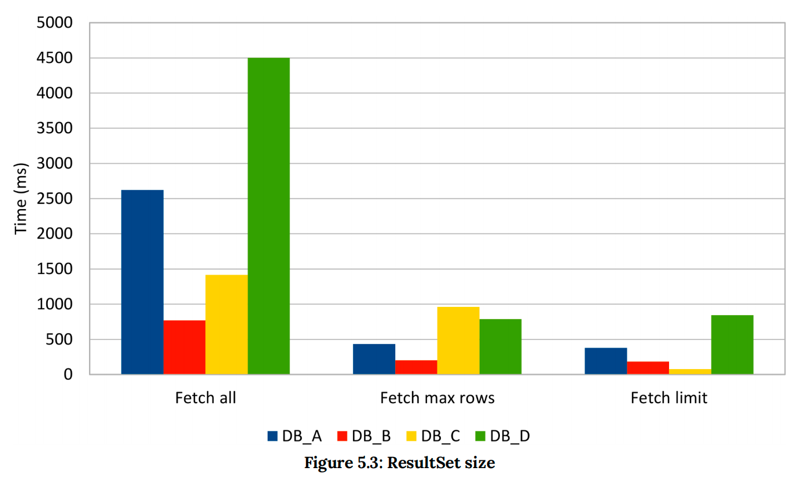


测试结果证实了之前的假设，SQL 层限制被证明是限制结果集的最佳策略。maxRows 驱动程序的实现效果出乎意料地好，尤其是在考虑到 JDBC 规范中关于丢弃多余记录的规定时。获取大型结果集会给数据库资源带来巨大压力，这不仅会影响当前工作单元的处理时间，还会导致其他并发事务的处理时间延长，这是由于数据库资源不足造成的。


### 5.5.2 列数过多

获取过多行不仅会导致性能问题，提取过多列也会增加结果集的处理响应时间。下一个测试用例将使用以下两个语句之一，选择 100 篇帖子及其关联的 1000 条评论：

SELECT *
FROM post_comment pc
INNER JOIN post p ON p.id = pc.post_id
INNER JOIN post_details pd ON p.id = pd.id

SELECT pc.version
FROM post_comment pc
INNER JOIN post p ON p.id = pc.post_id
INNER JOIN post_details pd ON p.id = pd.id

下图展示了获取所有列与仅提取部分列投影的执行时间对比。

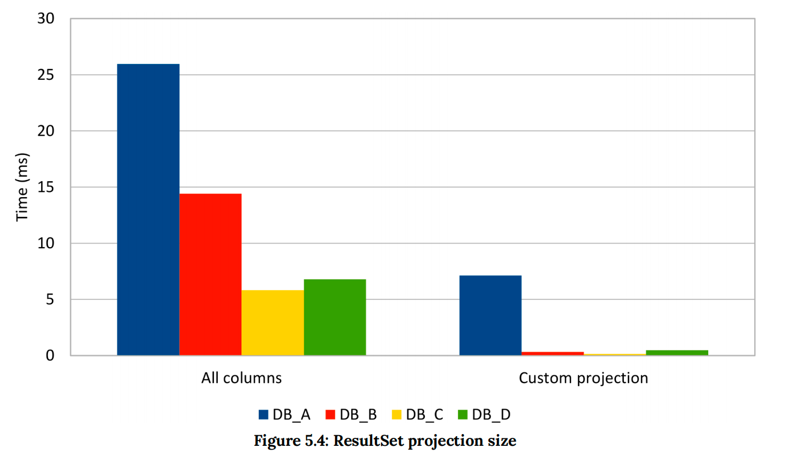

这种情况在 ORM 工具中更为常见，因为要完整填充实体，需要选择所有列。如果只选择少量实体，这可能不会造成明显影响，但对于大型结果集，这可能会演变成一个显著的性能问题。

如果业务需求仅需实体属性的子集，则获取额外的列将浪费数据库和应用程序资源（CPU、内存、I/O、网络）。


# 6. 事务

数据库系统必须允许对底层数据进行并发访问。然而，共享数据意味着读写操作必须同步，以确保数据完整性不受影响。

为了控制并发修改，Java 编程语言定义了 synchronized 关键字，其用途有二：

• 它可以限制对共享对象的访问（以保持不变性），从而确保在任何给定时间只有一个线程可以执行某个例程。

• 它将当前线程本地内存中的更改传播到所有正在运行的线程都可以访问的全局内存。


这种行为在其他并发编程环境中很常见，数据库系统也不例外。在关系数据库中，确保数据完整性的机制是在事务之上实现的。

事务是一组读写操作的集合，这些操作可以作为一个整体同时成功或失败。所有数据库语句都必须在事务上下文中执行，即使数据库客户端没有显式定义事务边界。

1981 年，Jim Gray 在他著名的论文《事务概念：优点和局限性》中首次定义了数据库事务的属性。这篇论文以及 SQL 标准的早期版本（SQL-86 和 SQL-89）都只使用了三个属性来定义数据库事务：原子性、一致性和持久性。

此后，事务研究以及其他关系数据库主题的研究一直在持续进行，因此 SQL-92 版本引入了隔离级别（IL）的概念。这四个特性被组合成著名的 ACID（原子性、一致性、隔离性和持久性）缩写，并很快成为关系数据库事务的代名词。

了解数据库事务的工作原理非常重要，原因有二：
* 有效的数据访问（在追求高性能的同时，不应牺牲数据完整性）

• 高效的数据访问（减少争用可以最大限度地缩短事务响应时间，从而提高吞吐量）。

接下来的章节将详细介绍与高性能数据处理相关的各项事务属性。

## 6.1 原子性

原子性是指将多个操作组合成一个要么全部成功要么全部失败的工作单元的特性，只有当所有单独的操作都成功时，该工作单元才能成功。因此，数据库必须能够回滚与每个已执行语句关联的所有操作。

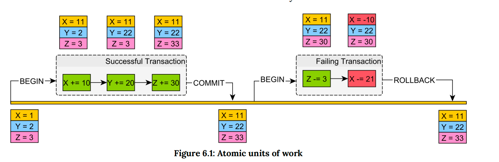


::: info

写-写冲突

理想情况下，每个事务都应该有一个完全隔离的分支，以便在回滚时可以轻松丢弃。这类似于版本控制系统（例如 Git）实现分支的方式。如果发生冲突，虚拟控制系统会中止提交操作，客户端必须手动解决冲突。与版本控制系统工具不同，关系数据库引擎必须在没有任何人工干预的情况下管理冲突。

因此，数据库会防止写-写冲突，并且在任何给定时间只能有一个事务写入记录。

:::

所有语句均针对实际数据结构（表、索引、内存缓冲区）执行，仅在提交时才实际生效。如果发生回滚，数据库必须将所有待处理的已更改数据还原到之前的状态。

::: info

Oracle

撤销表空间将先前的数据版本存储在撤销段中。回滚时，数据库引擎会搜索关联的撤销段，以恢复当前运行事务所更改的每个数据的先前映像。

SQL Server

事务日志存储有关当前运行事务及其关联修改的详细信息。回滚过程会向后扫描事务日志以查找关联的撤销记录。找到记录后，数据库引擎会恢复受影响数据的先前映像。

为防止事务日志被填满，必须定期截断日志。长时间运行的事务会延迟截断过程，因此这也是应尽可能避免长时间运行事务的另一个原因。

PostgreSQL
与其他数据库系统不同，PostgreSQL 不使用专用的仅追加撤销日志。由于其多版本特性，每个数据库对象都维护着自己的版本历史记录。由于没有日志查找阶段，回滚过程变得更加轻量级，因为它只需要从一个版本切换到另一个版本。

缺点是旧版本占用的空间大小有限，因此必须重复利用。回收旧版本占用存储空间的过程称为 VACUUM 清理。

每个事务都有一个关联的 XIDa，新事务的 XID 必须大于所有先前事务的 XID。

事务 XID 是一个 32 位数字，因此可以容纳超过 40 亿个事务。在高性能应用程序中，事务的生命周期非常短，如果禁用 VACUUM 清理，则可能会达到此阈值。当 XID 计数器达到其最大值时，它会循环并从零重新开始计数。

在 XID 回绕之前发起的事务的标识符大于 XID 计数器重置之后发起的新事务的标识符。这种异常情况会导致系统将较旧的事务视为未来发起的事务，从而导致非常严重的数据完整性问题。

MySQL
撤销日志存储在系统表空间的回滚段中。

每个撤销日志分为两个部分，一部分用于回滚，另一部分用于重建回滚前的映像。事务结束后，第一部分可以立即清除，而第二部分则需要保留一段时间，直到当前正在运行的查询或其他并发事务需要查看相关记录的先前版本为止。

在后台，MySQL 会运行一个清除进程，清理已删除记录占用的存储空间，并回收不再需要的撤销日志段。

长时间运行的事务会延迟清除过程的执行，导致撤销日志变得非常大，尤其是在写入密集型数据访问场景中。
:::

## 6.2 一致性

修改事务可以看作是一种状态转换，它将数据库从一个有效状态转移到另一个有效状态。关系数据库模式确保所有主要修改（插入/更新/删除语句）以及次要修改（由触发器发出）都遵循底层数据结构的特定规则：

* 列类型
* 列长度
* 列是否允许为空
* 外键约束
* 唯一键约束
* 自定义检查约束。

一致性是指验证事务状态的变更，确保所有已提交的事务离开数据库时都处于正确的状态。如果违反了任何约束，整个事务将被回滚，所有修改都将被还原。

虽然应用程序必须在编写数据库语句之前验证用户输入，但应用程序级别的检查无法跨越其他并发请求，这些请求可能来自不同的 Web 服务器。当数据库是主要集成点时，严格模式的优势就更加明显了。

::: info

MySQL

传统上，MySQL 的约束并非严格执行，数据库引擎会将无效值替换为预定义的默认值：

* 超出范围的数值会被设置为 0 或最大值。
* 字符串值会被截断至最大长度。
* 允许使用错误的日期/时间值（例如 2015-02-30）。
* NOT NULL 约束仅对单行 INSERT 语句强制执行。对于多行插入，空数值会被替换为 0，空字符串会被替换为 ''。

自 5.0.2 版本起，如果数据库引擎配置为使用自定义 SQL 模式，则可以执行严格的约束：

  SET GLOBAL sql_mode='POSTGRESQL,STRICT_ALL_TABLES';

由于服务器启动时 sql_mode 会重置，因此最好在 MySQL 配置文件中进行设置：

[mysqld]
  sql_mode = POSTGRESQL,STRICT_ALL_TABLES”

:::


::: info

CAP 定理中的一致性

根据 CAP 定理，当分布式系统遇到网络分区时，系统必须在一致性（所有更改立即应用于所有节点）和可用性（任何节点都可以接受请求）之间做出选择，而不能同时选择两者。虽然在 ACID 的定义中，一致性是指遵守约束，但在 CAP 定理的语境下，一致性指的是线性化，这是一种隔离性保证。
:::

## 6.3 隔离

如果只有一个用户访问数据库，则不会出现数据冲突的风险。根据通用可扩展性定律，如果数据访问模式的顺序部分小于 100%，则数据库系统可以从并行化中获益。

通过提供多个并发连接，可以提高事务吞吐量，从而使数据库系统能够处理更多流量。然而，并行化也带来了额外的挑战，因为数据库必须以某种方式交错执行事务，以确保冲突不会损害数据完整性。当所有当前正在运行的事务操作的执行顺序与底层事务按顺序执行的结果相同时，则称这些事务操作的执行顺序是可串行化的。

因此，可串行化执行是唯一既不损害数据完整性又允许一定程度并行化的事务隔离级别。1981 年，Jim Gray 曾描述最大的航空公司和银行拥有 10,000 个终端和 100 个活跃事务，这解释了为什么在 SQL-92 之前，可串行化一直是事实上的事务隔离级别。


### 6.3.1 并发控制

为了管理数据冲突，多年来人们开发了多种并发控制机制。处理数据冲突主要有两种策略：

避免冲突（例如两阶段锁定）需要使用锁定来控制对共享资源的访问。

检测冲突（例如多版本并发控制）可以提供更好的并发性，但代价是降低了可串行性，并且可能接受各种数据异常。

#### 6.3.1.1 两阶段锁定

1976 年，Kapali Eswaran 和 Jim Gray 等人发表了题为《数据库系统中的一致性和谓词锁的概念》的论文，该论文证明，如果所有事务都使用两阶段锁定 (2PL) 协议，则可以实现可串行化。

最初，所有数据库系统都采用 2PL 来实现可串行化事务，但随着时间的推移，许多厂商转向了 MVCC（多版本并发控制）架构。默认情况下，SQL Server 仍然使用锁定来实现可串行化隔离级别。

由于 2PL 保证了事务的可串行化，因此了解维护严格数据完整性对应用程序整体可扩展性和事务性能的影响至关重要。

然而，锁并非仅用于两阶段逻辑（2PL）实现。为了解决数据操作语言（DML）和数据定义语言（DDL）语句交互问题，并最大限度地减少对共享资源的争用，关系数据库系统采用多粒度锁。

数据库对象本质上是分层的，一个逻辑表空间映射到多个数据库文件，这些文件由数据页构成，每个数据页包含多行数据。因此，可以对不同类型的数据库对象获取锁。

对较低层级（例如行）进行锁可以提高并发性，因为它降低了争用的可能性。由于每个锁都会占用资源，持有多个较低层级的锁会累积资源消耗，因此数据库可能会决定将多个较低层级的锁合并为一个较高层级的锁。这个过程称为锁升级，它以牺牲并发性为代价来换取数据库资源。

每个数据库系统都有其自身的锁层次结构，但最常见的锁类型（甚至在 2PL 的初始论文中也有提及）仍然是以下几种：

* 共享（读）锁，允许读取操作，但阻止写入记录；
* 排他（写）锁，禁止读取和写入操作。

仅靠锁不足以防止冲突。并发控制策略必须定义如何获取和释放锁，因为这也会影响事务交错。

为此，2PL协议定义了一种锁管理策略来确保可串行化。

2PL协议将事务分为两个阶段：

* 扩展阶段（获取锁，但不释放锁）

* 收缩阶段（释放所有锁，且不再获取其他锁）。

在基于锁的并发控制中，所有事务都必须遵循 2PL 协议，否则可串行性可能会受到损害，从而导致数据异常。


::: info
事务调度

为了确保从故障中恢复，事务调度（所有交错操作的顺序）必须严格执行。如果第一个事务中的写操作发生在后续事务发生冲突之前，为了实现事务的严格性，第一个事务的提交事件也必须发生在冲突之前。

由于操作顺序正确，严格性可以防止级联中止（一个事务回滚触发一系列其他事务中止，从而维护数据一致性）。只有在事务结束（提交或回滚）后才释放所有锁是实现严格调度的必要条件。
:::

下图展示了2PL机制如何协调事务的交错执行：

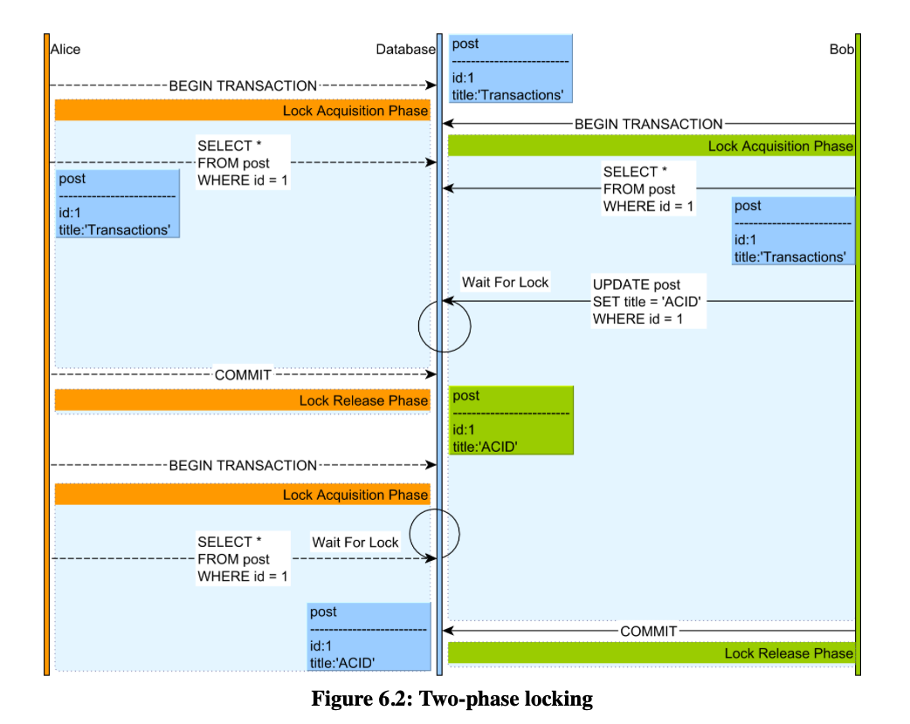


* Alice和Bob都选择了一条帖子记录，并都获得了该记录的共享锁。

* 当Bob尝试更新该帖子记录时，由于Alice仍然持有该数据库行的共享锁，Bob的语句被锁管理器阻塞。

* 只有在Alice的事务结束并释放所有锁之后，Bob才能继续执行更新操作。

* Bob的更新操作会触发锁升级，共享锁被替换为排他锁，从而阻止任何其他并发的读写操作。

* Alice启动了一个新事务，并对同一条帖子记录发出查询请求，但由于Bob持有该记录的排他锁，Alice的语句被锁管理器阻塞。

* 在Bob的事务提交后，所有锁都被释放，Alice的查询可以继续执行，从而获取该数据库记录的最新值。

::: info
死锁

使用锁来控制对共享资源的访问容易导致死锁，而事务调度程序本身无法阻止死锁的发生。

当两个并发事务都无法继续执行，因为它们都在等待对方释放锁时，就会发生死锁。
由于两个事务都处于获取锁的阶段，因此在获取下一个锁之前，它们都不会释放当前持有的锁。

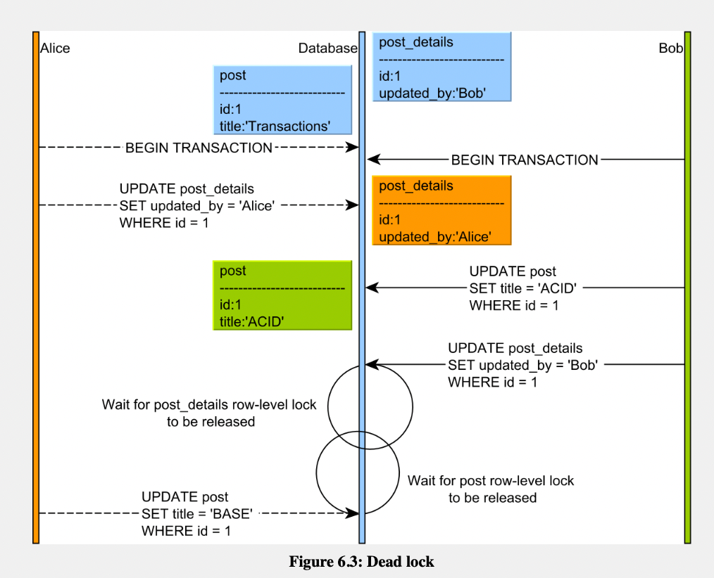

维护锁的顺序成为数据访问层的责任，数据库只能协助处理死锁情况。

数据库引擎运行一个独立的进程，扫描当前的冲突图以查找锁等待循环（即死锁）。当检测到循环时，数据库引擎会选择其中一个事务并终止它，从而释放该事务持有的锁，使其他事务能够继续执行。

:::

#### 6.3.1.2 多版本并发控制

尽管加锁可以提供可串行化的事务调度，但锁竞争的开销会损害事务响应时间和可伸缩性。响应时间会增加，因为事务必须等待锁释放，而且长时间运行的事务也会减慢其他并发事务的执行速度。根据阿姆达尔定律和通用可伸缩性定律，并发性也会受到竞争的影响。

为了解决这些缺点，数据库厂商选择了乐观并发控制机制。如果说两阶段锁定（2PL）是防止冲突，那么多版本并发控制（MVCC）则采用冲突检测策略。

::: info

MVCC 的优势在于，读操作不会阻塞写操作，写操作也不会阻塞读操作。唯一的冲突来源是写操作会阻塞其他并发的写操作，否则会影响事务回滚和原子性。

:::


为了防止阻塞，数据库可以重建数据库记录的先前版本，从而将未提交的更改隐藏起来，使其不被并发读取者访问。由于缺乏锁定机制，实现可串行化调度变得更加困难，因此数据库引擎必须分析当前交错执行的操作，并检测可能破坏可串行性的异常情况。

::: info

Oracle

Oracle 数据库完全不使用两阶段锁定（2PL），而是依靠多版本并发控制（MVCC）机制来管理并发数据访问。每个查询都会获取一个特定时间点的数据快照，并且根据隔离级别的不同，时间戳引用可以是相对于当前语句或当前事务开始时间。

为了重建之前的记录版本，Oracle 使用撤销段，其中已包含回滚未提交更改所需的所有数据。时间点基于系统更改号（SCN），这是一个逻辑时间戳引用，与物理时间不同，它保证单调递增。

除了 MVCC 之外，Oracle 还支持显式锁定，使用 SELECT FOR UPDATE SQL 语法。

:::

::: info

SQL Server

默认情况下，SQL Server 使用锁来实现 SQL 标准规定的所有隔离级别。

为了使 Read Committed 隔离级别能够利用 MVCC 模型，必须首先进行以​​下配置：

ALTER DATABASE high_performance_java_persistence
SET READ_COMMITTED_SNAPSHOT ON;

对于更高级别的隔离，SQL Server 提供了快照隔离模式，该模式必须在数据库级别启用：

ALTER DATABASE high_performance_java_persistence
SET ALLOW_SNAPSHOT_ISOLATION ON;

由于快照隔离是一种自定义隔离级别，因此在启动新事务之前，也必须在连接级别进行设置：

SET TRANSACTION ISOLATION LEVEL SNAPSHOT;
GO
BEGIN TRANSACTION;
GO
COMMIT TRANSACTION;
GO

启用行版本控制后，数据库可以在 tempdb 数据库中跟踪记录更改。

当行被更新或删除时，当前行条目会引用到存储在 tempdb 数据库版本存储中的先前版本。行不会立即删除，而只是标记为删除，实际删除操作由 Ghost 清理任务完成。旧版本必须保留，直到当前正在运行的事务不再需要它们为止，这由事务隔离级别指定。

Ghost 清理任务会定期运行，回收不再需要的旧版本占用的存储空间。

长时间运行的事务会要求数据库引擎长时间保留一些旧版本，而且由于版本更改是以链表结构链接在一起的，因此恢复非常旧的版本可能会消耗大量资源。”

:::

::: info

PostgreSQL

与其他所有数据库系统不同，PostgreSQL 将当前行及其先前版本（甚至包括已中止事务的版本）都存储在实际的数据库表中。与 Oracle 类似，PostgreSQL 采用 MVCC 数据访问模型，并且完全不提供 2PL 事务隔离实现。

每个表行都有两个额外的列（xmin 和 xmax），用于控制不同行版本的可见性。插入行时，当前事务标识符存储在 xmin 列中。

更新和删除操作最终都会创建一个新的行条目，其 xmax 列存储当前事务标识符。

Vacuum 进程会定期运行，回收被删除条目（以及已成功提交的事务）或当前运行事务不再需要的先前版本所占用的存储空间。

尽管 PostgreSQL 被视为纯粹的 MVCC 模型，但仍然需要锁定来防止写-写冲突或进行显式锁定。SELECT FOR UPDATE 用于获取排他行级锁，而 SELECT FOR SHARE 则用于应用共享锁。

:::

::: info

MySQL

InnoDB 存储引擎支持 ACID 事务，并使用 MVCC（多版本并发控制）来控制对共享资源的访问。InnoDB 的 MVCC 实现与 Oracle 非常相似，之前的数据库行版本也存储在回滚段中。

当事务需要访问之前的行版本时，MySQL 必须从回滚段中重建该版本。删除操作只是将条目标记为待删除状态，实际的物理清理工作由清除线程完成。

事务回滚和恢复之前行版本（这是保证给定事务可见性所必需的）的过程非常相似。

与其他数据库系统一样，当 MVCC 无法满足需求时，MySQL 也提供显式锁定机制。可以使用 SELECT LOCK IN SHARE MODE 获取共享锁，而独占锁则使用更常见的 SELECT FOR UPDATE 语法。

:::


### 6.3.2 异像

对于合理的事务吞吐量值，假定事务可串行化是合理的。但随着传入流量的增长，严格数据完整性的代价变得过高，这是存在多种隔离级别的主要原因。放宽可串行化保证可能会导致数据完整性异常，这些异常也称为现象。

SQL-92 标准引入了三种在偏离可串行化事务调度时可能出现的异像：
* 脏读
* 不可重复读
* 幻读

实际上，由于事务交错执行，还会出现其他一些现象，正如著名的论文《对 ANSI SQL 隔离级别的批判》中所描述的那样：
* 脏写
* 读倾斜
* 写倾斜
* 丢失更新

::: info
选择合适的隔离级别需要在提高并发性和容忍可能出现的异常之间进行权衡。

可伸缩性会受到资源争用和数据一致性维护成本的影响。隔离级别越低，所需的锁（或多版本事务回滚）就越少，应用程序的可伸缩性就越高。

然而，较低的隔离级别允许更多异常情况发生，数据完整性的责任也从数据库端转移到了应用程序逻辑层。应用程序必须确保采取一​​切措施来防止或减轻任何此类数据异常。
::: 

在深入探讨隔离级别之前，最好先了解每种现象背后的原理以及它们如何影响数据完整性。在选择特定的事务隔离级别时，理解这些现象对于做出正确决策至关重要。

#### 6.3.2.1 脏写

脏写是指两个并发事务被允许同时修改同一行数据。如前所述，所有更改都会应用到实际的数据库对象结构上，这意味着第二个事务会直接覆盖第一个事务尚未提交的更改。

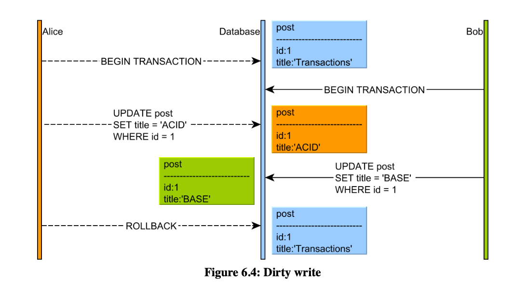

如果这两笔事务都提交成功，其中一笔事务会悄无声息地覆盖另一笔事务，导致更新丢失。另一个问题是，如果第一笔事务想要回滚，数据库引擎就必须选择以下几种处理方式之一：

如果两个事务都提交，其中一个事务会悄无声息地覆盖另一个事务的更改，导致更新丢失。另一个问题是，当第一个事务想要回滚时，数据库引擎必须选择以下操作路径之一：

* 它可以将行恢复到之前的版本（即第一个事务更改之前的版本），但这会覆盖第二个事务尚未提交的更改。
* 它可以承认存在一个较新的版本（由第二个事务创建），但如果第二个事务也需要回滚，那么它的先前版本将成为第一个事务尚未提交的更改。

如果数据库引擎不阻止脏写，就无法保证回滚的有效性。由于在缺乏可靠回滚的情况下无法实现原子性，因此所有数据库系统都必须阻止脏写。

尽管SQL标准没有提及这种现象，但即使是最低的隔离级别（读未提交）也能阻止它。

::: warning

关于脏写：

https://www.cnblogs.com/heyu/articles/14598223.html

:::

#### 6.3.2.2 脏读

如前所述，所有数据库更改都会应用于实际的数据结构（内存缓冲区、数据块、索引）。当一个事务被允许读取其他并发事务尚未提交的更改时，就会发生脏读。
基于尚未提交的值做出业务决策是危险的，因为未提交的更改可能会被回滚。

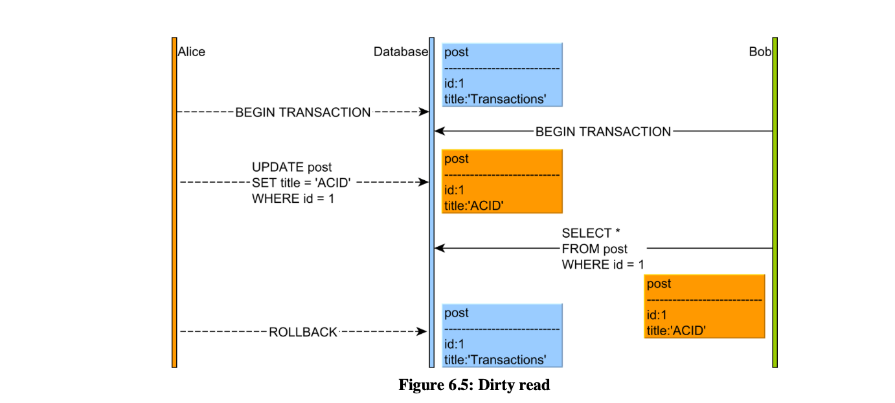


这种异常情况仅在“读未提交”（Read Uncommitted）隔离级别下允许发生，由于其对数据完整性造成严重影响，大多数数据库系统都提供更高的默认隔离级别。

为了防止脏读，数据库引擎必须对所有其他并发事务隐藏未提交的更改。每个事务都可以看到自己的更改，否则“读自己写入的数据”的一致性保证就会被破坏。

如果底层数据库使用两阶段锁定（2PL），则未提交的行会受到写锁的保护，从而阻止其他并发事务在这些记录提交之前读取它们。

当底层数据库使用多版本并发控制（MVCC）时，数据库引擎可以使用已记录每个未提交记录先前版本的撤销日志（undo log），在其他并发事务查询中恢复先前的值。大多数数据库系统都会优化恢复先前值的过程，从而降低其对整体应用程序性能的影响。

读取未提交数据（Read Uncommitted）很少用到（仅限于非严格的报表查询，在这些查询中可以接受脏读），因此读取已提交数据（Read Committed）通常是实际应用中最低的隔离级别。

#### 6.3.2.3 不可重复读

如果一个事务读取数据库中的一行数据时没有对新获取的记录加共享锁，那么在第一个事务结束之前，另一个并发事务可能会修改该行数据。

“当当前事务根据给定数据库行的初始值做出业务决策时，这种现象就会出现问题（例如，客户可能会根据库存数量值订购产品，而该值可能不再是正整数）。

大多数数据库系统已转向多版本并发控制（MVCC）模型，不再强制要求使用共享锁来防止不可重复读。通过验证当前行版本，如果先前获取的记录在此期间发生了更改，则可以中止该事务。

可重复读（Repeatable Read）和可串行化（Serializable）隔离级别默认可以防止这种异常。在读已提交（Read Committed）隔离级别下，如果显式获取共享锁（例如，使用 SELECT FOR SHARE），也可以避免不可重复读（模糊读）。

一些ORM框架（例如 JPA/Hibernate）提供应用程序级别的可重复读。任何检索到的实体对象的第一个快照都会缓存在当前运行的持久化上下文中。任何后续查询返回同一数据库行时，都将使用之前缓存的同一个对象。这样，即使在读已提交隔离级别下，也可以防止模糊读。

#### 6.3.2.4 幻读

如果一个事务基于满足给定谓词的一组行做出业务决策，但在没有范围锁的情况下，另一个并发事务可能会插入一条符合该谓词的记录。

SQL 标准规定，如果两次连续的查询执行返回不同的结果，则会发生幻读，这是因为并发事务在两次查询之间修改了记录范围。虽然提供一致性读取是可串行化的必要条件，但这还不够。例如，一个买家可能会购买一件产品，却不知道在他获取商品列表后不久就出现了更好的报价。

基于 2PL 的可串行化隔离级别通过使用谓词锁来防止幻读。另一方面，MVCC 数据库引擎通过返回一致的快照来解决幻读异常。但是，并发事务仍然可以修改之前读取的记录范围。即使 MVCC 数据库引擎检查事务调度，其结果也并非总是与基于 2PL 的实现相同。例如，当第二个事务执行插入操作而没有读取与第一个事务相同的记录范围时，就会出现这种情况。在这种特定情况下，某些 MVCC 数据库引擎不会回滚第一个事务。

#### 6.3.2.5 读取偏差

读取偏差是一种鲜为人知的异常现象，它涉及对多个数据库表的约束。在以下示例中，应用程序要求帖子（post）和帖子详情（post_details）同步更新。每当帖子记录发生更改时，其关联的帖子详情必须记录进行当前修改的用户。

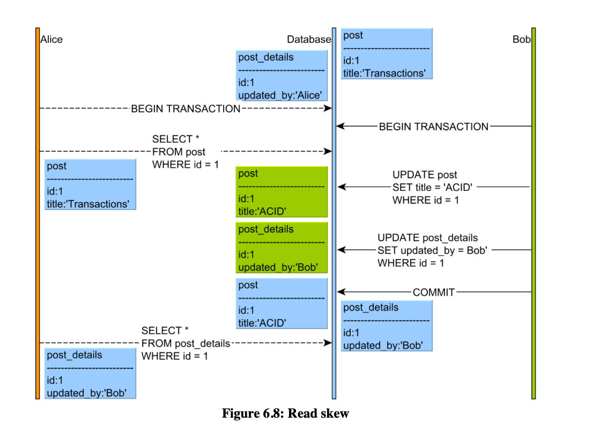

在选择帖子和帖子详情行的过程中，第二个事务悄悄介入并成功更新了这两条记录。第一个事务看到的是帖子行的旧版本和关联帖子详情的最新版本。由于这种读取​​偏差，第一个事务误以为该帖子是由 Bob 更新的，但实际上，它是 Alice 更新的旧版本。

与不可重复读类似，有两种方法可以避免这种现象：

* 第一个事务可以对每次读取都获取共享锁，从而阻止第二个事务更新这些记录。

* 在验证提交约束时（使用可重复读或可序列化隔离级别的 MVCC 实现时），第一个事务可以中止。

TODO：事务中止的效果是什么

#### 6.3.2.6 写倾斜

与读倾斜类似，这种现象涉及对两个不同表进行不相关的写入操作，而这两个表又被约束为必须作为一个整体进行更新。每当帖子行发生更改时，客户端都必须更新 post_details 表，并记录进行更改的用户。

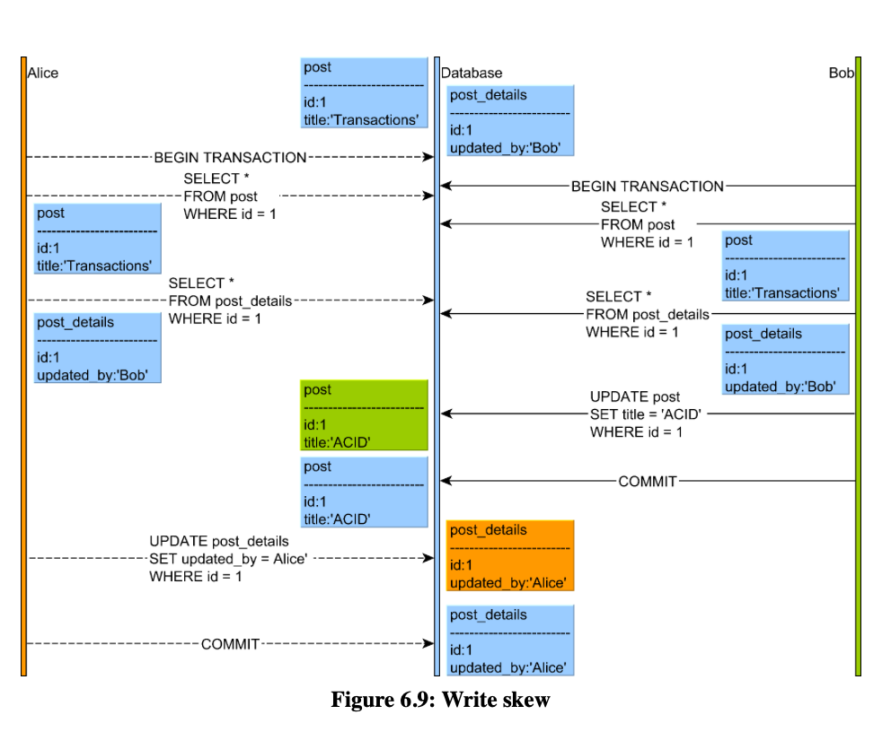

Alice 和 Bob 都选择了帖子及其关联的 post_details 记录。如果允许写倾斜，Alice 和 Bob 可以分别更新这两个记录，从而违反约束。

与不可重复读一样，有两种方法可以避免这种现象：

第一个事务可以对这两个条目都获取共享锁，从而阻止第二个事务更新这些记录。

数据库引擎可以检测到另一个事务已更改这些记录，因此它可以强制第一个事务回滚（在可重复读或可串行化隔离级别的 MVCC 实现下）。

#### 6.3.2.7 更新丢失

当一个事务读取一行数据，而另一个事务在该事务完成之前修改了该行数据时，就会发生更新丢失现象。在下面的示例中，Bob 的更新会被 Alice 静默覆盖，而 Alice 并不知道该记录已被更新。

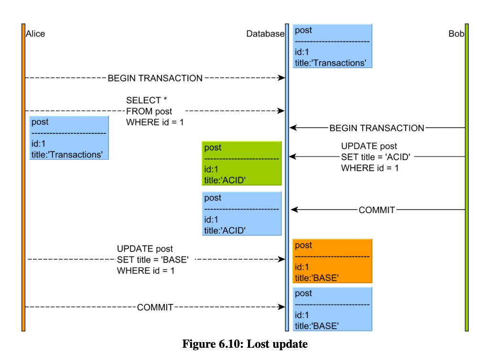

这种异常可能会对数据完整性造成严重后果（例如，买家可能会在不知情的情况下购买价格已更改的商品），尤其因为它会影响到“读已提交”（Read Committed）隔离级别，而这正是许多数据库系统的默认隔离级别。

传统上，“可重复读”（Repeatable Read）隔离级别可以防止更新丢失，因为共享锁可以阻止并发事务修改已读取的记录。而在 MVCC（多版本并发控制）机制下，第二个事务可以进行修改，但当数据库引擎检测到行版本不匹配时（在第一个事务提交期间），第一个事务将被中止。

大多数 ORM 工具（例如 Hibernate）都提供应用程序级别的乐观锁，它会在每次修改记录时自动集成行版本。如果行版本不匹配，更新计数将为零，因此应用程序可以回滚当前事务，因为当前的数据快照已过期。


### 6.3.3 隔离级别

如前所述，Serializable 是唯一能够提供真正 ACID 事务交错的隔离级别。然而，可串行化并非没有代价，因为锁定会引入争用，进而限制并发性和可伸缩性。即使在多版本并发控制模型中，可串行化也可能需要中止太多受各种现象影响的事务。

为此，SQL-92 标准引入了多种隔离级别，数据库客户端可以选择在并发性和数据正确性之间进行权衡。每个隔离级别都根据它必须阻止的最小现象数量来定义，因此 SQL 标准引入了以下事务隔离级别：

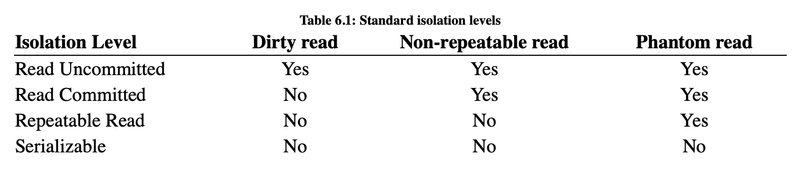

如果没有显式设置，JDBC 驱动程序将使用默认隔离级别，可以使用 DatabaseMetaData 对象的 getDefaultTransactionIsolation() 方法进行查看：

``` java
int level = connection.getMetaData().getDefaultTransactionIsolation();
```

可以使用 Connection 对象的 setTransactionIsolation(int level) 方法更改默认隔离级别。

``` java
connection.setTransactionIsolation(Connection.TRANSACTION_SERIALIZABLE);
```

::: info
尽管 ACID 属性意味着可串行化调度，但大多数关系数据库系统使用的默认隔离级别较低：

读已提交 (Oracle、SQL Server、PostgreSQL)
可重复读 (MySQL)
:::

以下各节将详细介绍每种事务隔离级别，并演示特定数据库系统实际阻止的现象列表。

#### 6.3.3.1 未提交读

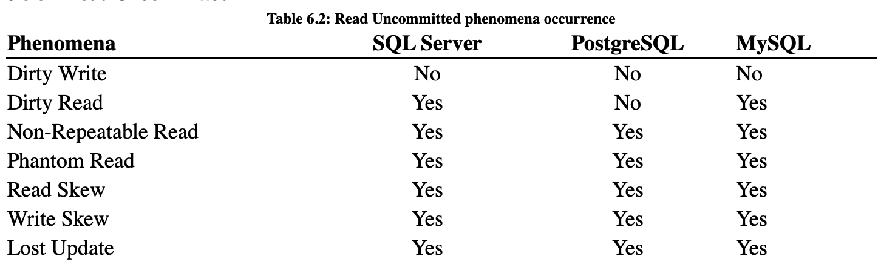

::: info
Oracle

Oracle 不允许脏读，因此最低隔离级别是“读已提交”。

如果客户端尝试在当前连接上设置“未提交读”隔离级别，JDBC 驱动程序甚至会抛出异常。
:::

::: info
SQL Server

“未提交读”仅防止脏写，允许所有其他现象发生。使用“未提交读”时，不会对特定的 SQL 修改操作施加排他锁，因此即使在提交之前，其他并发事务也可以访问未提交的更改。如果可以接受脏读的风险，避免排他锁可以加快报表查询速度，尤其是在扫描大量数据时。

对于基于锁的并发控制机制，如果脏读的风险远小于锁定数据库表中大部分数据的风险，则值得考虑使用“未提交读”。由于 MVCC 避免了读写锁和写读锁，因此允许脏读可能不会带来显著的性能提升。

:::

::: info
PostgreSQL
与 Oracle 类似，PostgreSQL 不允许脏读，最低隔离级别为 Read Committed。

选择 Read Uncommitted 时，JDBC 驱动程序会默默地回退到 Read Committed。

:::

::: info
MySQL
尽管使用 MVCC，但 InnoDB 实现了 Read Uncommitted，因此允许脏读。
作为一项优化措施，每个查询都无需重建当前扫描记录的先前已提交版本（使用回滚段）（以防这些记录最近被修改过）。
:::

#### 6.3.3.2 Read Committed

Read Committed 是最常见的隔离级别之一，它在多个关系数据库系统或各种并发控制模型中表现一致。

许多数据库系统选择 Read Committed 作为默认隔离级别，因为它在防止脏写和脏读等严重异常的同时，提供了最佳性能。
但是，性能是有代价的，因为 Read Committed 允许许多可能导致数据损坏的异常情况。

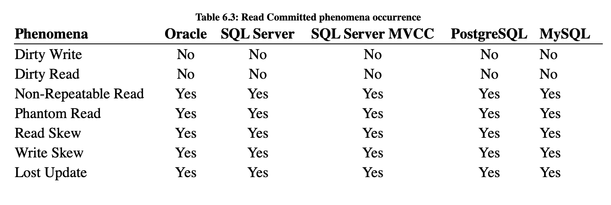


::: info
Oracle

每个语句都有一个开始时间戳，用于创建相对于该特定时间点的数据库快照。这样，写入方仍然可以更新当前选定的记录，而数据库可以简单地重构查询开始时可用的先前版本。后续查询执行可能会返回不同的行版本，因此允许出现不可重复读。

当两个事务尝试更新同一条记录时，第一个事务会锁定该记录以防止脏写。第二个事务必须等待第一个事务释放锁（提交或回滚），并且会根据最新数据重新评估语句的过滤条件。
:::

::: info
PostgreSQL
与 Oracle 类似，每个查询都会看到当前正在运行的查询开始时的数据库快照。由于不使用共享锁来保护先前读取的记录不被修改，因此 Read Committed 允许出现多种数据异常。

排他锁可以防止写写冲突，因此当两个事务更新同一条记录时，第二个事务会等待第一个事务释放其锁。当第二个事务恢复执行时，如果过滤条件仍然有效，它可能会覆盖第一个事务的修改，从而导致更新丢失。
:::

::: info
MySQL

查询时快照用于隔离语句与其他并发事务。当显式获取共享锁或排他锁，或发出更新或删除语句（这些语句会获取排他锁以防止脏写）时，如果选定的行通过唯一搜索条件（例如主键）进行过滤，则可以将锁应用于关联的索引条目。

在 5.7 版本之前，如果修改语句使用范围过滤器并且搜索条件利用了唯一索引扫描，则数据库可以使用间隙锁或下一键锁（因此也可以防止幻读）。Read Committed 不支持基于语句的复制，因此应用程序必须使用基于行的二进制日志记录。
:::

::: info

SQL Server
默认情况下，SQL 语句使用共享锁来防止其他事务修改当前获取的记录。锁会在查询执行完成后释放。激活 Read Committed Snapshot Isolation 后，数据库不再使用共享锁，每个查询都会选择查询开始时的行版本。
:::

6.3.3.3 可重复读

可重复读是隔离级别中合规性最低的一种，其实现细节会影响到它所能防止的并发问题：

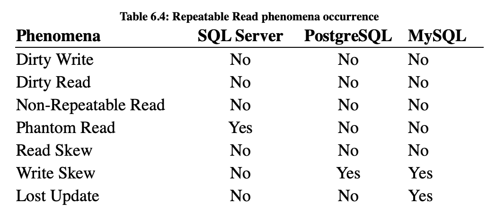

::: info
Oracle
Oracle 完全不支持可重复读隔离级别，如果客户端尝试显式设置该级别，JDBC 驱动程序将抛出异​​常。
:::

::: info
SQL Server

对于客户端读取的每一行，当前事务都会获取一个共享锁，阻止任何其他事务同时修改该行。共享锁会在事务提交或回滚时释放。
:::

::: info
PostgreSQL

PostgreSQL 使用快照隔离（Snapshot Isolation）来实现可重复读，因此不仅可以防止脏读，还可以防止幻读。PostgreSQL 的 MVCC 实现不使用锁，而是允许冲突发生，但会中止任何不再满足事务保证的事务。
:::

::: info
MySQL

每个事务只能看到事务开始时的行状态。这可以防止不可重复读，但仍然允许丢失更新和写倾斜。
:::


6.3.3.4 可序列化 Serializable

可序列化旨在提供一种事务调度机制，即使语句交错执行，其结果也应等同于串行执行。

即使并发控制机制是基于锁的，或者管理多个记录版本，它也必须防止所有异常情况，以确保事务的可序列化。仅仅防止 SQL 标准中提到的所有异常（脏读、不可重复读和幻读）是不够的，可序列化还必须防止更新丢失、读取偏差和写入偏差。

实际上，并发控制的实现细节往往会暴露出来，并非所有关系型数据库系统都能提供真正可序列化的隔离级别（某些数据完整性异常仍然可能发生）。

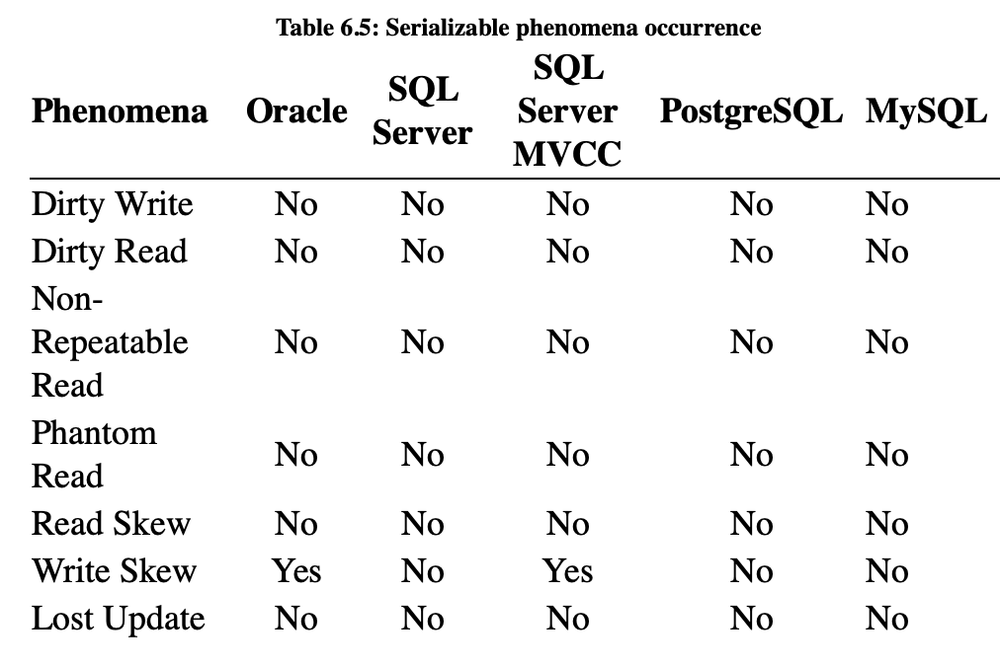

::: info
Oracle
Serializable 隔离级别实际上是快照隔离并发控制机制的一种 MVCC 实现。与 PostgreSQL 的 Repeatable Read 隔离级别类似，Oracle 无法防止写入偏差，这意味着它无法提供真正可序列化的事务。
:::

::: info
SQL Server
Serializable 隔离级别基于 2PL，因此可以防止所有异常现象。基于 MVCC 的快照隔离与 Oracle 的 Serializable 和 PostgreSQL 的 Repeatable Read 隔离级别类似，因此它允许写入偏差。
:::

::: info
PostgreSQL
为了克服快照隔离的局限性，PostgreSQL 开发了可序列化快照隔离 (SSI)，它提供了真正的可序列化事务。由于 SSI 仍然是 MVCC 实现，PostgreSQL 会监控事务调度并检测可能的可序列化异常。

当前的实现可能会检测到误报，即使某些事务实际上并未破坏事务的可序列化性，也可能会被中止。只有精确可序列化快照隔离 (PSSI) 模型才能消除所有误报，但由于性能开销过高，数据库实现者最终选择了 SSI。
:::

::: info
MySQL
Serializable 隔离级别是在 Repeatable Read 的基础上实现的，不同之处在于，每个被选中的记录都会被共享锁保护。这种基于锁的方法使 MySQL 能够防止写入偏差现象，而这种现象在许多快照隔离实现中普遍存在。
:::

## 6.4 持久性

购买机票时，款项会从银行账户中扣除，并为购票者预留座位。假设在购票后，航空公司预订系统立即崩溃，那么即使系统重启后，所有之前处理的交易也必须保持有效。如果系统不强制执行此要求，已预订的机票可能会丢失，购票者可能会面临账户被扣款但却没有机票的情况。

持久性确保所有已提交的事务更改都是永久性的。

持久性保证了系统的可恢复性，在某种程度上类似于回滚机制。

::: info
那么撤销日志呢（undo log）？

为了支持事务回滚并在多版本并发控制（MVCC）系统中重建先前版本，数据库系统会将当前修改（包括未提交的更改）记录在撤销日志中。但是，可恢复性只需要已提交的更改，而且由于过时的撤销段可能会被频繁回收，因此仅靠撤销日志不足以实现可恢复性。

事务提交后，数据库会将所有当前更改持久化到一个仅追加的顺序数据结构中，该结构通常称为重做日志（redo log）。
:::

::: info

Oracle
重做日志由多个重做记录组成，每个记录包含更改向量，用于捕获实际的数据块更改。
出于性能考虑，重做记录存储在缓冲区中，日志写入器会将内存中的记录刷新到当前活动的重做日志文件中。在任何给定时间，Oracle 至少有两个重做文件，但只有一个文件处于活动状态并可用于收集日志缓冲区条目。事务提交后，数据库会刷新缓冲区，更改也会被持久化。

如果缓冲区已满，Oracle 会刷新缓冲区以及所有未提交的更改，如果相关事务回滚，这些未提交的更改将被删除。
:::

::: info

SQL Server
与 Oracle 不同，SQL Server 将撤销日志和重做日志合并到一个称为事务日志的单一数据结构中。默认情况下，当事务提交时，所有相关的事务日志条目都会在控制权返回给客户端之前写入磁盘。

SQL Server 2014 添加了可配置的持久性支持。日志条目写入磁盘的操作可以延迟执行，从而提高 I/O 利用率并降低事务响应时间。如果系统崩溃，所有尚未写入磁盘的日志条目都将从内存中丢失。因此，只有在可以容忍数据丢失的情况下，才适合使用异步写入模式。
:::

::: info

PostgreSQL
语句更改记录在预写日志 (WAL) 中。日志条目缓存在内存中，并在每次事务提交时写入磁盘。

由于可以在恢复期间从 WAL 恢复其状态，因此无需为每个事务都将缓存的数据页和索引条目写入磁盘（从而优化了 I/O 利用率）。从 9.1 版本开始，PostgreSQL 支持可配置的持久性，因此 WAL 也可以异步写入。
:::

::: info
MySQL
与单个事务关联的所有重做日志条目都存储在迷你事务缓冲区中，并一次性写入全局重做缓冲区。全局缓冲区在“提交”期间写入磁盘。默认情况下，有两个日志文件交替使用。

默认情况下，写入操作是同步进行的，但可以通过 innodb_flush_log_at_trx_commit 参数切换到异步模式。
:::


由于数据持久性对于业务运营至关重要，因此最好坚持使用同步刷新机制。只有当业务需求允许数据丢失且重做日志刷新确实成为性能瓶颈时，延迟持久性保证才是一个可行的选择。

## 6.5 只读事务

JDBC Connection 定义了 setReadOnly(boolean readOnly) 方法，该方法可用于提示驱动程序对即将进行的只读事务应用一些数据库优化。不应在事务执行过程中调用此方法，因为数据库系统无法将读写事务转换为只读事务（事务必须从一开始就设置为只读）。

::: info
Oracle
根据 JDBC 驱动程序文档，数据库服务器不支持只读事务优化。即使将 Connection 的只读状态设置为 true，仍然允许执行修改语句，限制此类语句的唯一方法是执行以下 SQL 命令：

connection.setAutoCommit(false);
try(CallableStatement statement = connection.prepareCall(
"BEGIN SET TRANSACTION READ ONLY; END;")) {
statement.execute();
}

SET TRANSACTION READ ONLY 命令必须在禁用自动提交状态后运行，否则它仅对该特定语句生效。
:::

::: info
SQL Server

与 Oracle 类似，只读 Connection 状态不会传播到数据库引擎，禁用 SQL 修改的唯一方法是使用单独的帐户，该帐户仅限于查看数据。

设置 ApplicationIntent=ReadOnly 连接属性并不能阻止 JDBC 驱动程序在只读 Connection 上执行修改语句。此属性的目的是将读写连接和只读连接路由到副本节点。
:::

::: info
PostgreSQL
如果在只读状态设置为 true 的 Connection 上执行修改语句，则会抛出异常。

数据库引擎会优化只读事务，因此可以降低可序列化隔离级别下的误报率，并允许使用可延迟的可序列化快照。
执行 SET TRANSACTION SERIALIZABLE READ ONLY DEFERRABLE 时会激活可延迟快照。当前事务必须等待可用的安全快照，该快照可以执行而不会因非可序列化异常而被中止。如果默认的读写可序列化事务在访问大量数据时存在问题，则可延迟快照可能是长时间运行事务的更好选择。
:::

::: info

MySQL

如果在 Connection 设置为只读状态时执行修改语句，JDBC 驱动程序将抛出异​​常。 InnoDB 可以优化只读事务，因为它无需生成事务ID，而只读事务也不需要事务ID。
:::


### 6.5.1 只读事务路由

设置数据库复制环境对于实现高可用性（从节点可以替代崩溃的主节点）和流量分流都非常有用。在主从复制拓扑结构中，主节点接受读写事务和只读事务，而从节点仅处理只读流量。

::: info
Oracle
Oracle ADG（Active Data Guard）允许企业应用程序将读写流量分发到主节点，并将只读事务分发到备用数据库。WebLogic Server GridLink 数据源在 Oracle ADG 之上提供了故障转移和负载均衡功能。
:::

::: info
SQL Server
必须配置数据库可用性组以使用只读路由，在这种情况下，重定向基于 ApplicationIntent 连接属性。这意味着应用程序需要为读写连接和只读连接分别配置不同的数据源，并且事务路由必须在应用程序服务层启动。
:::
::: info

PostgreSQL
JDBC 驱动程序定义了两个用于负载均衡的连接属性：loadBalanceHosts（默认禁用）和 targetServerType（master 或 preferSlave）。
要启用事务路由，应用程序必须使用不同的数据源自行进行路由。
:::
::: info

MySQL

com.mysql.jdbc.ReplicationDriver 支持在主从拓扑结构上进行事务路由，路由决策基于连接的只读状态。
:::

即使 JDBC 驱动程序不支持主从路由，应用程序也可以使用多个 DataSource 实例来实现。这种设计不能依赖于底层 Connection 的只读状态，因为路由必须在获取数据库连接之前进行。

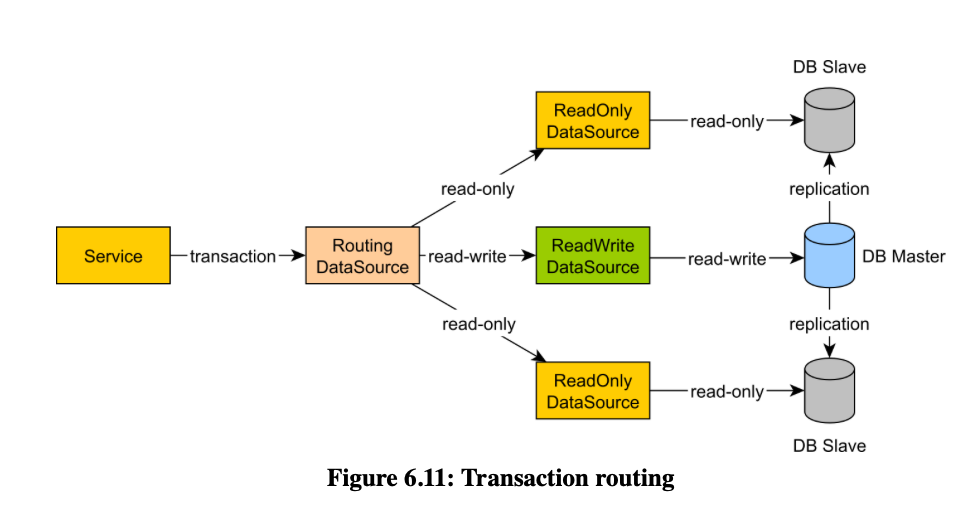

如果事务管理器支持声明式只读事务，则可以根据当前事务的只读偏好来决定路由。否则，必须在每个服务层组件中手动进行路由，因此只读事务会使用只读的 DataSource 或只读的 JPA 持久化上下文。

## 6.6 事务边界

每个数据库语句都在数据库事务的上下文中执行，即使客户端没有显式设置事务边界。虽然可能存在单语句事务（通常是只读查询），但当工作单元包含多个 SQL 语句时，数据库应该将它们全部封装在一个工作单元中。

::: info
默认情况下，每个连接都以自动提交模式启动，每个语句都在单独的事务中执行。

不幸的是，这种模式不适用于多语句事务，因为它将原子性边界从逻辑工作单元转移到了每个单独的语句。

应尽可能避免使用自动提交模式，即使对于单语句事务，也最好显式标记事务边界。
:::

在以下示例中，一笔款项在两个银行账户之间进行转账。账户余额必须始终保持一致，因此如果一个账户被扣款，另一个账户必须同时存入相同金额的款项。

``` java

try(Connection connection = dataSource.getConnection();
    PreparedStatement transferStatement = connection.prepareStatement(
        "UPDATE account SET balance = ? WHERE id = ?"
    )) {
    transferStatement.setLong(1, Math.negateExact(cents));
    transferStatement.setLong(2, fromAccountId);
    transferStatement.executeUpdate();

    transferStatement.setLong(1, cents);
    transferStatement.setLong(2, toAccountId);
    transferStatement.executeUpdate();
}
```

由于启用了自动提交模式，如果第二条语句执行失败，只有该语句所做的更改可以回滚，而第一条语句已经提交，无法撤销。

因此，必须禁用默认的自动提交模式，并手动管理事务。只有当所有语句都成功执行时，事务才会提交；如果任何语句执行失败，则会触发回滚。考虑到这一点，前面的示例应该重写如下：

``` java

 try(Connection connection = dataSource.getConnection()) {
    connection.setAutoCommit(false);
    try(PreparedStatement transferStatement = connection.prepareStatement(
        "UPDATE account SET balance = ? WHERE id = ?"
    )) {
        transferStatement.setLong(1, Math.negateExact(cents));
        transferStatement.setLong(2, fromAccountId);
        transferStatement.executeUpdate();

        transferStatement.setLong(1, cents);
        transferStatement.setLong(2, toAccountId);
        transferStatement.executeUpdate();
        connection.commit();
    } catch (SQLException e) {
        connection.rollback();
        throw e;
    }
}
```

细心的读者可能会注意到，前面的示例违反了单一职责原则，因为数据访问对象（DAO）方法混合了事务管理和数据访问逻辑。事务管理是一个横切关注点，因此很适合将其移至单独的通用库中。这样，事务管理逻辑就集中在一个地方，并且可以从 DAO 方法中删除许多重复的代码。提取事务管理逻辑的一种方法是使用模板方法模式：

``` java
 public void transact(Consumer<Connection> callback) {
    Connection connection = null;
    try {
        connection = dataSource.getConnection();
        callback.accept(connection);
        connection.commit();
    } catch (Exception e) {
        if (connection != null) {
            try {
                connection.rollback();
            } catch (SQLException ex) {
                throw new DataAccessException(e);
            }
        }
        throw (e instanceof DataAccessException ?
            (DataAccessException) e : new DataAccessException(e));
    } finally {
        if(connection != null) {
            try {
                connection.close();
            } catch (SQLException e) {
                throw new DataAccessException(e);
            }
        }
    }
}
```

有了这个工具，前面的示例可以简化为：
``` java

transact((Connection connection) -> {
    try(PreparedStatement transferStatement = connection.prepareStatement(
        "UPDATE account SET balance = ? WHERE id = ?"
    )) {
        transferStatement.setLong(1, Math.negateExact(cents));
        transferStatement.setLong(2, fromAccountId);
        transferStatement.executeUpdate();

        transferStatement.setLong(1, cents);
        transferStatement.setLong(2, toAccountId);
        transferStatement.executeUpdate();
    } catch (SQLException e) {
        throw new DataAccessException(e);
    }
});

```

虽然比第一个代码片段有所改进，但将数据访问逻辑和事务管理分开仍然不够。

事务边界仍然很僵化，而且，要在单个数据库事务中包含多个数据访问方法，就必须将 Connection 对象作为参数传递给每个 DAO 方法。

声明式事务可以更好地解决这个问题，它打破了数据访问逻辑和事务管理代码之间的紧密耦合。事务边界通过元数据（例如注解）进行标记，并由一个独立的事务管理器抽象负责协调事务逻辑。

::: info

Java EE 和 JTA

声明式事务对于分布式事务而言至关重要。Java EE（企业版）最初出现时，应用服务器同时托管 Web 应用程序和中间件集成服务，这意味着 Java EE 容器需要协调多个数据源（DataSource）甚至 JMS（Java 消息服务）队列。

JTA（Java 事务 API）遵循 X/Open XA 架构，为 Java EE 的分布式事务需求提供支持。

:::


### 6.6.1 分布式事务

本地事务和全局事务的区别在于，前者使用单个资源管理器，而后者则操作多个异构资源管理器。ACID 保证仍然适用于每个单独的资源，但必须使用全局事务管理器来协调分布式事务的结果。

所有事务性资源适配器都由全局事务管理器注册，该管理器决定何时允许资源提交或回滚。Java EE 管理的资源可以通过 JNDI（Java 命名和目录接口）或 CDI（上下文和依赖注入）访问。

Spring 提供了一个事务管理抽象层，可以配置为使用本地事务（JDBC 或 RESOURCE_LOCAL JPA）或通过独立的 JTA 事务管理器使用全局事务。依赖注入机制将托管资源自动注入到 Spring Bean 中。

6.6.1.1 两阶段提交

JTA 使用两阶段提交 (2PC) 协议来协调资源的原子提交，该协议分为两个阶段：准备阶段和提交阶段。

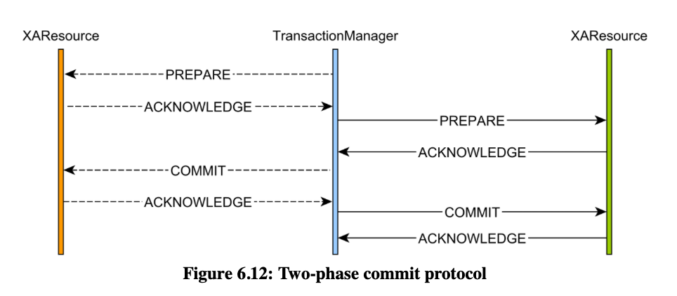

在准备阶段，资源管理器会执行所有必要的操作，为即将到来的提交做好准备。只有当所有资源管理器都成功确认准备阶段后，事务管理器才会进入提交阶段。如果某个资源未确认准备阶段，事务管理器将回滚所有当前参与者。

如果所有资源管理器都确认提交阶段，则全局事务将成功结束。

如果某个资源提交失败（或超时），事务管理器将必须在后台线程中重试此操作，直到成功或报告该事件以进行手动干预。

::: info
单阶段提交 (1PC) 优化：由于 Java EE 仅使用 JTA 事务，额外的数据库往返通信带来的协调开销可能会在高吞吐量应用环境中影响性能。当事务仅涉及一个资源适配器（指定单个资源管理器）时，事务管理器可以跳过准备阶段，直接执行提交或回滚阶段。通过这种优化，分布式事务的行为类似于 JDBC 连接管理本地事务的方式。

XAResource.commit(Xid xid, boolean onePhase) 方法接受一个布尔标志，事务管理器会将该标志设置为 true，以提示关联的资源适配器启动 1PC 优化。
:::

### 6.6.2 声明式事务

事务边界通常与服务层相关联，服务层使用一个或多个 DAO 来实现业务逻辑。事务在服务层事务边界内从一个组件传播到另一个组件。

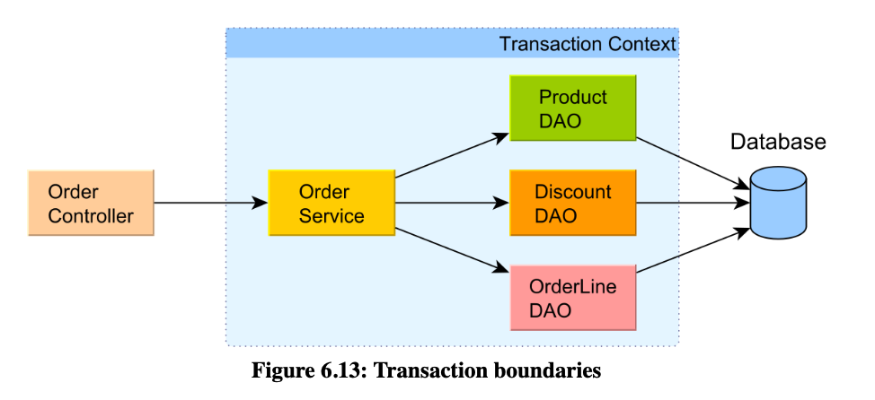


声明式事务模型同时受到 Java EE 和 Spring 的支持。事务边界通过类似的传播策略进行控制，这些策略定义了在最外层组件（当前调用堆栈中）与当前组件（等待被调用）之间的边界处，事务边界如何被继承或中断。

::: info
传播

为了配置 EJB 组件的事务传播策略，Java EE 定义了 @TransactionAttribute 注解。自 Java EE 7 起，即使是非 EJB 组件，如果添加了 @Transactional 注解，也可以参与到事务上下文中。

在 Spring 中，事务传播（与其他事务属性一样）可以通过 @Transactional 注解进行配置。
:::


表 6.6：事务传播策略

| 传播行为      | Java EE | Spring | 描述                                                                 |
|---------------|---------|--------|----------------------------------------------------------------------|
| REQUIRED      | 是      | 是     | 默认传播策略。仅在当前线程未关联事务上下文时创建新事务                 |
| REQUIRES_NEW  | 是      | 是     | 挂起当前事务（如果存在），并创建新事务                               |
| SUPPORTS      | 是      | 是     | 当前存在事务则加入，否则以非事务方式运行                             |
| NOT_SUPPORTED | 是      | 是     | 挂起当前事务（如果存在），并以非事务方式执行                         |
| MANDATORY     | 是      | 是     | 必须在已有事务上下文中执行，否则抛出异常                             |
| NESTED        | 否      | 是     | 当前存在事务时在嵌套事务中执行，否则创建新事务（仅Spring支持）        |
| NEVER         | 是      | 是     | 必须在非事务上下文中执行，当前存在事务时抛出异常                     |

::: info
声明式异常处理

由于事务逻辑封装了底层服务和数据访问逻辑调用链，因此异常处理也必须以声明方式进行配置。默认情况下，Java EE 和 Spring 都会在遇到系统异常（任何 RuntimeException）时回滚事务，并在遇到应用异常（受检异常）时提交事务。

在 Java EE 中，可以使用 @ApplicationException 注解自定义回滚策略。

Spring 允许每个事务通过列出触发事务失败的异常类型来定制回滚策略。
:::

::: info

声明式只读事务

Java EE 不支持以声明方式标记只读事务。

Spring 提供了事务只读属性，该属性可以传播到底层 JPA 提供程序（以优化 EntityManager 的刷新机制）和当前关联的 JDBC 连接。
:::

::: info

声明式隔离级别

Java EE 不支持可配置的隔离级别，因此所有数据库连接的隔离级别都由底层 DataSource 定义。

Spring 在使用 JpaTransactionManager 时支持事务级别的隔离级别。对于 JTA 事务，JtaTransactionManager 遵循 Java EE 标准，不允许覆盖默认隔离级别。作为一种变通方法，Spring 框架提供了扩展点，应用程序开发人员可以自定义默认行为并实现一种机制，以基于事务设置隔离级别。
:::

## 6.7 应用级事务

到目前为止，本书主要关注数据库事务，以确保 ACID 特性。然而，从应用程序的角度来看，业务工作流程可能跨越多个物理数据库事务，在这种情况下，数据库的 ACID 保证就不再足够了。一个逻辑事务可能包含多个 Web 请求，包括用户的思考时间，因此可以将其视为一个长时间的交互过程。

在下面的示例中，Alice 和一个后台进程正在同时修改同一条数据库记录。

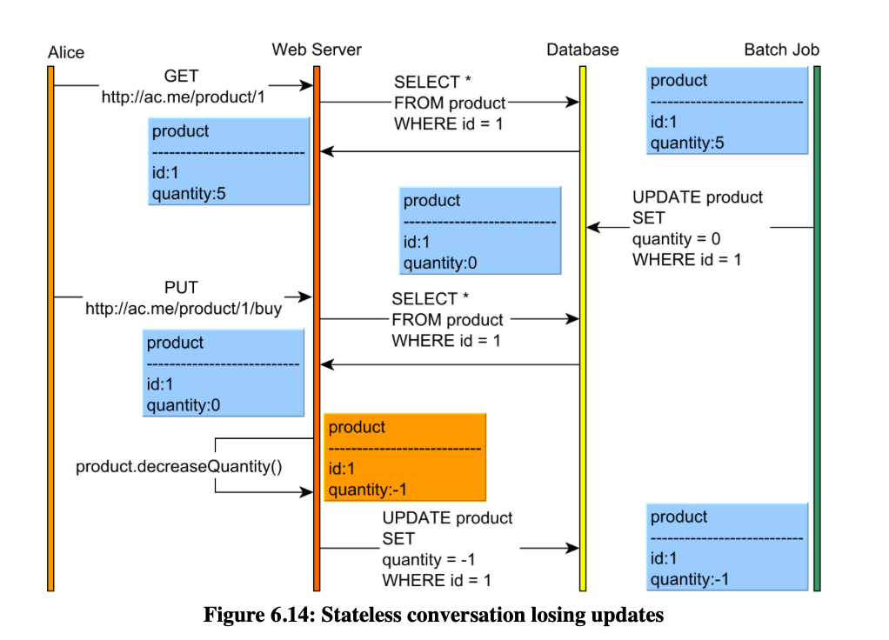

由于 Alice 的逻辑事务包含两个独立的 Web 请求，每个请求都对应一个独立的数据库事务，因此如果没有额外的并发控制机制，即使是最强的隔离级别也无法防止更新丢失的问题。

将数据库事务跨越多个 Web 请求是不可行的，因为锁会在用户思考期间一直被持有，从而影响系统的可扩展性。即使使用 MVCC，维护先前版本（这可能导致版本图变得非常庞大）的成本也会不断增加，从而影响性能和并发性。应用级事务需要应用级的并发控制机制。

HTTP 本质上是无状态的，而且出于诸多原因，无状态应用程序比有状态应用程序更容易扩展。然而，应用程序级别的事务不能是无状态的，否则后续请求就无法从之前的请求中断处继续执行。在多个 Web 请求之间保持状态可以构建会话上下文，从而提供应用程序级别的可重复读取保证。

在下图中，Alice 使用了有状态的会话上下文，但在没有记录版本控制系统的情况下，仍然可能丢失更新。

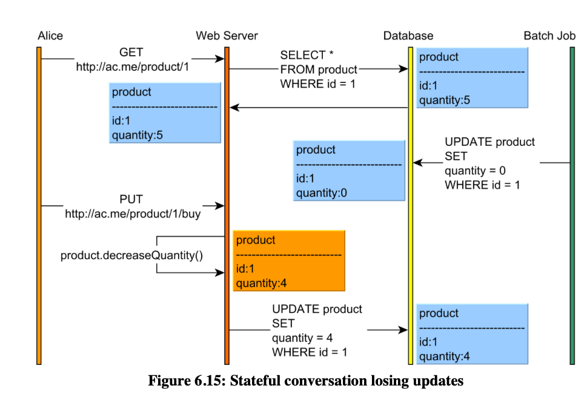

在 Alice 不知情的情况下，批处理程序重置了产品数量。Alice 以为产品版本没有改变，于是尝试购买一件商品，导致之前的产品数量减少了一件。最终，爱丽丝的操作覆盖了批处理程序的修改，数据完整性遭到破坏。

因此，应用程序级别的可重复读并不能完全解决问题（这个论点也适用于数据库隔离级别）。为了防止更新丢失，并发控制机制变得必不可少。

### 6.7.1 悲观锁和乐观锁

隔离级别隐含着锁机制，无论是物理锁（例如 2PL）还是数据异常检测（MVCC）。为了协调状态变更，应用层并发控制使用显式锁，显式锁有两种类型：悲观锁和乐观锁。

#### 6.7.1.1 悲观锁

如前所述，大多数数据库系统都提供了手动请求共享锁或排他锁的功能。这种并发控制被称为悲观锁，因为它假设冲突必然发生，因此必须采取相应的措施来防止冲突。

由于锁可以及时释放，因此在长时间会话的最后一个数据库事务中使用排他锁是合适的。这样，应用程序可以确保一旦获得锁，其他事务就无法干扰当前锁定的资源。

对关键记录加锁可以防止不可重复读、丢失更新以及读写偏差等现象。

#### 6.7.1.2 乐观锁

乐观锁这个名称无疑是个误称（尽管相当普遍），因为它实际上根本不使用任何锁。一个更好的名称应该是乐观并发控制，因为它使用与悲观锁完全不同的方法来管理冲突。

MVCC 是一种乐观并发控制策略，因为它假设冲突不太可能发生，因此它不依赖于锁来控制对共享资源的访问。乐观并发机制检测异常，并中止那些不满足不变性的事务。

虽然数据库确切地知道在给定时间间隔内发布了哪些行版本，但应用程序需要维护事件的发生顺序。每个数据库行都必须有一个关联的版本，该版本由逻辑事务在本地递增。每个修改数据的 SQL 语句（更新或删除）都使用先前加载的版本作为假设，即该行在此期间没有被更改。

由于即使是最低的隔离级别也可以防止写写冲突，因此在任何给定时间只允许一个事务更新一个行版本。由于数据库已经提供了单调更新，因此行版本也可以单调递增，应用程序可以检测到何时更新的记录已过期。

乐观锁并发控制算法如下所示：

* 当客户端读取特定行时，该行的版本号会与其他字段一起返回。
* 更新行时，客户端会根据之前加载的版本号来过滤当前记录。
``` sql
  UPDATE product 
  SET (quantity, version) = (4, 2)
  WHERE id = 1 AND version = 1
```

* 如果更新语句的更新计数为零，则表示版本号在此期间已被其他操作递增，当前事务正在操作的是一个过时的记录版本。

前面的示例可以进行调整，以利用这种乐观并发控制机制。这次，产品被赋予了版本号，并且Web应用程序和批处理程序的数据访问逻辑都使用行版本号来协调更新操作的顺序。

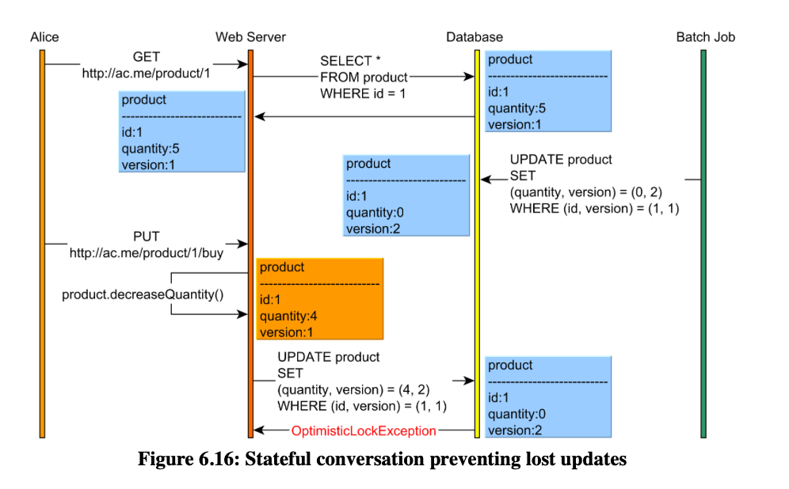

Alice和批处理程序都尝试以乐观的方式递增产品版本号。批处理程序可以成功更新产品数量，因为SQL语句的过滤条件与实际数据库记录的版本号匹配。

当Alice尝试更新产品时，数据库返回的更新计数为零，这样她就被告知在此期间发生了并发更新。

由于应用程序在收到记录版本过时的通知时可以中止当前事务，因此可以防止丢失更新的问题。


# 二、JPA 和 Hibernate

# 7. JPA 和 Hibernate 的重要性

尽管 JDBC 很好地提供了一个通用的 API，隐藏了特定于数据库供应商的通信协议，但它仍然存在以下缺点：

* 即使对于简单的任务，API 也非常冗长。

* 从数据访问层的角度来看，批处理操作并不透明，需要使用与非批处理语句不同的特定 API。

* 缺乏对显式锁定和乐观并发控制的内置支持。

* 对于本地事务，数据访问与事务管理语义纠缠在一起。

* 获取关联关系需要额外的处理，才能将 ResultSet 转换为领域模型或 DTO（数据传输对象）图。

虽然 ORM（对象关系映射）工具的主要目标是自动将对象状态转换转换为 SQL 语句，但本章旨在演示 Hibernate 如何解决上述所有 JDBC 的缺点。

::: info
Java 持久化历史

EJB 1.1 版本通过可扩展的企业组件（称为实体 Bean）提供了更高级别的持久化抽象。
尽管这种设计在理论上看起来不错，但实际上，基于 RMI 的重量级实现从性能角度来看是灾难性的。EJB 2.0 对本地接口的支持也未能挽救实体 Bean 的流行度，由于其高复杂性和特定于供应商的实现细节，大多数项目最终选择了 JDBC。

Hibernate的诞生源于使用实体Bean开发模型所带来的种种挫折。作为一个开源项目，Hibernate迅速获得了广泛的欢迎，并很快成为事实上的Java持久化框架。

为了回应所有与实体Bean持久化相关的批评，Java社区进程（JCP）提出了一种轻量级的基于POJO的方法，并由此诞生了JDO规范。

尽管JDO与数据源无关，能够与关系型数据库、NoSQL数据库甚至平面文件一起工作，但它从未真正普及。因此，Java社区进程决定EJB3将基于一个新的规范，该规范受到Hibernate和TopLink的启发，最终JPA（Java Persistence API）成为标准的Java持久化技术。

由此可见，持久化是一个非常复杂的主题，它需要对数据库和数据访问使用模式有深入的了解。
:::

::: warning
Spring Dada, ORM 和 JPA 的关系：
https://www.51cto.com/article/684643.html
:::

## 7.1 阻抗不匹配

当通过面向对象程序操作关系型数据库时，两种不同的数据表示方式就会产生冲突。

在关系型数据库中，数据存储在表中，关系代数定义了数据关联的形成方式。另一方面，面向对象编程（OOP）语言允许对象同时拥有状态和行为，并且允许双向关联。

协调这两种截然不同的方法所带来的负担造成了很大的困扰，并且长期以来一直困扰着企业系统。

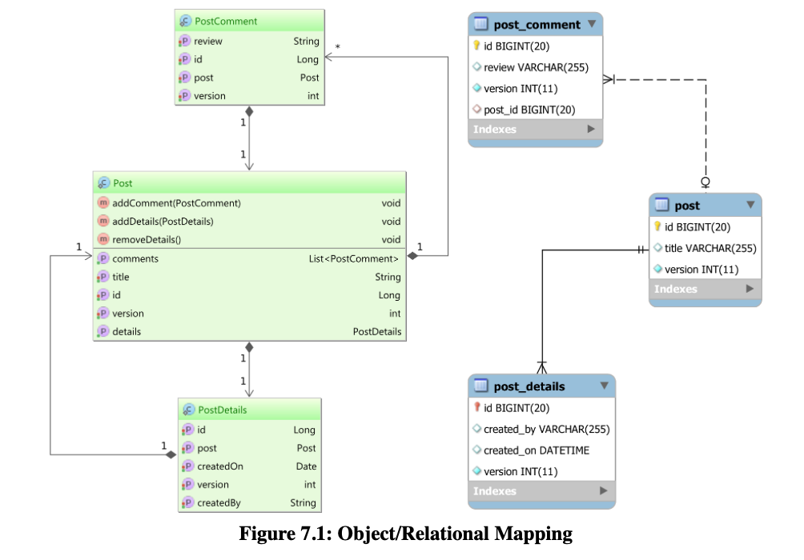

上图描绘了数据访问层需要关联的两种不同模式。数据库模式由SQL标准规范驱动，而领域模型也具有面向对象的模式表示。

领域模型封装了业务逻辑规范，并捕获了数据结构以及控制业务需求的各种行为。面向对象编程（OOP）有助于领域建模，许多现代企业系统都是基于面向对象编程语言实现的。

由于底层数据存储在关系型数据库中，因此领域模型必须适应数据库模式和基于 SQL 的通信协议。ORM 设计模式有助于弥合这两种不同的数据表示形式之间的差距，并消除它们之间的技术鸿沟。每个数据库行都与一个领域模型对象（在 JPA 术语中称为实体）相关联，因此 ORM 工具可以将实体状态转换转换为 DML 语句。

从应用程序开发的角度来看，这非常方便，因为操作领域模型关系比通过底层 SQL 语句来理解业务逻辑要容易得多。

## 7.2 JPA 与 Hibernate

JPA 仅仅是一个规范。它描述了客户端操作的接口以及标准的对象关系映射元数据（Java 注解或 XML 描述符）。除了 API 定义之外，JPA 还解释了（尽管并非详尽无遗）JPA 提供程序应该如何实现这些规范。JPA 随着 Java EE 平台本身的发展而发展（Java EE 6 包含 JPA 2.0，Java EE 7 引入了 JPA 2.1）。

在 JPA 规范首次发布时，Hibernate 已经是一个功能齐全的 Java ORM 实现。尽管它实现了 JPA 规范，但 Hibernate 仍然保留了其原生 API，以实现向后兼容性并支持非标准功能。

尽管最好遵循 JPA 标准，但实际上，许多 JPA 提供程序都提供了针对高性能数据访问层需求的附加功能。为此，Hibernate 提供了以下非 JPA 兼容功能：

* 扩展标识符生成器（hi/lo、pooled、pooled-lo）
* 透明的预编译语句批处理
* 可自定义的 CRUD（@SQLInsert、@SQLUpdate、@SQLDelete）语句
* 静态/动态实体/集合过滤器（例如 @FilterDef、@Filter、@Where）
* 将属性映射到 SQL 片段（例如 @Formula）
* 不可变实体（例如 @Immutable）
* 更多刷新模式（例如 FlushMode.MANUAL、FlushMode.ALWAYS）
* 通过给定实体的自然键查询二级缓存
* 实体级缓存并发策略（例如 Cache(usage = CacheConcurrencyStrategy.READ_WRITE)）
* 通过 HQL 进行版本化批量更新
* 从乐观锁检查中排除字段（例如 @OptimisticLock(excluded = true)）
* 无版本乐观锁（例如 OptimisticLockType.ALL、OptimisticLockType.DIRTY）
* 支持跳过（不等待）悲观锁请求
* 支持 Java 8 日期和时间以及 stream()
* 支持多租户

如果说 JPA 是接口，那么 Hibernate 就是一种实现，而从性能角度来看，实现细节始终至关重要。

JPA 的实现细节会影响性能，忽略这些细节可能会阻碍应用程序性能，甚至导致数据不一致问题。例如，以下 JPA 属性就具有一些特殊行为，这可能会让那些只熟悉 JPA 规范的人感到意外：

* FlushModeType.AUTO 不会像处理 JPQL 或 Criteria API 查询那样触发原生 SQL 查询的刷新操作。

* 无论实体是直接从 EntityManager 获取，还是通过 JPQL（Java Persistence Query Language）或 Criteria API 查询获取，FetchType.EAGER 都可能选择使用 SQL JOIN 或二次查询。

因此，本书重点介绍 Hibernate 如何实现 JPA 规范及其非标准的原生功能（这些功能从效率角度来看非常重要）。

::: info
可移植性问题

与其他非功能性需求一样，可移植性也是一项重要特性，但人们仍然普遍担心使用特定于数据库或框架的功能。实际上，企业应用程序遇到数据访问性能问题的频率远高于需要从一种技术迁移到另一种技术（无论是关系型数据库还是 JPA 提供程序）的频率。

许多关系型数据库的最低通用标准是 SQL-92 标准的超集（尽管它们也并非完全支持该标准）。SQL-99 支持公共表表达式（Common Table Expressions），但 MySQL 5.7 不支持。虽然 SQL-2003 定义了 MERGE 操作符，但 PostgreSQL 9.5 却更倾向于使用 UPSERT 操作。遵循 SQL-92 语法可以提高数据库的可移植性，但放弃特定于数据库的功能可能会影响应用程序性能。解决可移植性问题的方法有两种：一种是移除非通用功能，另一种是进行专门化处理。通过为每个受支持的数据库系统提供不同的实现（例如 jOOQ 框架），仍然可以实现可移植性。

同样的道理也适用于 JPA 提供程序。通过对应用程序进行分层，即使有充分的理由需要将一个成熟的 JPA 实现替换为另一个，切换 JPA 提供程序也会变得更加容易。
:::

## 7.3 模式所有权

由于数据表示的双重性，在谁拥有底层模式的问题上一直存在争议。尽管理论上，数据库和领域模型都可以驱动模式演进，但出于实际考虑，模式通常归数据库所有。

企业系统可能过于庞大，无法容纳在单个应用程序中，因此将其拆分为多个子系统是很常见的，每个子系统都服务于特定的目标。例如，可能包括前端 Web 应用程序、集成 Web 服务、电子邮件调度程序、全文搜索引擎以及需要将数据加载到系统中的后端批处理程序。所有这些子系统都需要使用底层数据库，无论是用于向用户显示内容还是将数据导入系统。

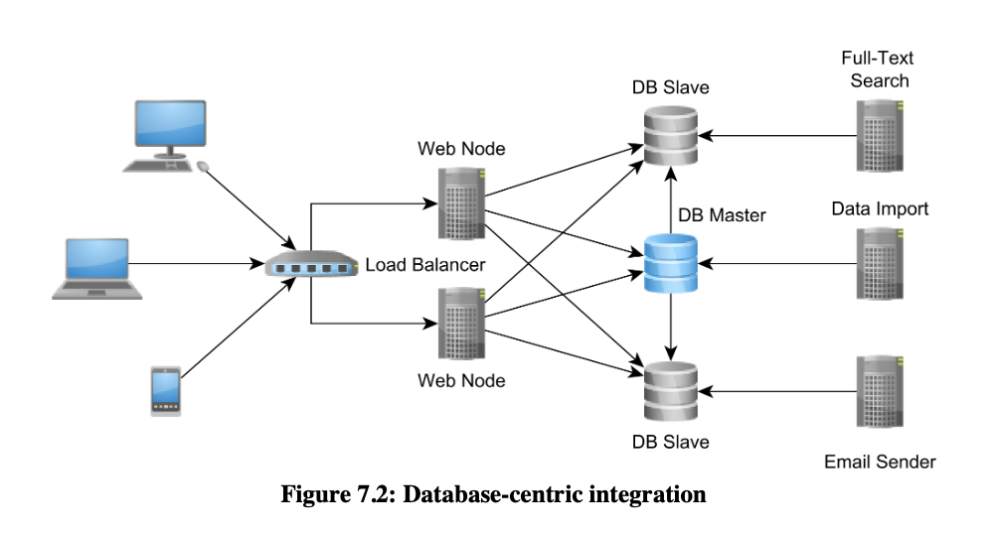

虽然这种方式可能不适用于所有企业系统，但对于许多规模适中的企业系统而言，将数据库作为中央集成点仍然是一个可行的选择。

关系型数据库的并发模型提供了强大的数据一致性保证，因此在应用程序开发方面具有显著优势。如果集成点不提供事务语义，则实现分布式并发控制机制将更加困难。

大多数数据库系统已经支持各种复制拓扑结构，这可以提供更大的容量来应对不断增长的请求流量。即使数据需求持续增长，硬件也在不断改进（而且价格也越来越低），数据库供应商也在不断改进其引擎以处理更多数据。

因此，将数据库作为集成点仍然是企业系统设计中一个重要的考虑因素。

::: info
分布式提交日志

对于大型企业系统而言，数据通常分散存储在不同的数据源中（例如关系型数据库系统、缓存、Hadoop、Spark），此时已无法再依靠关系型数据库来整合所有不同的子系统。

在这种情况下，Apache Kafka 提供了一种容错且可扩展的仅追加日志结构，每个参与的子系统都可以并发地读取和写入该日志。

提交日志成为集成点，每个分布式节点独立地遍历日志，并在顺序日志结构中维护客户端特定的指针。这种设计类似于数据库复制机制，因此它也提供了持久性（日志持久化到磁盘）、写入性能（仅追加日志不需要随机访问）和读取性能（并发读取不会阻塞）。

:::

无论选择何种架构风格，仍然需要将瞬态领域模型与底层持久化数据关联起来。

数据模式会随着企业系统的发展而演变，因此两种不同的模式表示必须始终保持一致。

即使数据访问框架可以自动生成数据库模式，模式也必须进行增量迁移，并且所有更改都需要在版本控制系统 (VCS) 中进行追踪。因此，数据库模式（包括表结构、索引和触发器）与领域模型源代码本身一同维护。像 Flywaydb 这样的工具可以自动执行数据库模式迁移，无论是在测试环境还是生产环境中，系统都可以持续部署。

::: info
模式的所有权归数据库所有，数据访问层必须协助领域模型与底层数据进行交互。
:::

## 7.4 实体状态转换

JPA 将开发人员的思维方式从 SQL 语句转移到实体状态转换。实体可以处于以下状态之一：

| 状态 | 描述 |
| :--- | :--- |
| **新建（瞬态）** | 一个新创建的、未映射到任何数据库行的实体被认为是处于新建或瞬态状态。一旦它变为受管状态，持久化上下文会在刷新时发出插入（INSERT）语句。 |
| **受管（持久化）** | 持久化实体与一个数据库行相关联，并且正由当前运行的持久化上下文管理。状态更改会被脏检查机制检测到，并在刷新时作为更新（UPDATE）语句传播到数据库。 |
| **脱管** | 一旦当前运行的持久化上下文关闭，所有先前受管的实体都会变为脱管状态。后续的更改不再被跟踪，也不会发生自动的数据库同步。 |
| **已删除** | 已删除实体仅被计划用于删除，实际的数据库删除（DELETE）语句在持久化上下文刷新期间执行。 |

持久化上下文会捕获实体状态的变化，并在刷新操作期间将这些变化转换​​为 SQL 语句。JPA 的 EntityManager 接口和 Hibernate 的 Session 接口（后者包含用于在不同状态之间转换实体的额外方法）是访问底层持久化上下文的入口，它们定义了所有实体状态转换操作。

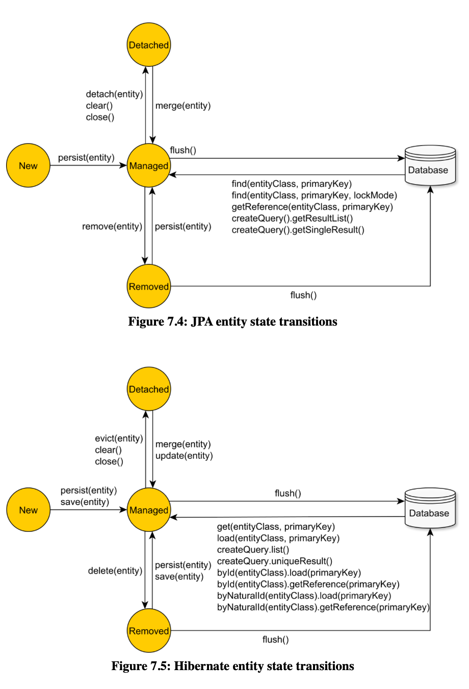

## 7.5 基于写入的优化

::: info
防止 SQL 注入
通过管理 SQL 语句的生成，JPA 工具可以帮助最大限度地降低 SQL 注入攻击的风险。操作 SQL 字符串语句的机会越少，应用程序就越安全。风险无法完全消除，因为应用程序开发人员仍然可以拼接 SQL 或 JPQL 片段，因此建议谨慎使用。

Hibernate 仅使用 PreparedStatement，因此它不仅可以防止 SQL 注入，而且数据访问层还可以更好地利用服务器端和客户端的语句缓存。
:::

::: info
自动生成的 DML 语句

企业系统数据库模式会随着时间推移而演变，数据访问层也必须反映所有这些修改。

由于 JPA 提供程序会自动生成插入和更新语句，因此数据访问层可以轻松适应数据库表结构的修改。通过更新实体模型模式，Hibernate 可以自动相应地调整修改语句。

这也适用于更改数据库列类型。如果数据库模式需要将邮政编码从 INT 数据库类型迁移到 VARCHAR(6)，则数据访问层只需将关联的域模型属性类型从 Integer 更改为 String，所有语句都将自动更新。Hibernate 定义了一个高度可定制的 JDBC 到数据库类型映射系统，应用程序开发人员可以覆盖默认类型关联，甚至可以添加对 Hibernate 当前不支持的新数据库类型的支持。

实体获取过程由 JPA 实现自动管理，该实现会自动生成关联数据库表的 SELECT 语句。这样，JPA 可以使应用程序开发人员无需维护实体选择查询。

Hibernate 允许自定义所有 CRUD 语句，在这种情况下，应用程序开发人员负责维护关联的 DML 语句。

尽管它负责实体选择过程，但大多数企业系统都需要利用底层数据库的查询功能。因此，每当数据库模式发生更改时，所有原生 SQL 查询都需要根据其关联的业务逻辑要求手动更新。
:::

::: info
写回缓存

持久化上下文充当事务性写回缓存，将实体状态的刷新延迟到最后一刻。

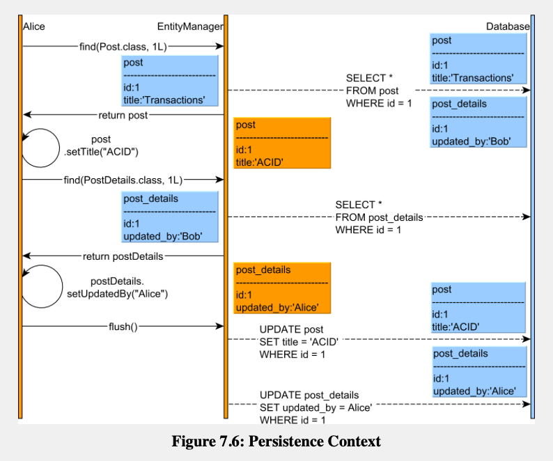

由于每个修改数据的 DML 语句都需要加锁（以防止脏写），写回缓存可以缩短数据库锁的持有时间，从而提高并发性。

然而，缓存会带来一致性方面的挑战，因此在执行任何 JPQL 或原生 SQL 查询之前，持久化上下文都需要进行刷新，否则可能会破坏“读自己写入的数据”的一致性保证。

正如后续章节所述，Hibernate 在即将执行原生查询时不会自动刷新待处理的更改，应用程序开发人员必须明确指定需要同步哪些数据库表。
:::

::: info
透明的语句批处理

由于所有更改都会一次性刷新，因此 Hibernate 可以受益于 JDBC 语句的批处理。即使在数据访问逻辑已经实现之后，也可以透明地启用批处理更新。通常，性能调优会推迟到系统已经在生产环境中运行之后进行，而切换到批处理语句不应该需要大量的开发工作。

只需一项配置，Hibernate 就可以批量执行所有预处理语句。
:::

::: info

应用程序级并发控制

如前所述，任何数据库隔离级别都无法防止在执行多请求长事务时丢失更新。JPA 支持乐观锁和悲观锁。

JPA 的乐观锁机制通过强制执行“先发生后发生”的事件顺序来防止丢失更新。但是，在多请求事务中，乐观锁需要维护旧的实体快照，JPA 通过扩展持久化上下文或分离实体来实现这一点。

Java EE 应用程序服务器可以在多个 Web 请求之间保留给定的持久化上下文，从而提供应用程序级的可重复读。但是，这种策略并非没有代价，因为应用程序开发人员必须确保持久化上下文不会包含过多的实体，这不仅会消耗内存，还会影响 Hibernate 默认的脏检查机制的性能。

即使不使用 Java EE，也可以使用分离实体来实现相同的目标，分离实体可以对需要在不同 Web 请求之间保留的数据量进行细粒度的控制。JPA 允许合并分离实体，这些实体会重新变为托管状态，并自动与底层数据库系统同步。

JPA 还支持悲观锁查询抽象，这在使用较低级别的事务隔离模式时非常有用。

Hibernate 具有原生的悲观锁 API，该 API 支持锁定获取请求超时或跳过已获取的锁。
:::


## 7.6 基于读取的优化

遵循 SQL 标准，JDBC ResultSet 是底层获取数据的表格表示形式。由于领域模型被构建为实体图，数据访问层必须将扁平的 ResultSet 转换为分层结构。

尽管 ORM 工具的目标是缩小面向对象的领域模型与其关系型对应模型之间的差距，但务必记住，数据源并非内存中的存储库，数据获取行为会影响整体数据访问效率。

在这种情况下，数据库是无法被抽象掉的，假装实体可以像其他普通对象一样被操作，会对应用程序性能造成非常不利的影响。在读取数据时，阻抗不匹配问题变得更加明显，出于性能考虑，必须牢记与每个数据获取操作相关的 SQL 语句。

::: warning

https://tqnwhz.github.io/blog/2024/04/09/DDIA-Note-2/

对象关系不匹配概念
* 多数应用是使用面向对象的概念编程，SQL 以关系存储模型
* 需要一个尴尬的中间层，完成二者之间的转换
* 这个问题也被称为阻抗不匹配（Object–relational impedance mismatch）
* 对象关系映射（Object-relational mapping，ORM）框架，例如 ActiveRecord、Hibernate 减少了转换层的模板代码开销，但还是不能掩盖二者的差异
:::

在以下示例中，我们将获取帖子记录及其所有关联的评论。使用 JDBC，可以使用以下代码片段完成此任务：

``` java

 doInJDBC(connection -> {
    try (PreparedStatement statement = connection.prepareStatement(
        "SELECT * " +
        "FROM post AS p " +
        "JOIN post_comment AS pc ON p.id = pc.post_id " +
        "WHERE " +
        "   p.id BETWEEN ? AND ? + 1"
    )) {
        statement.setInt(1, id);
        statement.setInt(2, id);
        try (ResultSet resultSet = 
        “statement.executeQuery()) {
            List<Post> posts = toPosts(resultSet);
            assertEquals(expectedCount, posts.size());
        }
    } catch (SQLException e) {
        throw new DataAccessException(e);
    }
});

```

在连接多对一或一对一关联时，每个 ResultSet 记录对应一对实体，因此在每次迭代中都可以解析父实体和子实体。对于一对多或多对多关系，由于 SQL 连接的工作方式，ResultSet 会为每个关联的子实体包含一个重复的父实体记录。

构建分层实体结构需要手动转换 ResultSet，为了解决重复问题，父实体引用会存储在 Map 结构中。

``` java
List<Post> toPosts(ResultSet resultSet) throws SQLException {
    Map<Long, Post> postMap = new LinkedHashMap<>();
    while (resultSet.next()) {
        Long postId = resultSet.getLong(1);
        Post post = postMap.get(postId);
        if(post == null) {
            post = new Post(postId);
            postMap.put(postId, post);
            post.setTitle(resultSet.getString(2));
            post.setVersion(resultSet.getInt(3));
        }
        PostComment comment = new PostComment();
        comment.setId(resultSet.getLong(4));
        comment.setReview(resultSet.getString(5));
        comment.setVersion(resultSet.getInt(6));
        post.addComment(comment);
    }
    return new ArrayList<>(postMap.values());
}
```

JDBC 4.2 的 PreparedStatement 仅支持位置参数，且第一个参数的索引从 1 开始。JPA 也允许使用命名参数，这在需要多次引用同一参数时特别有用，因此前面的示例可以重写如下：

``` java
doInJPA(entityManager -> {
    List<Post> posts = entityManager.createQuery(
        "select distinct p " +
        "from Post p " +
        "join fetch p.comments " +
        "where " +
        "   p.id BETWEEN :id AND :id + 1", Post.class)
    .setParameter("id", id)
    .getResultList();
    assertEquals(expectedCount, posts.size());
});
```

在上述两个示例中，对象关系转换都是隐式或显式地进行的。在 JDBC 的用例中，关联关系必须手动解析，而 JPA 则会根据实体模式自动完成解析。

::: info
数据获取的责任

除了将数据库列映射到实体属性之外，实体关联关系还可以用对象关系来表示。此外，数据获取行为还可以硬编码到实体模式本身中，但这通常是一种糟糕的做法。

获取多个一对多或多对多关联关系更加棘手，因为它们可能需要进行笛卡尔积运算，从而影响性能。控制硬编码的模式获取策略非常麻烦，因为它阻止了使用延迟加载机制来覆盖预先加载的策略。

每个业务用例都有不同的数据访问需求，一种策略无法预见所有可能的用例，因此数据获取策略应该始终基于查询来设置。
:::

::: info
优先使用投影进行只读视图

虽然获取实体及其所有关联关系非常方便，但也应该考虑其对性能的影响。如前所述，获取过多数据是不合适的，因为它会增加事务响应时间。

实际上，并非所有用例都需要加载实体，也并非所有读取操作都需要使用相同的数据获取机制。有时，自定义投影（仅从实体中选择少量列）更加合适，而且数据访问逻辑甚至可以利用 JPA 查询抽象可能不支持的特定于数据库的 SQL 构造。

一般来说，当逻辑事务需要修改实体时，即使修改操作发生在后续的 Web 请求中，获取实体也是合适的。考虑到这一点，就更容易确定在给定业务逻辑用例中应该采用哪种数据获取机制。
:::

::: info

二级缓存

如果持久化上下文充当事务性写回缓存，则其生命周期将与逻辑事务的生命周期绑定。因此，持久化上下文也被称为一级缓存，它不能被多个并发事务共享。

另一方面，二级缓存与 EntityManagerFactory 关联，所有持久化上下文都可以访问它。二级缓存可以存储实体、实体关联（一对多和多对多关系）甚至实体查询结果。由于 JPA 规范并未强制要求使用二级缓存，因此每个提供程序都采用不同的缓存策略（例如，EclipseLink 默认启用二级缓存，而 Hibernate 默认禁用二级缓存）。

通常，缓存是在一致性和性能之间进行权衡。由于缓存成为另一个数据源，因此可能会出现不一致的情况，只有当所有数据库修改都通过单个 EntityManagerFactory 或同步的分布式缓存解决方案进行时，才能避免这种情况。实际上，这并不现实，因为应用程序可能部署在多个节点上（每个节点都有自己的 EntityManagerFactory），并且数据库可能被多个应用程序访问。

虽然二级缓存可以缓解实体获取的性能问题，但它需要分布式缓存实现，而分布式缓存本身也可能无法避免网络开销。

:::

### 7.7 总结

连接两种高度专业化的技术始终是一个难以解决的问题。当企业系统构建在面向对象语言之上时，对象关系阻抗不匹配问题就不可避免地出现了。ORM模式旨在弥合这一差距，尽管它无法完全消除这种不匹配。

最终，所有通信都通过JDBC进行，所有执行都在数据库引擎本身中完成。高性能的企业应用程序必须与底层数据库系统协同工作，而ORM工具绝不能破坏这种关系。

正如它试图解决的问题一样，Hibernate是一个非常复杂的框架，其中包含许多细微之处，需要对数据库系统、JDBC以及框架本身都有深入的了解。本章仅为概述，旨在从不同的角度介绍JPA和Hibernate，帮助读者更好地理解高性能对象关系映射。如果某些主题不够清晰，请不必担心，因为后续章节将更详细地分析所有这些概念。

# 8. 连接管理和监控

正如之前在 JDBC 连接管理章节中所述，出于性能考虑，数据库连接最好重用。由于 JPA 提供程序会代表用户生成 SQL 语句，因此监控此过程并了解其结果至关重要。本章将介绍 Hibernate 连接提供程序机制以及监控语句执行的方法。

## 8.1 JPA 连接管理

与整个 Java EE 套件一样，JPA 1.0 规范与企业应用服务器紧密相关。在 Java EE 容器中，所有数据库连接都由应用服务器管理，应用服务器提供连接池、监控和 JTA 功能。

配置完成后，可以通过 JNDI 查找 Java EE DataSource。在 persistence.xml 配置文件中，应用程序开发人员必须提供关联的 JTA 或 RESOURCE_LOCAL DataSource 的 JNDI 名称，transaction-type 属性也必须与数据源的事务功能相匹配。

```
<persistence-unit name="persistenceUnit" transaction-type="JTA">
    <provider>org.hibernate.jpa.HibernatePersistenceProvider</provider>
    <jta-data-source>java:global/jdbc/flexypool</jta-data-source>
</persistence-unit>
```

RESOURCE_LOCAL事务必须使用非JTA数据源（DataSource）。
```
<persistence-unit name="persistenceUnit" transaction-type="RESOURCE_LOCAL">
<provider>org.hibernate.jpa.HibernatePersistenceProvider</provider>
    <non-jta-data-source>java:/comp/env/jdbc/hsqldb</non-jta-data-source>
</persistence-unit>
```

虽然对于 Java EE 应用程序而言，完全依赖应用服务器提供功能齐全的 DataSource 引用是完全可以的，但独立应用程序通常使用依赖注入而不是 JNDI 进行配置。

从 JPA 实现的角度来看，DataSource 可以由外部配置，也可以由 JPA 提供程序自身配置。通常，配置外部 DataSource 仍然是首选方案，因为它在修饰连接提供机制（例如日志记录、监控）方面提供了更大的灵活性。

自 JPA 2.0 标准化了数据库连接配置属性以来，JPA 提供程序可以通过底层 JDBC 驱动程序获取连接：

| 属性 | 说明 |
| :--- | :--- |
| `javax.persistence.jdbc.driver` | 驱动程序完整类名（例如：`org.hsqldb.jdbc.JDBCDriver`） |
| `javax.persistence.jdbc.url` | 驱动程序连接 URL（例如：`jdbc:hsqldb:mem:test`） |
| `javax.persistence.jdbc.user` | 数据库用户名 |
| `javax.persistence.jdbc.password` | 数据库用户密码 |

不幸的是，仅凭这些属性还不够，因为大多数企业应用程序仍然需要连接池和监控功能。
因此，JPA 连接管理仍然是一个特定于实现的主题，接下来的章节将深入探讨 Hibernate 使用的连接提供程序机制。

## 8.2 Hibernate 连接提供程序

Hibernate 需要在 Java EE 和独立环境中运行，数据库连接配置可以通过声明式或编程方式完成。
为了支持 JDBC 驱动程序连接以及 RESOURCE_LOCAL 和 JTA DataSource 配置，Hibernate 定义了自己的连接工厂抽象，该抽象由 org.hibernate.engine.jdbc.connections.spi.ConnectionProvider 接口表示：
``` java
public interface ConnectionProvider extends Service, Wrapped {

    public Connection getConnection() throws SQLException;

    public void closeConnection(Connection connection) throws SQLException;
    
    public boolean supportsAggressiveRelease();
}
```

由于连接提供程序可能会影响事务响应时间，因此我们将从高性能 OLTP 系统的角度分析每个提供程序。

### 8.2.1 DriverManagerConnectionProvider

当Hibernate接收到上述JPA 2.0连接属性或相应的Hibernate特定配置时，会选择此提供程序：
* hibernate.connection.driver_class
* hibernate.connection.url
* hibernate.connection.username
* hibernate.connection.password

尽管它通过底层的DriverManager获取数据库连接，但此提供程序尝试通过使用简单的连接池实现来避免连接获取的开销。
Hibernate文档不建议在生产环境中使用DriverManagerConnectionProvider。

### 8.2.2 C3P0ConnectionProvider

C3P0是一个成熟的连接池解决方案，已在许多生产环境中得到验证，并且，Hibernate可以使用底层的JDBC连接属性，将内置连接池替换为c3p0 DataSource。要激活此提供程序，应用程序开发人员必须提供至少一个以hibernate.c3p0前缀开头的配置属性：

```
<property name="hibernate.c3p0.max_size" value="5"/>
```

C3P0（发布于2001年）和Apache DBCP（发布于2002年）是最早也是部署最广泛的独立Java连接池解决方案。
2010年，BoneCP作为c3p0和Apache DBCP的高性能替代方案出现。

如今，BoneCP的GitHub页面显示它已被弃用，推荐使用HikariCP。

截至本文撰写之时，目前最受欢迎的 Java 连接池包括 HikariCP、Vibur DBCP 和 Apache DBCP2。HikariCP 和 Vibur DBCP 提供内置的 Hibernate 连接提供程序。

### 8.2.3 HikariCPConnectionProvider

Hibernate 5 通过以下依赖项支持 HikariCP（最快的连接池之一）：
```
<dependency>
    <groupId>org.hibernate</groupId>
    <artifactId>hibernate-hikaricp</artifactId>
    <version>${hibernate.version}</version>
</dependency>
```

通过指定 hibernate.connection.provider_class 属性，应用程序开发人员可以覆盖默认的连接提供程序机制：
``` property
<property name="hibernate.connection.provider_class" 
    value="org.hibernate.hikaricp.internal.HikariCPConnectionProvider"/>
```

与 DriverManagerConnectionProvider 或 C3P0ConnectionProvider 不同，HikariCP 需要特定的配置属性：

表 8.2：HikariCP 连接属性

| 属性 | 说明 |
| :--- | :--- |
| `hibernate.hikari.dataSourceClassName` | 驱动程序完整类名 |
| `hibernate.hikari.dataSource.url` | 驱动程序连接 URL |
| `hibernate.hikari.dataSource.user` | 数据库用户名 |
| `hibernate.hikari.dataSource.password` | 数据库用户密码 |
| `hibernate.hikari.maximumPoolSize` | 最大连接池大小 |


### 8.2.4 DatasourceConnectionProvider

当 JPA 配置文件定义了 non-jta-data-source 或 jta-data-source 元素，或者提供了 hibernate.connection.datasource 配置属性时，将选择此提供程序。

::: info
与其他提供程序不同，此提供程序与 JTA 事务兼容，而 JTA 事务在 Java EE 中是必需的。

Spring 既可以与独立的 JTA 事务管理器（例如 Bitronix 或 Atomikos）配合使用，也可以与 Java EE DataSource 配合使用。由于它提供了对实际 DataSource 配置的最佳控制，因此 DatasourceConnectionProvider 是首选（即使对于 HikariCP 也是如此）。
:::

### 8.2.5 连接释放模式

Hibernate 会延迟数据库连接的获取，直到当前事务需要执行其第一个 SQL 语句（由读取或写入操作触发）。
这种优化使 Hibernate 能够缩短物理事务间隔，从而增加从连接池获取连接的机会。

连接释放策略通过 hibernate.connection.release_mode 属性控制，该属性可以采用以下值：

表 8.3：连接释放模式

| 值 | 说明 |
| :--- | :--- |
| `after_transaction` | 数据库连接被获取后，仅当当前事务提交或回滚后才会被释放。 |
| `after_statement` | 连接在每条语句执行后释放，并在执行下一条语句前重新获取。此策略旨在防止应用服务器在连续的 EJB 调用之间错误地检测到连接泄漏，尽管 JDBC 或 JTA 规范均未要求此行为。 |
| `auto` | 这是默认值。对于 RESOURCE_LOCAL 事务，它使用 `after_transaction` 模式；而对于 JTA 事务，则回退到 `after_statement` 模式。 |


对于 JTA 事务，默认模式可能过于严格，因为并非所有 Java EE 应用服务器在管理事务资源方面的行为都相同。因此，检查数据库连接是否可以在触发连接获取事件的 EJB 组件之外关闭非常重要。基于 Spring 的企业系统不使用 Enterprise Java Beans，即使使用独立的 JTA 事务管理器，after_transaction 连接释放模式也可能完全适用。

after_statement 模式会频繁地获取和释放连接，这显然会带来一定的性能开销。因此，以下测试测量了在 Spring 应用程序上下文中使用 Bitronix 时连接获取的开销。每个事务都会执行相同的语句（获取当前时间戳），执行次数由 x 轴表示。y 轴记录了 after_statement 和 after_transaction 两种连接释放模式下的事务响应时间。

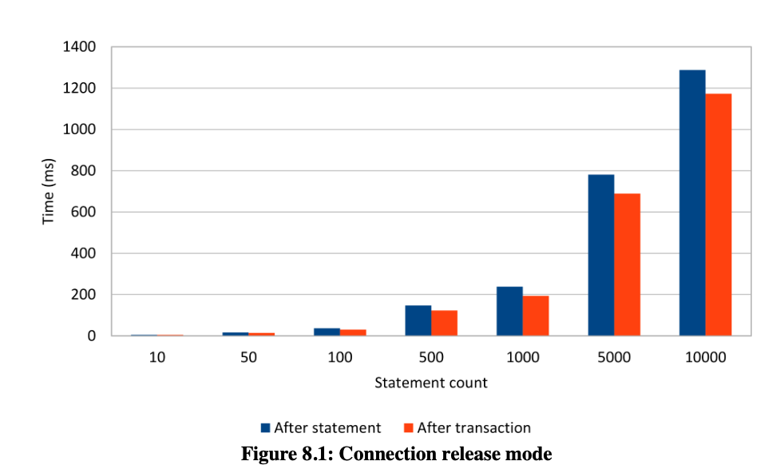

事务执行的语句越多，从底层连接池重新获取相关数据库连接的开销就越大。为了更好地展示连接获取的开销，测试运行了多达 10,000 条语句，尽管这个数字对于典型的 OLTP 事务来说可能过高。

理想情况下，数据库事务应该尽可能短，语句数量也不应该太多。这一要求源于连接池中的连接数量有限，并且锁最好尽快释放。

after_transaction 连接释放模式比默认的 JTA after_statement 策略更高效，因此如果 JTA 事务资源管理逻辑不与此连接释放策略冲突，则应该使用 after_transaction 模式。

::: warning
JTA 和 JDBC 事务

https://cloud.tencent.com/developer/article/1786161
:::

## 8.3 监控连接

如前所述，使用外部配置的 DataSource 是首选方案，因为实际的 DataSource 可以通过连接池、监控和日志记录功能进行增强。FlexyPool 的工作原理也正是如此，下图展示了 DataSource 的代理机制：

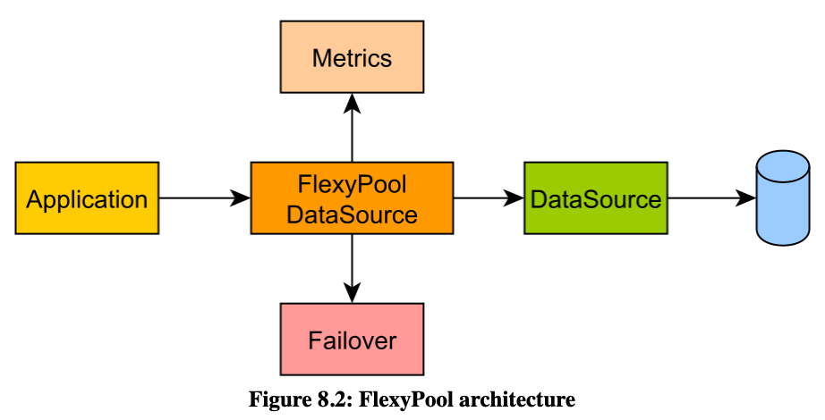

数据访问层获取的不是实际的 DataSource 实例，而是其代理引用。该代理会拦截连接获取和释放请求，从而监控连接的使用情况。

在使用 Spring 时，设置 FlexyPool 相当简单，因为应用程序可以完全控制 DataSource 的配置。

在 Java EE 中，数据库连接应始终从托管的 DataSource 获取。集成 FlexyPool 的一种简单方法是扩展默认的 DatasourceConnectionProviderImpl，并将原始 DataSource 替换为 FlexyPoolDataSource。

因此，FlexyPool 提供了以下 Hibernate 连接提供程序：

``` java
public class FlexyPoolHibernateConnectionProvider
    extends DatasourceConnectionProviderImpl {

    private transient FlexyPoolDataSource<DataSource> flexyPoolDataSource;

    @Override 
    public void configure(Map props) {
        super.configure(props);
        flexyPoolDataSource = new FlexyPoolDataSource<>(getDataSource());
    }

    @Override 
    public Connection getConnection() throws SQLException {
        return flexyPoolDataSource.getConnection();
    }

    @Override 
    public boolean isUnwrappableAs(Class unwrapType) {
        return super.isUnwrappableAs(unwrapType) ||
            getClass().isAssignableFrom(unwrapType);
    }

    @Override 
    public void stop() {
        flexyPoolDataSource.stop();
        super.stop();
    }
}
```

要使用 FlexyPoolHibernateConnectionProvider，应用程序必须配置 hibernate.connection.provider_class 属性：

``` property
<property 
 name="hibernate.connection.provider_class" 
 value="com.vladmihalcea.flexypool.adaptor.FlexyPoolHibernateConnectionProvider"
/>
```

### 8.3.1 Hibernate 统计信息

Hibernate 内置了一个统计信息收集器，用于收集与数据库连接、Session 事务甚至二级缓存使用情况相关的通知。StatisticsImplementor 接口定义了拦截各种 Hibernate 内部事件的契约：

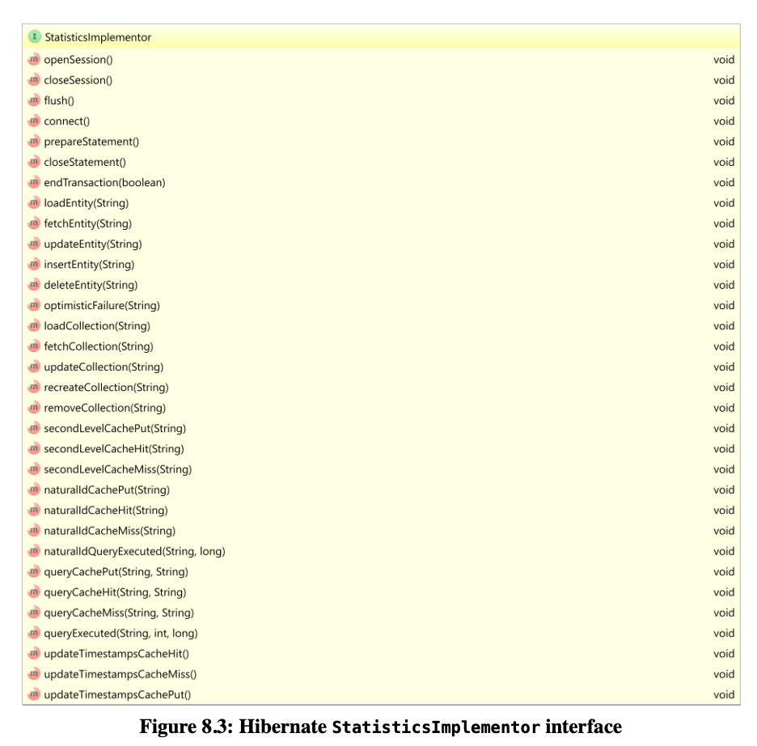

Hibernate 可以代表用户收集各种各样的指标，但出于性能考虑，统计机制默认是禁用的。

要启用统计信息收集机制，必须首先配置以下属性：

``` property
<property name="hibernate.generate_statistics" value="true"/>
```

启用统计信息收集后，要将统计信息打印到当前应用程序日志中，必须设置以下日志记录器配置：

``` property
<logger 
    name="org.hibernate.engine.internal.StatisticalLoggingSessionEventListener"
    level="info" />
```

完成以上两项设置后，每当 Hibernate Session（持久化上下文）结束时，当前运行的日志中就会显示以下报告。

```
37125102 nanoseconds spent acquiring 10000 JDBC connections;
25521714 nanoseconds spent releasing 10000 JDBC connections;
95242323 nanoseconds spent preparing 10000 JDBC statements;
923615040 nanoseconds spent executing 10000 JDBC statements;
```

默认的统计信息收集器仅统计特定回调方法的调用次数，如果这不能满足需求，应用程序开发人员可以提供自己的自定义 StatisticsImplementor 实现。

::: info

Dropwizard Metrics

在高吞吐量的事务系统中，需要记录的指标数据量可能非常庞大，因此将所有这些值存储在内存中是完全不切实际的。

为了减少内存占用，Dropwizard Metrics 项目采用了各种蓄水池采样策略，这些策略要么使用固定大小的采样器，要么使用基于时间的采样窗口。

Dropwizard Metrics 不仅支持多种指标类型（例如计时器、直方图、计数器），还可以使用多种报告通道（例如 SLF4J、JMX、Ganglia、Graphite）。

鉴于以上种种原因，使用像 Dropwizard Metrics 这样成熟的框架比从头开始构建自定义实现要好得多。

:::

#### 8.3.1.1 自定义统计信息

虽然内置的指标信息相当丰富，但 Hibernate 并不局限于默认的统计信息收集机制，该机制可以完全自定义。

在接下来的示例中，统计信息收集器还提供以下指标：

物理事务时间的分布（从首次获取连接到释放连接的时间间隔）

在任何给定事务的生命周期内，连接获取请求次数的直方图（由于使用了 after_statement 释放模式）。

StatisticsReport 类在 Dropwizard Metrics 的基础上提供了指标存储和报告生成功能：

``` java

 public class StatisticsReport {

    private final Logger LOGGER = LoggerFactory.getLogger(getClass());

    private MetricRegistry metricRegistry = new MetricRegistry();

    private Histogram connectionCountHistogram = metricRegistry.
        histogram("connectionCountHistogram");

    private Timer transactionTimer = metricRegistry.
        timer("transactionTimer");

    private Slf4jReporter logReporter = Slf4jReporter
            .forRegistry(metricRegistry)
            .outputTo(LOGGER)
            .build();

    public void transactionTime(long nanos) {
        transactionTimer.update(nanos, TimeUnit.NANOSECONDS);
    }

    public void connectionsCount(long count) {
        connectionCountHistogram.update(count);
    }

    public void generate() {
        logReporter.report();
    }
}

```

StatisticsImplementor 接口定义了 Hibernate 内部 API 与各种自定义统计信息收集实现之间的契约。为简化起见，以下 StatisticsImplementor 接口实现扩展了默认的 ConcurrentStatisticsImpl 类，因为它只需要重写 connect 和 endTransaction 方法。

``` java
 public class TransactionStatistics extends ConcurrentStatisticsImpl {

    private static final ThreadLocal<AtomicLong> startNanos = 
    	ThreadLocal.withInitial(AtomicLong::new);

    private static final ThreadLocal<AtomicLong> connectionCounter = 
    	ThreadLocal.withInitial(AtomicLong::new);

    private StatisticsReport report = new StatisticsReport();

    @Override
    public void connect() {
        connectionCounter.get().incrementAndGet();
        startNanos.get().compareAndSet(0, System.nanoTime());
        super.connect();
    }

    @Override
    public void endTransaction(boolean success) {
        try {
            report.transactionTime(System.nanoTime() - startNanos.get().get());
            report.connectionsCount(connectionCounter.get().get());
            report.generate();
        } finally {
            startNanos.remove();
            connectionCounter.remove();
        }
        super.endTransaction(success);
    }
}
```

StatisticsImplementor 是一个单例实例，因此在事务结束后必须重置 ThreadLocal 计数器。事务结束时，会生成报告，并将物理事务时间和特定事务期间发出的连接请求次数记录到日志中。

由于持久化上下文可以运行多个并发事务，因此报告会在每个事务结束时生成。

要使用自定义的 StatisticsImplementor 实例，Hibernate 需要在配置属性中提供一个 StatisticsFactory。StatisticsImplementor 的构建过程会接收一个 SessionFactoryImplementor 参数，因此也可以访问 Hibernate 的配置数据。

``` java
public class TransactionStatisticsFactory implements StatisticsFactory {   
    @Override public StatisticsImplementor buildStatistics(
        SessionFactoryImplementor sessionFactory) {
        return new TransactionStatistics();
    }
}
```

hibernate.stats.factory 配置属性必须包含 StatisticsFactory 实现类的完全限定名：

``` property
<property name="hibernate.stats.factory" value="com.vladmihalcea.book.hpjp.hibernate\
.statistics.TransactionStatisticsFactory" />
```

当将之前的 JTA 连接释放模式示例与此自定义统计信息收集器一起运行时，会显示以下输出：

```
type=HISTOGRAM, name=connectionCounterHistogram, count=107, 
min=1, max=10000, mean=162.41, stddev=1096.69, 
median=1.0, p75=1.0, p95=50.0, p98=1000.0, p99=5000.0, p999=10000.0

type=TIMER, name=transactionTimer, count=107, 
min=0.557524, max=1272.75, mean=27.16, stddev=152.57, 
median=0.85, p75=1.24, p95=41.25, p98=283.50, p99=856.19, p999=1272.75, 
mean_rate=36.32, rate_unit=events/second, duration_unit=milliseconds
```
::: info
对于高性能数据访问层而言，统计信息和指标是必不可少的。Hibernate 统计机制是一个非常强大的工具，可以帮助开发团队更好地了解 Hibernate 的内部工作原理。
:::

## 8.4 语句日志记录

ORM 工具可以自动生成 DML 语句，但应用程序开发人员有责任验证这些语句的有效性和整体性能影响。将 SQL 语句验证推迟到数据访问层出现性能问题时才进行是存在风险的，甚至会影响开发成本。因此，从应用程序开发的早期阶段开始，SQL 语句日志记录就变得至关重要。

在实现业务逻辑时，“完成定义”应该包含对所有相关数据访问层操作的审查。遵循此规则可以在企业系统部署到生产环境时节省大量麻烦。

尽管 JPA 2.1 没有用于记录 SQL 语句的标准配置属性，但大多数 JPA 实现都通过特定于框架的设置支持此功能。为此，Hibernate 定义了以下配置属性：

表 8.4：连接释放模式

| 属性 | 描述 |
| :--- | :--- |
| `hibernate.show_sql` | 将 SQL 语句打印到控制台 |
| | |
| `hibernate.format_sql` | 在记录或打印到控制台之前格式化 SQL 语句 |
| | |
| `hibernate.use_sql_comments` | 在自动生成的 SQL 语句中添加注释 |

使用系统控制台进行日志记录是一种不好的做法，日志框架（例如 Logback 或 Log4j）是更好的选择，因为它支持可配置的附加器和日志级别。

::: info
由于 hibernate.show_sql 属性会将日志打印到控制台，因此应避免使用它。
:::

Hibernate 会在 org.hibernate.SQL 日志记录层次结构中以调试级别记录所有 SQL 语句。

要启用语句日志记录，必须将以下 Logback 日志记录器添加到相应的配置文件中：

``` property
<logger name="org.hibernate.SQL" level="debug"/>
```

由于 Hibernate 仅使用 PreparedStatement，因此在将语句打印到日志时，无法获取绑定参数值：
``` property
INSERT INTO post (title, version, id) VALUES (?, ?, ?)
```

### 8.4.1 语句格式化

默认情况下，每条 SQL 语句（无论多长）都以单行文本的形式写入。为了提高可读性，Hibernate 可以将 SQL 语句转换为跨越多行日志的可读格式。可以通过设置以下配置属性来激活此功能：
``` property
<property name="hibernate.format_sql" value="true" />
```

启用此设置后，之前的语句可以格式化如下：

``` property
 insert 
    into
        post
        (title, version, id) 
    values
        (?, ?, ?)
```

虽然格式化语句可以提高可读性，但此设置仅适用于开发阶段。在生产系统中，日志通常会在集中式系统中进行解析和聚合，而多行语句格式可能会影响日志解析机制。聚合后，可以在应用程序性能监控用户界面中显示之前对记录的查询进行格式化。

::: info

hibernate.format_sql 属性仅适用于日志记录的语句，并且不会传递到底层的 JDBC 驱动程序（SQL 语句仍然以单行文本的形式发送）。

因此，当通过外部 DataSource 代理记录语句时，语句格式化不会产生任何效果。
:::

### 8.4.2 语句级注释

除了格式化之外，Hibernate 还可以通过在语句主体中添加 SQL 级注释来解释语句生成过程。此功能使应用程序开发人员能够更好地理解以下过程：
* 触发当前执行语句的实体状态转换
* 选择连接以获取给定结果集的原因
* 当前语句使用的显式锁定机制

默认情况下，Hibernate 不会在自动生成的语句中添加任何 SQL 注释。要启用此机制，必须配置以下 Hibernate 属性：

``` property
<property name="hibernate.use_sql_comments" value="true" />
```

持久化 Post 实体时，Hibernate 会通过以下注释解释与此特定语句相关的实体状态转换：

```
/* insert com.vladmihalcea.book.hpjp.util.providers.BlogEntityProvider$Post
“*/ 
INSERT INTO post (title, version, id) VALUES (?, ?, ?)
```

::: info
与 SQL 语句格式化不同，SQL 注释不仅在日志记录期间生成，还会传播到底层驱动程序。虽然这种技术可能对调试很有用，但在生产环境中，最好禁用它，以减少数据库请求的网络开销。
:::

### 8.4.3 日志记录参数

必须对 JDBC 驱动程序或 DataSource 进行代理，才能拦截语句执行并记录实际参数值。除了语句日志记录之外，JDBC 代理还可以提供其他横切功能，例如长时间运行查询检测或自定义语句执行监听器。

#### 8.4.3.1 DataSource-proxy

DataSource-proxy 是一个鲜为人知的 JDBC 日志记录框架，它支持自定义 JDBC 语句执行监听器。在 Java EE 中，并非所有应用服务器都允许配置外部 DataSource，因为它们依赖于自己的自定义实现来绑定用户提供的 JDBC 驱动程序。由于 DataSource-proxy 只能装饰 DataSource，因此它可能不适用于所有 Java EE 环境。

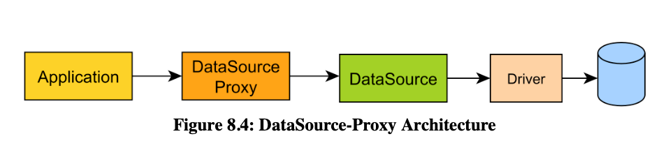

另一方面，其程序化配置支持与大多数现代 Spring 应用程序采用的基于 Java 的配置方法相契合：

``` java
@Bean 
public DataSource dataSource() {
    SLF4JQueryLoggingListener loggingListener = new
SLF4JQueryLoggingListener();
    loggingListener.setQueryLogEntryCreator(new InlineQueryLogEntryCreator());
    return ProxyDataSourceBuilder
        .create(actualDataSource())
        .name(DATA_SOURCE_PROXY_NAME)
        .listener(loggingListener)
        .build();
}
```

在以下示例中，DataSource-proxy 用于记录三个 PreparedStatement 的批量插入操作。虽然通常批量操作会打印在日志的一行中，但为了适应当前页面布局，输出被拆分成了多行。

```
Name:DATA_SOURCE_PROXY, Time:6, Success:True, 
Type:Prepared, Batch:True, QuerySize:1, BatchSize:3, 
Query:["insert into post (title, version, id) values (?, ?, ?)"], 
Params:[(Post no. 0, 0, 0), (Post no. 1, 0, 1), (Post no. 2, 0, 2)]
```

现在不仅可以看到绑定参数值，而且由于它们被分组在一起，因此也很容易可视化批量处理机制。

::: info
借助自定义语句监听器支持，DataSource-proxy 可以构建查询计数验证器，以断言自动生成的语句数量，从而在开发阶段防止 N+1 查询问题。
:::

#### 8.4.3.2 P6Spy

P6Spy 发布于 2002 年，当时 J2EE 应用服务器统治着企业系统领域。由于 Java EE 应用服务器不允许程序化配置 DataSource，因此 P6Spy 支持声明式配置方法（通过 spy.properties 文件）。

P6Spy 支持代理 JDBC 驱动程序（适用于 Java EE 应用程序）或 JDBC 数据源（某些 Java EE 容器支持，也是 Spring 企业应用程序的常用做法）。

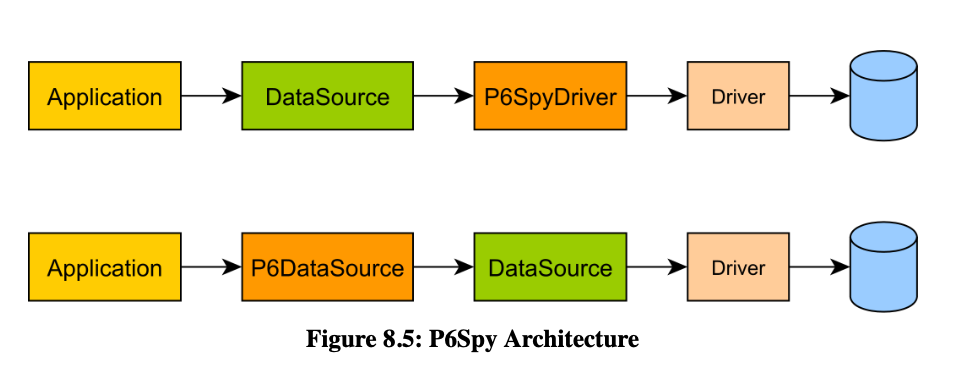

运行前面的示例会得到以下输出（已应用格式）：
```
p6spy - 1448122491807|0|batch|connection 7|
	insert into post (title, version, id) values (?, ?, ?)|
	insert into post (title, version, id) values ('Post no. 0', 0, 0)
p6spy - 1448122491807|0|batch|connection 7|
	insert into post (title, version, id) values (?, ?, ?)|
	insert into post (title, version, id) values ('Post no. 1', 0, 1)
p6spy - 1448122491807|0|batch|connection 7|
	insert into post (title, version, id) values (?, ?, ?)|
	insert into post (title, version, id) values ('Post no. 2', 0, 2)
p6spy - 1448122491812|5|statement|connection 7|
	insert into post (title, version, id) values (?, ?, ?)|
	insert into post (title, version, id) values ('Post no. 2', 0, 2)
```
输出按事件发生的顺序排列，包含以下列：

表 8.5：P6Spy 输出

| 字段 | 描述 |
| :--- | :--- |
| **时间戳** | 语句执行的时间戳 |
|   |   |
| **执行时间** | 语句执行的持续时间（毫秒） |
|   |   |
| **类别** | 当前语句的类别（例如：statement, batch） |
|   |   |
| **连接** | 数据库连接标识符（由 P6Spy 分配） |
|   |   |
| **原始语句** | 被 P6Spy 拦截的原始 SQL 语句 |
|   |   |
| **格式化语句** | 所有参数占位符被实际绑定值替换后的语句 |

前三行代码与向批处理中添加语句相关，而第四行代码记录了实际的批处理执行情况（这也解释了执行时间列的值）。

::: info
一个非常有用的配置是 `outagedetection` 属性，它可以检测长时间运行的语句。
:::


# 9. 映射类型和标识符

JPA 通过将 Java 对象类型与数据库结构关联起来，解决了对象/关系不匹配的问题。假设有一个包含四个列（例如 id、created_by、created_on 和 status）的任务数据库表，JPA 提供程序必须将其映射到由两个 Java 类（例如 Task 和 Change）组成的领域模型。

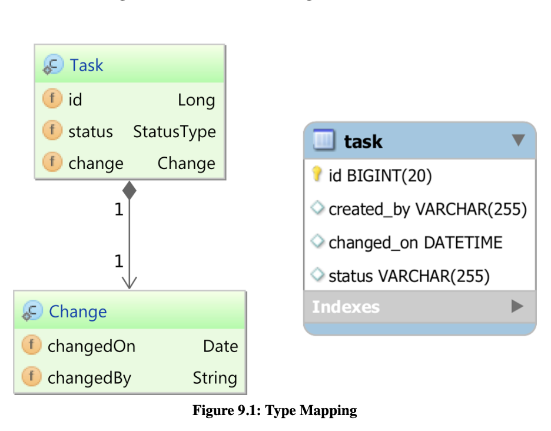

JPA 使用三个主要的面向对象关系映射元素：类型、可嵌入类型和实体。在前面的图中，Task 对象是一个实体，而 Change 对象是一个可嵌入类型。

实体和可嵌入类型都通过依赖 Hibernate 类型将数据库列类型与 Java 值对象（例如 String、Integer、Date）关联起来，从而对多个领域模型属性进行分组。实体和可嵌入类型之间的主要区别在于是否存在标识符，该标识符用于将数据库表的唯一键（通常是主键）与领域模型对象属性关联起来。